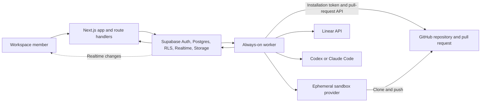

# Architecture

Wallie turns a session into a sequence of human-reviewed agent runs. The
database owns the durable nouns and atomic transitions; typed TypeScript
services orchestrate them; route handlers and server components provide the
user-facing edge; an always-on worker performs asynchronous work.

This document assigns semantic ownership and dependency direction. For the
exact session and job transitions, see
[Pipeline and worker lifecycle](PIPELINE-WORKER-LIFECYCLE.md).

Runtime-specific contracts live in:

- [Agent harness](AGENT-HARNESS.md)
- [Database and RLS](DATABASE-AND-RLS.md)
- [Sandbox provider contracts](SANDBOX-PROVIDER-CONTRACTS.md)
- [Worker operations](WORKER-OPERATIONS.md)

## System context



The web app is stateless. Durable work lives in Supabase. Agent jobs progress
only while at least one worker is running; serverless background callbacks are
not a substitute for the worker.

## Layers and owners

| Layer                | Owns                                                                                                        | Primary locations                                                                                                                                                                                                                     |
| -------------------- | ----------------------------------------------------------------------------------------------------------- | ------------------------------------------------------------------------------------------------------------------------------------------------------------------------------------------------------------------------------------- |
| Schema               | Tables, enums, foreign keys, tenant isolation, RLS, triggers, atomic RPCs                                   | [`supabase/migrations/`](../supabase/migrations/)                                                                                                                                                                                     |
| Domain services      | Pipeline execution, review actions, cancellation, archive semantics, job/run lifecycle, sandbox abstraction | [`src/lib/pipeline/`](../src/lib/pipeline/), [`src/lib/wallie/`](../src/lib/wallie/), [`src/lib/sandbox/`](../src/lib/sandbox/)                                                                                                       |
| Edge                 | Authentication, request validation, authorization context, response contracts, server-rendered feature data | [`src/app/api/`](../src/app/api/), [`src/features/`](../src/features/)                                                                                                                                                                |
| Worker               | Claim scheduling, heartbeats, pipeline invocation, stall recovery, Linear reconciliation, sandbox reaping   | [`src/worker/`](../src/worker/)                                                                                                                                                                                                       |
| Integration adapters | GitHub, Linear, agent runners, encrypted credentials, provider-specific sandbox SDKs                        | [`src/features/github/`](../src/features/github/), [`src/lib/linear/`](../src/lib/linear/), [`src/lib/agent-runner/`](../src/lib/agent-runner/), [`src/lib/secrets/`](../src/lib/secrets/), [`src/lib/sandbox/`](../src/lib/sandbox/) |

The generated [`database.types.ts`](../src/lib/supabase/database.types.ts) is a
projection of the applied Supabase schema, not an independent schema owner. Do
not edit it by hand.

## Semantic ownership

| Concept                                   | Semantic owner                                         | Important projections and consumers                     |
| ----------------------------------------- | ------------------------------------------------------ | ------------------------------------------------------- |
| Workspace membership and tenant isolation | Postgres schema and RLS policies                       | Server/browser Supabase clients, route authorization    |
| Pipeline and stage definitions            | `pipelines` and `pipeline_stages`                      | Settings editor, session loaders, prompt rendering      |
| Session pinning and current stage         | `sessions.pipeline_id` and `sessions.current_stage_id` | Dashboard, worker, review route                         |
| Atomic session creation                   | `create_session_with_first_job` RPC                    | Session creation service and initial run UI             |
| Approval and stage advancement            | `approve_session_stage` RPC                            | Phase-action route and pipeline processor               |
| Rejection and rerun orchestration         | Pipeline processor                                     | Artifact feedback, job/run rows, review UI              |
| Active-job deduplication                  | Database partial unique index plus key builders        | Session/stage enqueue, retry, and Linear reconciliation |
| Worker capacity and claims                | `claim_next_agent_job` RPC plus worker scheduler       | Heartbeats and stall detector                           |
| Sandbox lifecycle                         | Sandbox interface and provider adapters                | Pipeline processor, cancellation, reaper, settings      |
| Agent prompt and execution                | Prompt templates, pipeline processor, agent runners    | Workspace stage templates and versioned artifacts       |
| Workspace secrets                         | Secret crypto and encrypted database rows              | Privileged server services and worker                   |
| Environment configuration                 | `src/env/` plus documented runtime-only exceptions     | Web deployment and worker deployment                    |

When a fact appears in several surfaces, change its semantic owner first and
derive or verify the projections. Do not solve drift by adding another copied
constant.

## Dependency direction

The intended direction is:

```text
UI / route edge
        ↓
typed domain service
        ↓
schema RPC or tenant-scoped query

worker scheduler
        ↓
pipeline service
        ↓
agent, GitHub, sandbox, and persistence adapters
```

Use these rules when placing code:

1. Route handlers authenticate, validate, and delegate. Multi-row transition
   semantics belong in a domain service or transactional RPC, not in the route.
2. Browser code uses the browser client and public contracts. It must not reach
   service-role clients, server environment values, or secret decryption.
3. RLS-backed server reads use the server client. The admin client is reserved
   for the worker and explicitly privileged server paths.
4. The worker may call pipeline and integration services, but domain services
   must not depend on UI components or route response shapes.
5. Provider-specific SDK calls stay behind agent or sandbox adapters. Generic
   pipeline code branches on capabilities, not provider implementation details.
6. Cross-row concurrency belongs in Postgres when one transaction is required.
   TypeScript callers still handle an empty CAS result as a normal race outcome.

## Durable invariants

- Every tenant-owned row is scoped by `workspace_id`; RLS is the isolation
  boundary for user-session clients.
- Stages are data. Generic pipeline execution must not assign special behavior
  to seeded stage slugs or positions.
- Sessions are pinned to a pipeline ID when created. Editing that pipeline's
  existing stage rows can still change prompts or ordering observed by pinned
  sessions; pinning does not snapshot the stage rows.
- Job claims, artifact publication, approval, and cancellation use scoped
  status, version, or archive guards. Callers must treat a guard miss as a
  normal race outcome.
- Rejection only CAS-claims its first step and is not yet atomic with approval.
  The resulting concurrency gap is documented in
  [Pipeline and worker lifecycle](PIPELINE-WORKER-LIFECYCLE.md#review-concurrency).
- The schema is forward-only. The consolidated baseline is frozen; subsequent
  changes use uniquely versioned migrations.
- Workspace and user credentials are encrypted in the database. They are not
  deployment environment variables.
- The web and worker deploy from the same repository and share compatible
  environment and schema versions.
- Cancellation is durable before cleanup is attempted. Late workers may not
  turn canceled jobs or runs back into success or error.

## End-to-end flow

1. A privileged session-creation path validates workspace and repository access
   and calls the atomic creation RPC.
2. The RPC inserts the session, first queued job, and queued run together.
3. A worker claims ready work through the concurrency-aware claim RPC.
4. The generic pipeline processor loads the pinned stage, renders its prompt,
   acquires a sandbox, runs the selected agent, and persists a versioned
   artifact.
5. A guarded session update exposes the artifact as `awaiting_review`.
6. Rejection records version-specific feedback and queues another attempt of
   the same stage. Approval records completion and advances by stage position.
7. Approval of the final stage archives the completed session.

The precise atomic and multi-step boundaries are documented in
[Pipeline and worker lifecycle](PIPELINE-WORKER-LIFECYCLE.md).

## Change-impact map

| Change                               | Inspect together                                                                                     | Minimum proof                                            |
| ------------------------------------ | ---------------------------------------------------------------------------------------------------- | -------------------------------------------------------- |
| Table, enum, policy, trigger, or RPC | Forward migration, generated types, RLS consumers, seed, schema tests                                | Local reset or isolated upgrade plus focused tests       |
| Session or job transition            | Processor, transition RPC, phase-action route, cancel/archive paths, worker recovery                 | Transition tests including stale and concurrent cases    |
| Pipeline stage behavior              | Stage loaders, prompt variables, approval ordering, settings editor                                  | Generic-stage tests with non-default names and positions |
| Sandbox provider                     | Driver, connection storage, settings, capability check, processor acquisition, cancel/reaper cleanup | Provider contract tests and a real capability smoke test |
| Agent provider or credential         | Runner resolution, encrypted credential loader, lease behavior, diagnostic redaction                 | Runner tests plus a sandboxed smoke run                  |
| Authentication or authorization      | Middleware, route identity, server/browser/admin client choice, RLS                                  | Positive and cross-workspace negative tests              |
| User-facing workflow                 | Server loader, client island, route mutation, Realtime reconciliation                                | Focused tests plus browser proof at affected viewports   |
| Environment variable                 | Zod schema, `.env.example`, web and worker deployment                                                | Typecheck and startup validation in each runtime         |

## Deliberate legacy names

The product language is session, pipeline, stage, artifact, and run. Some
database columns and APIs still use `phase`, including `phase_status` and the
phase-action route. Treat those as compatibility names; do not use them as
evidence that stages are hardcoded.
