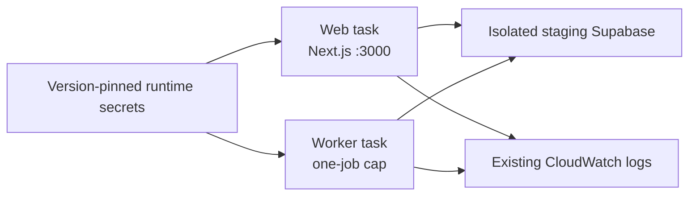

# First real staging tasks

**Prepare one web and one worker Fargate task definition for an isolated staging database.** The renderer is offline: it registers nothing and never handles secret values.



| Boundary   | Initial value                                                                                 |
| ---------- | --------------------------------------------------------------------------------------------- |
| Compute    | Fargate 1.4.0, Linux/x86-64, 0.5 vCPU / 1 GiB each; verify live memory before tuning          |
| Network    | `services-a` with both reviewed task security groups, no public IP                            |
| Images     | Exact separately qualified and signed ECR digests; default image commands start Wallie        |
| Roles      | Existing component execution roles only; no application task role or ECS Exec                 |
| Secrets    | Own component JSON bundle, exact ARN/key/version ID; no values in manifest or task definition |
| Filesystem | Writable container root for Next cache and worker control socket; non-root UID 1000           |
| Logs       | Existing `/wallie/staging/web` and `/wallie/staging/worker`, blocking delivery                |
| Scope      | One-off tasks, no service, load balancer, public ingress, or DNS switch                       |

## Before rendering

- Use a **fresh, schema-only staging Supabase project or branch**. Apply current migrations without seeds or copied application rows. Require the empty-data check below before either task starts. The worker's scheduler, Cursor auth processor, cleanup, and reaper can act on existing data immediately; never aim it at the existing Wallie database.
- Confirm the web and worker secret containers have reviewed **real** versions with both `SUPABASE_SECRET_KEY` and the same `WALLIE_ENCRYPTION_KEY` for this database. Empty containers and old synthetic canary versions are unsuitable. Preserve an existing encryption key only when migrating encrypted rows.
- Use the staging project's `sb_publishable_` key for the browser-visible setting; the renderer rejects legacy JWTs and `sb_secret_` keys in that field. [Supabase API key types](https://supabase.com/docs/guides/getting-started/api-keys)
- Recheck each exact image digest's scan and strict signature. The renderer validates digest syntax, not image qualification or secret contents.
- Require the live network plan/readback to show `enable_runtime_https_egress = true`, an available NAT route for `services-a`, and both task SGs from `runtime_https_egress.task_security_group_ids`. Review the separate staging HTTPS app origin, existing execution-role secret access, and a temporary deployment grant for only these task revisions. No AWS write is included here.

Require all counts to be zero after migrations:

```sql
select
  (select count(*) from public.workspaces) as workspaces,
  (select count(*) from public.sessions) as sessions,
  (select count(*) from public.agent_jobs) as agent_jobs,
  (select count(*) from public.agent_runs) as agent_runs,
  (select count(*) from public.worker_heartbeats) as worker_heartbeats,
  (select count(*) from public.cursor_auth_flows) as cursor_auth_flows,
  (select count(*) from public.session_attachments) as session_attachments,
  (select count(*) from public.workspace_vercel_sandbox_connections) as vercel_connections,
  (select count(*) from public.workspace_e2b_sandbox_connections) as e2b_connections,
  (select count(*) from public.workspace_daytona_sandbox_connections) as daytona_connections;
```

Create `.wallie/aws/app-tasks/manifest.json` privately (it contains public values and identifiers, **no secret values**):

```json
{
  "schemaVersion": 1,
  "account": "<12-digit-account>",
  "region": "us-west-2",
  "existingWallieSupabaseUrl": "https://<existing-project>.supabase.co",
  "publicConfig": {
    "NEXT_PUBLIC_APP_URL": "https://<separate-staging-origin>",
    "NEXT_PUBLIC_SUPABASE_URL": "https://<isolated-staging-project>.supabase.co",
    "NEXT_PUBLIC_SUPABASE_PUBLISHABLE_KEY": "<staging-publishable-key>"
  },
  "images": {
    "web": "sha256:<64-lowercase-hex>",
    "worker": "sha256:<64-lowercase-hex>"
  },
  "runtimeSecrets": {
    "web": { "arn": "<full-web-runtime-secret-arn>", "versionId": "<reviewed-web-version-id>" },
    "worker": {
      "arn": "<full-worker-runtime-secret-arn>",
      "versionId": "<reviewed-worker-version-id>"
    }
  }
}
```

The renderer refuses identical existing/staging Supabase origins, the production `wallie.dev` app origin, non-443 Supabase URLs, extra fields, floating image tags, and implicit secret labels. It cannot establish that the staging database is empty or that a URL belongs to the intended project; verify those separately.

```sh
umask 077
mkdir -p .wallie/aws/app-tasks
for component in web worker; do
  node scripts/prepare-aws-app-task-definition.mjs \
    --manifest .wallie/aws/app-tasks/manifest.json --component "$component" \
    > ".wallie/aws/app-tasks/$component-definition.json"
done
```

## Reviewed launch and evidence

1. Review both complete JSON definitions, exact digest/secret selectors, and isolated Supabase URL. Register one revision per component with `aws ecs register-task-definition --cli-input-json file://...` using the approved administrator/deployment grant. Save exact returned revision ARNs; do not repeat uncertain registrations. Keep `wallie-local`'s standing permissions unchanged until a separate grant is reviewed.
2. Run **one** web task, then **one** worker task on cluster `wallie-staging`, launch type `FARGATE`, platform `1.4.0`, the reviewed `services-a` subnet and both task SGs, `assignPublicIp=DISABLED`, and no command/environment/role override. Do not create a service yet.
3. Web: require task/container `RUNNING`, container `HEALTHY`, no OOM, and a Next.js ready line in `/wallie/staging/web`. Its health check fetches localhost port 3000 and performs a read-only `worker_heartbeats` Data API query with the injected key every 30 seconds per task. Budget that ongoing API traffic. It never prints credentials or rows. A healthy task proves startup and this task's DB path; it does not prove external browser access.
4. Worker: require `RUNNING`, `[worker] starting` and `[worker] entering scheduler loop` in `/wallie/staging/worker`; query the isolated database for its new `worker_heartbeats` row and advancing `last_heartbeat_at`. Observe at least 10 seconds (five default poll intervals) with no `[worker] atomic claim failed`, `[cursor-auth] processor failed`, or `[worker] fatal error` log. Check that `active_job_ids` stays empty and no jobs are claimed. A heartbeat alone does not prove the scheduler can call its claim RPC.
5. Before `ecs stop-task`, keep submissions disabled and recheck zero active/queued jobs plus empty heartbeat `active_job_ids`. Require worker log `graceful shutdown complete` and heartbeat deregistration. **Do not stop an active worker**: ECS offers at most 120 seconds after SIGTERM, while jobs can need 45 minutes. Exact-task pre-drain and automatic rollouts need a later PR.

The staging HTTPS origin remains a configuration target until ingress/DNS/TLS are deployed. These tasks verify private startup, not the public site cutover.
