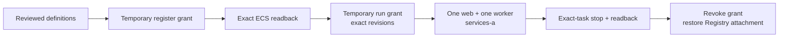

# One-off ECS app launch

**Register and run one reviewed web task and one reviewed worker task in private staging.** The helper only renders policies and requests. It makes no AWS calls.



| Gate     | Required before either task starts                                                                                                                             |
| -------- | -------------------------------------------------------------------------------------------------------------------------------------------------------------- |
| Database | Fresh, schema-only isolated Supabase target; [all activity tables empty](AWS-APP-TASK-DEFINITIONS.md#before-rendering); no integrations or submissions enabled |
| Runtime  | Real version-pinned web/worker secrets; reviewed app task JSON; fresh scan and strict signature for each image digest                                          |
| Network  | Live `runtime_https_egress` output, NAT route in `services-a`, both task SGs, no public task IP                                                                |
| IAM      | Account `111614490109`, region `us-west-2`, signed-in non-root `wallie-local`; administrator available for temporary policy swap                               |

## Temporary grant

1. An administrator checks **both exact task families** for existing active and inactive revisions. `wallie-local` currently lacks the pre-grant inventory read; an access denial is not proof of absence. Stop for review if either family already has revisions.
2. Render and review one registration policy. Use an explicit UTC expiry 5 minutes–24 hours ahead. The run-phase expiry must cover observation **and stop/cleanup**; an administrator must be ready to stop the exact recorded task if the grant expires early. Registration permits `RegisterTaskDefinition` only for `wallie-staging-web-app:*` and `wallie-staging-worker-app:*`, 512 CPU/1024 MiB, Fargate compatibility, fixed tags, tag readback for those families, and `PassRole` only for the two existing execution roles. It grants no `RunTask`.
3. `wallie-local` already uses **10/10 managed-policy attachments**. The administrator records the exact `WallieStagingRegistry` ARN/default version and every attached identity, then detaches **only that provisioning policy** from `wallie-local` and attaches a new temporary `WallieStagingAppTaskLaunch` policy. Do not swap while registry provisioning is in progress. Verify the attachment and rendered default policy before registration. The helper never changes IAM.

```sh
umask 077
mkdir -p .wallie/aws/app-tasks
export AWS_PROFILE=wallie-staging AWS_REGION=us-west-2
EXPIRY='<reviewed-UTC-time-like-2026-09-23T02:00:00Z>'
node scripts/prepare-aws-app-task-launch.mjs register-policy \
  --manifest .wallie/aws/app-tasks/manifest.json --expires-at "$EXPIRY" \
  > .wallie/aws/app-tasks/register-policy.json
```

4. Review the two JSON definitions from [the task-definition renderer](AWS-APP-TASK-DEFINITIONS.md#before-rendering). Register **one** revision of each using `aws ecs register-task-definition --cli-input-json file://...`. Save each complete response and exact revision ARN. On a timeout, inspect both families with an administrator; do not blindly register again.
5. Fetch each exact revision with `aws ecs describe-task-definition --task-definition "$ARN" --include TAGS`. Save the full responses as `web-readback.json` and `worker-readback.json`, then assemble them for the helper:

```sh
node --input-type=module - .wallie/aws/app-tasks <<'NODE' > .wallie/aws/app-tasks/definitions.json
import { readFileSync } from 'node:fs';
const dir = process.argv[2];
console.log(JSON.stringify(Object.fromEntries(['web', 'worker'].map((component) => [
  component, JSON.parse(readFileSync(`${dir}/${component}-readback.json`, 'utf8')),
])), null, 2));
NODE
```

6. Generate a fresh 32-hex non-secret run ID, then render the **run-phase replacement version**. This step fails unless both readbacks match every security-relevant field of the reviewed definitions, including digest, secret selectors, roles, environment, and tags. The administrator reviews and makes this version the temporary policy's default; registration permission disappears before launching tasks.

```sh
RUN_ID="$(openssl rand -hex 16)"
EXPIRY='<new-reviewed-UTC-expiry>'
node scripts/prepare-aws-app-task-launch.mjs run-policy \
  --manifest .wallie/aws/app-tasks/manifest.json \
  --definitions .wallie/aws/app-tasks/definitions.json \
  --run-id "$RUN_ID" --expires-at "$EXPIRY" \
  > .wallie/aws/app-tasks/run-policy.json
```

- The run version permits only those two **exact revision ARNs** on cluster `wallie-staging`, with this run's tag, no ECS Exec/EBS, and exact execution-role `PassRole`. Read/stop access is limited to this run's tagged tasks and app log streams. No service creation, task-definition registration, deregistration, secrets read, or IAM write.
- [ECS IAM conditions](https://docs.aws.amazon.com/service-authorization/latest/reference/list_ecs.html) cannot enforce the exact definition payload, task count, subnet/security groups, public IP, overrides, or absence of a task-role override. The strict readback and reviewed run requests are required. This policy is temporary and time-limited; IAM expiry does **not** stop running tasks.

## Launch and observe

1. Capture the current Terraform network outputs, then render a separate input per component. The renderer requires the enabled HTTPS-egress output, `services-a`, and both distinct task SGs. Review the complete requests; they use one Fargate 1.4.0 task, no public IP or overrides, and a stable client token.

```sh
terraform -chdir=infra/aws/staging-network output -json > .wallie/aws/app-tasks/network-output.json
for component in web worker; do
  node scripts/prepare-aws-app-task-launch.mjs run \
    --manifest .wallie/aws/app-tasks/manifest.json \
    --definitions .wallie/aws/app-tasks/definitions.json \
    --network .wallie/aws/app-tasks/network-output.json \
    --component "$component" --run-id "$RUN_ID" \
    > ".wallie/aws/app-tasks/$component-run-input.json"
done
```

2. Launch **web first** with `aws ecs run-task --cli-input-json file://.wallie/aws/app-tasks/web-run-input.json`, save the response, and require `failures: []` plus one recorded task ARN. If the response is ambiguous, use `ecs list-tasks --cluster wallie-staging --started-by "wa-$RUN_ID"` and an administrator to resolve it; do not generate a new token or run ID.
3. Require web `RUNNING` and `HEALTHY`, expected image digest, private ENI in `services-a`, exact two SGs, no public association, and a Next.js ready log. The health probe checks local HTTP and the isolated staging Data API. Then launch **one worker** from its saved input. Require `RUNNING`, advancing isolated-DB heartbeat, empty active job IDs, and no scheduler/processor errors over five polls. Follow [the full startup checks](AWS-APP-TASK-DEFINITIONS.md#reviewed-launch-and-evidence).
4. Keep submissions disabled. Before any worker stop, recheck zero runnable/active jobs and empty heartbeat `active_job_ids`. Stop only each **recorded task ARN** using `aws ecs stop-task --cluster wallie-staging --task "$ARN"`; wait for `STOPPED`, graceful worker log, and heartbeat deregistration. If work is active, do not stop: ECS gives only 120 seconds after SIGTERM, while a Wallie job may need 45 minutes. Planned drain/rollout protection remains a later change.
5. The administrator detaches `WallieStagingAppTaskLaunch`, reattaches the **exact saved** `WallieStagingRegistry` policy, verifies attachment/default versions, and checks no task from this run remains running. Retain requests/readbacks under ignored `.wallie/aws/app-tasks/`. Only an administrator may later deregister exact unused revisions after checking no tasks reference them.

No ingress, DNS, load balancer, ECS service, or public site switch occurs in this qualification.
