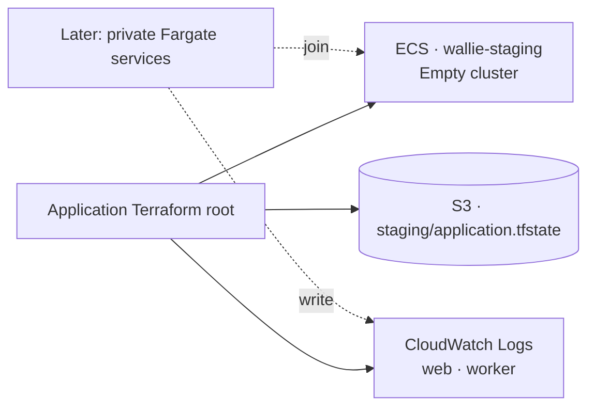

# AWS application foundation

**Prepare an empty ECS cluster and two application log groups.** This can proceed while runtime images are being qualified. Deploy after review and merge.



| Resource   | Configuration                                                                                    |
| ---------- | ------------------------------------------------------------------------------------------------ |
| Cluster    | `wallie-staging`; Container Insights explicitly disabled until workload monitoring is configured |
| Log groups | `/wallie/staging/web`, `/wallie/staging/worker`; STANDARD class; 30-day retention                |
| Encryption | CloudWatch's default AES-256-GCM at rest; no customer KMS key in this batch                      |
| Deletion   | Terraform `prevent_destroy` on all three resources; native log-group deletion protection         |
| State      | Existing private bucket; separate `staging/application.tfstate` and lock                         |

- Exactly **three resources**. No services, tasks, task definitions, workload roles, capacity providers, network routes, secrets, or log-event access.
- ECS is a regional control-plane grouping. Future task/service configuration places workloads in the staging VPC; this root does not choose subnets.
- Scope: commercial AWS only. Terraform **1.16.3**, AWS provider **6.65.0**.
- Log retention expires old events even with deletion protection. Retention and monitoring must be reviewed before production. [CloudWatch encryption](https://docs.aws.amazon.com/AmazonCloudWatch/latest/logs/encrypt-log-data-kms.html), [retention](https://docs.aws.amazon.com/AmazonCloudWatchLogs/latest/APIReference/API_PutRetentionPolicy.html)

## Prepare access

Prerequisites: completed [state bootstrap](AWS-STATE-BOOTSTRAP.md), temporary AWS login, and the existing **AWSServiceRoleForECS** service-linked role.

```sh
umask 077
mkdir -p .wallie/aws
export AWS_PROFILE=wallie-staging
export AWS_REGION=us-west-2
WALLIE_AWS_ACCOUNT_ID='<your-12-digit-account-id>'
node scripts/prepare-aws-application.mjs policy --account-id "$WALLIE_AWS_ACCOUNT_ID" --region "$AWS_REGION" > .wallie/aws/application-policy.json
node scripts/prepare-aws-application.mjs variables --account-id "$WALLIE_AWS_ACCOUNT_ID" --region "$AWS_REGION" > .wallie/aws/application.tfvars.json
node scripts/prepare-aws-state.mjs access-policy --account-id "$WALLIE_AWS_ACCOUNT_ID" --region "$AWS_REGION" > .wallie/aws/state-access-policy.json
node scripts/prepare-aws-state.mjs backend --component application --account-id "$WALLIE_AWS_ACCOUNT_ID" --region "$AWS_REGION" > .wallie/aws/application.backend.hcl
```

- Create customer-managed **WallieStagingApplication** from the rendered policy, or update its default version if it already exists; attach it to `wallie-local`.
- Update **WallieStagingStateAccess** with the rendered policy as its default version. It preserves foundation/registry access and adds only the application state key and lock; no state-object deletion.
- Keep existing backend files unchanged. Use Terraform's default workspace and the application key only.
- Rendering is offline. Plans, state, and local files stay under ignored `.wallie/`; no credentials are written by the renderer.

## Check prerequisites and names

```sh
aws sts get-caller-identity
aws iam get-role --role-name AWSServiceRoleForECS --query 'Role.{Arn:Arn,Path:Path}'
aws ecs describe-clusters --clusters wallie-staging --include TAGS SETTINGS
aws logs describe-log-groups --log-group-name-prefix /wallie/staging/
```

- Verify the intended account and non-root identity.
- Require role ARN `arn:aws:iam::<account>:role/aws-service-role/ecs.amazonaws.com/AWSServiceRoleForECS` and its matching service-role path. Terraform checks both before creating resources.
- **Missing role:** complete the separately reviewed [ECS service-linked-role bootstrap](AWS-ECS-SERVICE-ROLE.md). [CreateCluster can attempt to create this role](https://docs.aws.amazon.com/AmazonECS/latest/APIReference/API_CreateCluster.html); this policy deliberately grants only `iam:GetRole` and Terraform requires the role to exist first.
- **First deployment:** require an explicit `MISSING` cluster failure for `wallie-staging` and no exact match for either log-group name. Access errors are not absence. An existing or inactive cluster, or an existing log group, needs separate inspection; do not import or retag it automatically.
- Subsequent deployments: inspect managed state and ownership instead of requiring absence.

| Permission boundary | Detail                                                                                       |
| ------------------- | -------------------------------------------------------------------------------------------- |
| ECS                 | Exact cluster; create, metadata reads/tags, owned cluster configuration                      |
| CloudWatch Logs     | Exact two groups for create, retention, deletion-protection settings and tags                |
| Regional inventory  | `DescribeLogGroups` requires `Resource: "*"`; limited to the account/region; no log contents |
| IAM                 | Read the exact pre-existing ECS service-linked role only                                     |

- All configuration writes require the ownership marker. ECS initial tagging is restricted to `CreateCluster`; Logs has no equivalent create-only condition, so its initial-tag grant can claim an untagged group at either exact name. The absence check is required.
- A live tagged `CreateLogGroup` request was denied despite the bare-ARN tagging grant. Initial tagging now covers both bare and `:*` forms of the two exact group names, retaining every condition. A dependent-authorization ARN mismatch is inferred; this correction still needs live qualification. [Creation tagging permission](https://docs.aws.amazon.com/AmazonCloudWatchLogs/latest/APIReference/API_CreateLogGroup.html)
- Standalone tag reads, metadata updates, and tag removal keep the bare ARN. [CloudWatch ARN forms](https://docs.aws.amazon.com/AmazonCloudWatchLogs/latest/APIReference/API_LogGroup.html)
- Ownership tags cannot be removed or changed by this policy. Metadata tags can be maintained on owned resources.
- IAM permits owned-cluster configuration changes and cannot constrain log retention to exactly 30 days or force deletion protection to remain enabled; Terraform enforces the reviewed values. There are no resource-delete grants. [ECS tagging](https://docs.aws.amazon.com/AmazonECS/latest/developerguide/supported-iam-actions-tagging.html), [Logs ARN forms](https://docs.aws.amazon.com/AmazonCloudWatchLogs/latest/APIReference/API_LogGroup.html)

## Plan, apply, verify

```sh
WALLIE_AWS_FILES="$PWD/.wallie/aws"
terraform -chdir=infra/aws/staging-application init -lockfile=readonly -backend-config="$WALLIE_AWS_FILES/application.backend.hcl"
terraform -chdir=infra/aws/staging-application plan -var-file="$WALLIE_AWS_FILES/application.tfvars.json" -out="$WALLIE_AWS_FILES/application.tfplan"
terraform -chdir=infra/aws/staging-application show "$WALLIE_AWS_FILES/application.tfplan"
```

- First plan: **3 additions, 0 changes, 0 deletions**. Check names, account/region, ownership, retention, and deletion protection. The service-linked role is read, never created.
- Apply the reviewed saved plan:

```sh
terraform -chdir=infra/aws/staging-application apply "$WALLIE_AWS_FILES/application.tfplan"
terraform -chdir=infra/aws/staging-application output
aws ecs describe-clusters --clusters wallie-staging --include TAGS SETTINGS
aws logs describe-log-groups --log-group-name-prefix /wallie/staging/
aws logs list-tags-for-resource --resource-arn "arn:aws:logs:$AWS_REGION:$WALLIE_AWS_ACCOUNT_ID:log-group:/wallie/staging/web"
aws logs list-tags-for-resource --resource-arn "arn:aws:logs:$AWS_REGION:$WALLIE_AWS_ACCOUNT_ID:log-group:/wallie/staging/worker"
terraform -chdir=infra/aws/staging-application plan -var-file="$WALLIE_AWS_FILES/application.tfvars.json" -detailed-exitcode
```

- Require an ACTIVE empty cluster, no capacity providers, zero services/running/pending tasks/registered instances, and the reviewed settings/tags. Verify both log groups match the table; final plan must exit **0**.
- Mock tests establish configuration behavior, not live IAM or deployment qualification. A complete apply and zero-drift check remain required.
- Next: qualified images; private networking/egress; task execution and application roles; secrets; web ingress; drain-aware worker deployment; monitoring and rollback.

## Recover a partial first apply

- If cluster creation succeeds but both log groups fail, preserve the cluster and remote state. Do not import, delete, or reuse the original saved plan.
- Confirm the cluster matches state, ownership, and empty-cluster checks above; require both exact log-group names to remain absent.
- After the reviewed policy update, create and review a **new saved plan: 2 additions, 0 changes, 0 deletions**. Stop if the cluster changes or any other resource appears.
- Apply only that reviewed recovery plan; repeat all live checks and require the final drift plan to exit **0**.
