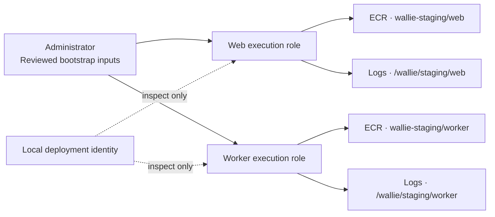

# ECS execution roles

**An administrator manages two fixed roles; the deployment identity can only inspect them.** Image pulls and log delivery are the default. An explicit option adds access to each role's own runtime secret. Apply changes only after review and merge.



| Boundary       | Exact scope                                                                                                |
| -------------- | ---------------------------------------------------------------------------------------------------------- |
| Roles          | `wallie-staging-web-execution`, `wallie-staging-worker-execution`; path `/`; maximum session 3,600 seconds |
| Trust          | Only `ecs-tasks.amazonaws.com`; exact source account and regional ECS ARN                                  |
| Image pulls    | `GetAuthorizationToken` on `*`; three pull actions on the role's own repository                            |
| Logs           | `CreateLogStream` and `PutLogEvents` on streams in the role's own existing group                           |
| Secret opt-in  | `GetSecretValue` on one full, reviewed `/wallie/staging/<component>/runtime` ARN, including its suffix     |
| Ownership      | Six fixed tags; `ManagedBy=Administrator`; one inline `WallieStagingExecution` policy                      |
| Local identity | Four read actions on the two exact role ARNs, added to existing `WallieStagingApplication`                 |

- These are **execution roles for the ECS/Fargate agent**, separate from application task roles. Secret access requires the explicit opt-in below. No task definitions, services, tasks, image publication, log-group creation, or `iam:PassRole` permissions. [AWS execution-role responsibilities](https://docs.aws.amazon.com/AmazonECS/latest/developerguide/task_execution_IAM_role.html)
- Trust uses `arn:aws:ecs:<region>:<account>:*`: ECS does not support narrowing this condition to a specific cluster. The later deployment batch must constrain which task definitions can use each role. [AWS trust conditions](https://docs.aws.amazon.com/AmazonECS/latest/developerguide/task-iam-roles.html)
- No managed attachments or permissions boundary. Administrator-owned trust and policy creation avoids delegating arbitrary IAM document writes. A boundary limits identity permissions; it does not replace review of role trust. [Permissions boundaries](https://docs.aws.amazon.com/IAM/latest/UserGuide/access_policies_boundaries.html)
- The existing Terraform application root keeps its cluster/log-group ownership. Roles are not imported into Terraform. This bootstrap supports one commercial AWS account/region; subsequent policy changes require separate review.

## Render and review

Prerequisites: existing [application log groups](AWS-APPLICATION-FOUNDATION.md), staging ECR repositories, and [private connectivity](AWS-STAGING-NETWORK.md#private-application-connectivity). Rendering and verification are offline and use no AWS credentials.

```sh
umask 077
WALLIE_AWS_ACCOUNT_ID='<your-12-digit-account-id>'
AWS_REGION=us-west-2
WALLIE_ROLE_FILES="$PWD/.wallie/aws/execution-roles"

for component in web worker; do
  mkdir -p "$WALLIE_ROLE_FILES/$component"
  for command in create-role-input put-role-policy-input manifest; do
    node scripts/prepare-aws-execution-roles.mjs "$command" \
      --account-id "$WALLIE_AWS_ACCOUNT_ID" --region "$AWS_REGION" \
      --component "$component" > "$WALLIE_ROLE_FILES/$component/$command.json"
  done
done
node scripts/prepare-aws-application.mjs policy \
  --account-id "$WALLIE_AWS_ACCOUNT_ID" --region "$AWS_REGION" \
  > .wallie/aws/application-policy.json
```

- Review both roles' JSON inputs and manifests. Role names, paths, trust, inline-policy name, tags, and permissions are fixed; the renderer accepts no role/policy overrides.
- After merge, an administrator updates **WallieStagingApplication** from the rendered policy. Existing grants remain; the added `GetRole`, `GetRolePolicy`, `ListRolePolicies`, and `ListAttachedRolePolicies` grants contain no IAM writes. No additional managed-policy attachment is needed. [IAM action/resource reference](https://docs.aws.amazon.com/service-authorization/latest/reference/list_iam.html)
- Do not attach the broad AWS-managed `AmazonECSTaskExecutionRolePolicy`. The rendered inline policies separate repository and log-group access.

## Administrator bootstrap

Use a separately approved administrator session. **Do not grant these create/update actions to `wallie-local`.** Run commands for one component at a time, then repeat for the other.

```sh
WALLIE_AWS_ADMIN_PROFILE='<approved-admin-profile>'
component=web
role_name="wallie-staging-$component-execution"

aws --profile "$WALLIE_AWS_ADMIN_PROFILE" sts get-caller-identity
aws --profile "$WALLIE_AWS_ADMIN_PROFILE" iam get-role --role-name "$role_name"
```

- Verify the expected account and administrator identity. First creation requires **`NoSuchEntity`** for the exact role name; `AccessDenied` is not absence.
- If a role already exists, stop and inspect it. Do not replace trust, overwrite its inline policy, attach policies, or import it automatically.
- After confirming absence and reviewing the input files:

```sh
aws --profile "$WALLIE_AWS_ADMIN_PROFILE" iam create-role \
  --cli-input-json "file://$WALLIE_ROLE_FILES/$component/create-role-input.json"
aws --profile "$WALLIE_AWS_ADMIN_PROFILE" iam put-role-policy \
  --cli-input-json "file://$WALLIE_ROLE_FILES/$component/put-role-policy-input.json"
```

- If creation partially succeeds, retain the returned role identity and stop. Inspect exact trust/tags/path and policy state before reviewing only the remaining action; do not replay creation or broaden permissions.
- Revoke/leave the administrator session when bootstrap is complete. Steady-state inspection uses the existing temporary-login identity.

## Capture and verify

Capture fresh responses for each role with the read-only identity. Keep the default account/region parameters above and repeat with `component=worker`.

```sh
WALLIE_AWS_READ_PROFILE=wallie-staging
component=web
role_name="wallie-staging-$component-execution"

aws --profile "$WALLIE_AWS_READ_PROFILE" sts get-caller-identity
aws --profile "$WALLIE_AWS_READ_PROFILE" iam get-role --role-name "$role_name" \
  --output json --no-cli-pager > "$WALLIE_ROLE_FILES/$component/get-role.json"
aws --profile "$WALLIE_AWS_READ_PROFILE" iam list-role-policies --role-name "$role_name" \
  --no-paginate --output json --no-cli-pager > "$WALLIE_ROLE_FILES/$component/list-role-policies.json"
aws --profile "$WALLIE_AWS_READ_PROFILE" iam list-attached-role-policies --role-name "$role_name" \
  --no-paginate --output json --no-cli-pager > "$WALLIE_ROLE_FILES/$component/list-attached-role-policies.json"
aws --profile "$WALLIE_AWS_READ_PROFILE" iam get-role-policy --role-name "$role_name" \
  --policy-name WallieStagingExecution --output json --no-cli-pager \
  > "$WALLIE_ROLE_FILES/$component/get-role-policy.json"
node scripts/prepare-aws-execution-roles.mjs verify \
  --account-id "$WALLIE_AWS_ACCOUNT_ID" --region "$AWS_REGION" --component "$component" \
  --readback-dir "$WALLIE_ROLE_FILES/$component"
```

- Verify the caller account/non-root identity first; stop if any capture command fails. The verifier cannot prove file freshness or the identity that captured it.
- Both list responses must explicitly contain `IsTruncated: false`, no continuation marker, exactly one expected inline policy, and zero managed attachments. An incomplete or ambiguous response fails closed; never treat an empty failed command as a valid snapshot.
- Verification compares exact ARN/name/path, description, session duration, all tags, absence of a boundary, complete trust, and complete inline permissions. IAM URL encoding, statement ordering, and scalar/singleton list forms are normalized; additional permissions or principals are rejected. [IAM policy encoding](https://docs.aws.amazon.com/IAM/latest/APIReference/API_GetRolePolicy.html)
- `readback-matches-manifest` means **offline metadata matched**. It does not establish effective IAM or live task capability. The [private task smoke](AWS-PRIVATE-TASK-SMOKE.md) prepares bounded image-pull/log qualification and temporary `PassRole` access. Application task roles and live secret injection remain later batches.

## Optional runtime secret access

- Start with a verified existing role and its [runtime secret container](AWS-SECRETS-FOUNDATION.md). Read the secret's **full ARN** from reviewed metadata; names, wildcard suffixes, and ECS JSON-key/version selectors are rejected.
- The option adds only `secretsmanager:GetSecretValue` for that component/account/region. Trust, tags, existing ECR/log permissions, and role creation inputs stay unchanged. Omitting the option still renders the original policy with **no secret access**.
- This grant covers the entire component secret. Values and task-definition injection mappings require later review; this renderer never reads or writes a value. The current AWS-managed encryption key needs no added `kms:Decrypt`; custom keys require separate work. [AWS secret permissions](https://docs.aws.amazon.com/AmazonECS/latest/developerguide/task_execution_IAM_role.html#task-execution-secrets)

```sh
component=web # repeat with worker and its own full ARN
WALLIE_RUNTIME_SECRET_ARN='<full-reviewed-own-component-runtime-secret-arn>'
WALLIE_ROLE_FILES="$PWD/.wallie/aws/execution-role-secret-access"
WALLIE_SECRET_ROLE_FILES="$WALLIE_ROLE_FILES/$component"
mkdir -p "$WALLIE_SECRET_ROLE_FILES"
for command in put-role-policy-input manifest; do
  node scripts/prepare-aws-execution-roles.mjs "$command" \
    --account-id "$WALLIE_AWS_ACCOUNT_ID" --region "$AWS_REGION" --component "$component" \
    --runtime-secret-arn "$WALLIE_RUNTIME_SECRET_ARN" \
    > "$WALLIE_SECRET_ROLE_FILES/$command.json"
done
```

- Preserve the earlier role readbacks. Review the single added statement, then have an administrator apply the reviewed `put-role-policy-input.json` to the existing `WallieStagingExecution` inline policy after merge. Do not recreate the role or change its trust.
- With the new `$WALLIE_ROLE_FILES` base, repeat only the four IAM read commands above; they write into `$WALLIE_SECRET_ROLE_FILES`. Use the verification command below with the **same ARN option**. Missing, extra, or different secret access fails comparison.

```sh
node scripts/prepare-aws-execution-roles.mjs verify \
  --account-id "$WALLIE_AWS_ACCOUNT_ID" --region "$AWS_REGION" --component "$component" \
  --runtime-secret-arn "$WALLIE_RUNTIME_SECRET_ARN" \
  --readback-dir "$WALLIE_SECRET_ROLE_FILES"
```

- Private Secrets Manager connectivity, populated values, task definitions, and a live injection check remain separate gates. Metadata verification alone does not qualify secret injection.
