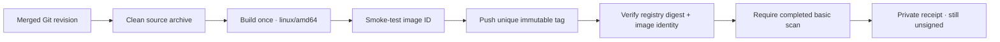

# Publish staging images

**Build and smoke-test one image, then upload that exact image to ECR.** Run after review and merge. These images remain **unsigned and not approved for deployment**.



| Guard       | Behavior                                                                                         |
| ----------- | ------------------------------------------------------------------------------------------------ |
| Source      | Full commit SHA in an isolated fetch of Wallie `main`; archive without local Git overrides       |
| Image       | Fixed Linux AMD64, non-root, revision label; no rebuild after smoke                              |
| Destination | Expected account/region and exact owned web or worker repository                                 |
| Tag         | Full SHA + platform + unique build ID; existing tags are never overwritten                       |
| Scan        | Effective BASIC scan-on-push; fail on incomplete/failed scans or High/Critical findings          |
| Credentials | Validated expiring session credentials; ECR token via stdin into disposable Docker configuration |

- Requires a local Docker Unix socket and AMD64 execution support. Apple Silicon uses emulation; builds can take longer.
- Source fetching and archiving use fresh Git metadata, with replacement objects and local/global archive attributes disabled. Local untracked/ignored files do not enter the source archive. Container configuration and application secrets are supplied later, at runtime.
- BuildKit attestations are disabled for this initial single-image flow. Signing, provenance, language-package scanning, and GitHub OIDC remain later PRs.

## Prepare access

Prerequisites: Node.js 22, Git, Docker with Buildx, AWS CLI v2 with temporary login, and the deployed [staging registry](AWS-STAGING-REGISTRY.md).

```sh
umask 077
mkdir -p .wallie/aws
export AWS_PROFILE=wallie-staging
export AWS_REGION=us-west-2
WALLIE_AWS_ACCOUNT_ID='<your-12-digit-account-id>'
node scripts/prepare-aws-image-publishing.mjs policy --account-id "$WALLIE_AWS_ACCOUNT_ID" --region "$AWS_REGION" > .wallie/aws/image-publishing-policy.json
```

- In IAM, create customer-managed **WallieStagingImagePublishing** from that file and attach it to the temporary-login identity.
- Grants uploads and verification reads for the two exact owned repositories. Authentication and registry scan-mode reads require `Resource: "*"`, constrained to the account/region.
- This policy grants no image/repository deletion, setting changes, manual scans, signing, IAM administration, or layer downloads. Existing infrastructure policies remain separate grants.
- The selected profile must provide expiring session credentials; long-lived access-key profiles are rejected. [AWS CLI temporary login](https://docs.aws.amazon.com/cli/latest/userguide/cli-configure-sign-in.html)
- Refresh after build/push and as needed before each AWS request. Require over 150 seconds remaining: a two-minute timeout plus a 30-second margin. Recheck after identity validation; stop if renewal cannot supply enough time.
- Expired-token responses get one identity-checked retry; Docker uploads are never retried automatically.
- Every replacement must match the initial account, partition, and principal. A refreshed role session may change its session name; its role ARN and unique role ID must match. Credentials remain in memory.
- AWS credentials and provider variables are removed from Git, Docker/Buildx, and smoke-test environments. The selected profile configuration is used only by the AWS credential resolver.
- Inherited `DOCKER_CONTENT_TRUST*` settings and passphrases are removed from those environments, keeping this unsigned flow independent of local [Docker signing settings](https://docs.docker.com/engine/security/trust/).
- No AWS keys in `.env`, GitHub secrets, build arguments, or Docker images.

## Publish one component

```sh
git fetch origin main
WALLIE_IMAGE_REVISION="$(git rev-parse origin/main)"
node scripts/publish-aws-image.mjs \
  --component web \
  --account-id "$WALLIE_AWS_ACCOUNT_ID" --region "$AWS_REGION" \
  --revision "$WALLIE_IMAGE_REVISION" --profile "$AWS_PROFILE"
```

- Repeat with `--component worker` for the same revision. Each command builds and tests independently using the existing [web](WEB-CONTAINER.md) or [worker](WORKER-CONTAINER.md) smoke checks.
- The publisher independently fetches `main` and rejects unmerged revisions, root credentials, wrong destinations, mutable tags, remote Docker daemons, or incompatible scanning settings.
- It checks effective scanning with `BatchGetRepositoryScanningConfiguration`; it never changes account-wide scan settings. BASIC scans cover OS packages only. [AWS scanning scope](https://docs.aws.amazon.com/AmazonECR/latest/userguide/image-scanning.html)
- The registry manifest must reference the tested local image configuration and match its reported digest. Future deployments use **`repository@sha256:…`**, never a mutable tag.

## Read the result

- Receipt: `.wallie/aws/image-<component>-<revision>-linux-amd64-<build-id>.json`, mode `0600`.
- Records source revision, tested image ID and config digest, registry digest, upload status, scan findings and freshness, and `signed: false` / `deployable: false`.
- Successful exit requires a completed scan with no High/Critical findings. Lower severities remain in the receipt; success is **not** full vulnerability clearance or deployment approval.
- A completed scan must be newer than the upload start and no later than the current time. Keep the host clock synchronized. Stale findings remain unverified while the publisher waits, then fail if no fresh scan arrives. Repeated digests may not receive a new scan because BASIC scanning limits each image to once per 24 hours. [AWS scan limits](https://docs.aws.amazon.com/AmazonECR/latest/userguide/image-scanning-basic.html)
- Scanning is checked **after upload**. A failed scan leaves the image in ECR and returns failure; inspect the receipt. An interrupted/failed upload may also leave an image or layers; verify its tag before retrying.
- Retry creates a new build/tag. No automatic rollback, image deletion, or expiration policy; storage can accumulate. [ECR usage charges](https://aws.amazon.com/ecr/pricing/)
- Next gate: sign and verify the recorded digest, establish release provenance and broader vulnerability checks, then qualify deployment. No compute or production cutover occurs here.

## Verification boundary

- Local tests exercise command ordering and failure handling with stubbed external operations; existing container checks exercise real Docker packaging and runtime behavior.
- First live upload follows merge and policy attachment. Verify the digest and real ECR findings before claiming publishing is qualified.
