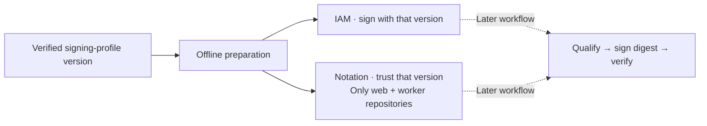

# Prepare image signing

**Render signing permissions and strict trust settings for review.** This step runs offline; it does not attach permissions, install tools, sign images, or approve deployment.



## Render

Prerequisite: the [signing profile](AWS-SIGNING-PROFILE.md) is deployed and its identity, status, version, and tags are verified. Take the version from that deployment's recorded readback; do not silently select a newer version.

```sh
umask 077
mkdir -p .wallie/aws
WALLIE_AWS_ACCOUNT_ID='<your-12-digit-account-id>'
WALLIE_AWS_REGION=us-west-2
WALLIE_SIGNING_PROFILE_VERSION='<verified-10-character-version>'
node scripts/prepare-aws-image-signing.mjs policy --account-id "$WALLIE_AWS_ACCOUNT_ID" --region "$WALLIE_AWS_REGION" --profile-version "$WALLIE_SIGNING_PROFILE_VERSION" > .wallie/aws/image-signing-policy.json
node scripts/prepare-aws-image-signing.mjs trust-policy --account-id "$WALLIE_AWS_ACCOUNT_ID" --region "$WALLIE_AWS_REGION" --profile-version "$WALLIE_SIGNING_PROFILE_VERSION" > .wallie/aws/image-signing-trust-policy.json
```

- Requires Node.js 22; no AWS credentials or other tools. Validates input syntax, not live account/profile availability.
- Fixed profile `wallie_staging_images`; fixed `wallie-staging/web` and `wallie-staging/worker` repositories.
- Supports commercial and GovCloud partition formatting. China and isolated partitions are rejected; their trust setup has not been qualified.
- Keep outputs for review. **Do not attach the signing policy or import trust settings yet**; the gated signing workflow follows separately. Prepare the [authenticated local toolchain](AWS-SIGNING-TOOLCHAIN.md) first.

## Permission boundaries

This policy adds to the existing [image-publishing policy](AWS-IMAGE-PUBLISHING.md#prepare-access).

| Grant                              | Scope                                                   |
| ---------------------------------- | ------------------------------------------------------- |
| `SignPayload`, `GetSigningProfile` | Exact owned profile, pinned version, account and region |
| `ListTagsForResource`              | Exact owned profile                                     |
| `GetRevocationStatus`              | Exact owned profile and account/region `signing-jobs/*` |
| `GetDownloadUrlForLayer`           | The two owned ECR repositories                          |

- The job wildcard permits revocation reads because job IDs are assigned when signing. Signing-job resources do not support the profile ownership/version conditions. [AWS Signer authorization reference](https://docs.aws.amazon.com/service-authorization/latest/reference/list_signer.html)
- Layer-download access covers **all image/signature layers** in those repositories.
- IAM restricts the signing profile/version, but cannot bind `SignPayload` to a repository, digest, or passing scan. The later workflow must enforce those gates. [Profile-version conditions](https://docs.aws.amazon.com/signer/latest/developerguide/authen-apipermissions.html)
- No profile creation/tag changes, cancellation, revocation, sharing, IAM administration, deletion, or registry-wide signing configuration.
- Detach the bootstrap policy before ordinary publishing/signing. Policies attached to the same identity combine; file separation does not isolate privileges.

## Trust boundaries

- `signatureVerification.level = strict`; no verification overrides.
- Exactly two registry scopes: this account/region's web and worker repository URIs.
- Exactly one trusted identity: the **version ARN** of the verified profile. Future rotation requires separately reviewed policy updates.
- Use only the selected partition's signing authority: `aws-signer-ts` or `aws-us-gov-signer-ts`. Rendering the name does not install or authenticate its root certificate. [AWS verification setup](https://docs.aws.amazon.com/signer/latest/developerguide/image-verification.html)
- The plugin signs using an unversioned profile ARN; IAM pins the allowed version. Its verifier supports the exact version ARN in trust policy. [Plugin signing](https://github.com/aws/aws-signer-notation-plugin/blob/93a2aa12f47cdb281b358d9161bd41aab5bbdd50/internal/signer/signer.go), [plugin verification](https://github.com/aws/aws-signer-notation-plugin/blob/93a2aa12f47cdb281b358d9161bd41aab5bbdd50/internal/verifier/verifier.go)

## Remaining release gates

1. Prepare the [pinned Notation/plugin binaries and root certificates](AWS-SIGNING-TOOLCHAIN.md) in isolated configuration. Linux CI toolchain qualification follows separately.
2. Recheck the exact source revision, image digest, current scans, profile identity/version/status, and repository ownership before signing. **Existing images still fail the High/Critical gate.**
3. Sign and strictly verify the digest; reject missing, expired, revoked, or untrusted signatures and failed revocation checks. A successful signature does not clear vulnerability findings.
4. Add provenance, broader package scanning, and GitHub OIDC publishing before deployment qualification.

- Tests cover offline rendering, input rejection, IAM scope, and trust configuration. Live IAM authorization and Notation interoperability remain unqualified in this batch.
