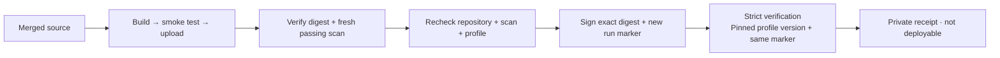

# Sign qualified staging images

**Optionally sign and strictly verify the image produced by the publisher's current run.** Every image must pass the unchanged fresh High/Critical scan gate before signing.



## Prepare access

- Verify the [signing profile's](AWS-SIGNING-PROFILE.md) identity, Active status, version, and six ownership tags. Use the recorded version; never silently select a newer one.
- Prepare the [authenticated local toolchain](AWS-SIGNING-TOOLCHAIN.md) and [publishing prerequisites](AWS-IMAGE-PUBLISHING.md#prepare-access). Runtime support is **macOS arm64 / commercial AWS** only.
- Render permissions and trust settings for review; this step requires only Node.js 22 and makes no AWS calls:

```sh
umask 077
mkdir -p .wallie/aws
WALLIE_AWS_ACCOUNT_ID='<your-12-digit-account-id>'
WALLIE_AWS_REGION=us-west-2
WALLIE_SIGNING_PROFILE_VERSION='<verified-10-character-version>'
node scripts/prepare-aws-image-signing.mjs policy --account-id "$WALLIE_AWS_ACCOUNT_ID" --region "$WALLIE_AWS_REGION" --profile-version "$WALLIE_SIGNING_PROFILE_VERSION" > .wallie/aws/image-signing-policy.json
node scripts/prepare-aws-image-signing.mjs trust-policy --account-id "$WALLIE_AWS_ACCOUNT_ID" --region "$WALLIE_AWS_REGION" --profile-version "$WALLIE_SIGNING_PROFILE_VERSION" > .wallie/aws/image-signing-trust-policy.json
```

- For live qualification after merge and a supported image remediation, create customer-managed **WallieStagingImageSigning** from the reviewed policy, or update its default version if it already exists. Attach it alongside **WallieStagingImagePublishing**; detach the bootstrap grant first. Scripts do not attach policies.
- The offline renderer also supports GovCloud formatting; runtime GovCloud qualification remains separate. China and isolated partitions are rejected.
- Rendered files are for review. The runtime generates fresh private trust configuration; it does not load an editable policy or old receipt from disk.

## Publish with signing

```sh
git fetch origin main
WALLIE_IMAGE_REVISION="$(git rev-parse origin/main)"
node scripts/publish-aws-image.mjs \
  --component web --revision "$WALLIE_IMAGE_REVISION" \
  --account-id "$WALLIE_AWS_ACCOUNT_ID" --region "$WALLIE_AWS_REGION" \
  --profile wallie-staging --signing-profile-version "$WALLIE_SIGNING_PROFILE_VERSION"
```

- Repeat for `worker`. Each invocation builds, tests, uploads, and scans independently. Omitting the signing option retains the existing unsigned flow.
- Rehash pinned tools and root material; reject profile rotation, cancellation, ownership changes, and failing/stale scans.
- Sign `repository@sha256:…` using OCI referrers. Strict verification requires a fresh marker in the signed metadata; an older signature cannot satisfy this run. [ECR referrers](https://aws.amazon.com/blogs/opensource/diving-into-oci-image-and-distribution-1-1-support-in-amazon-ecr/), [metadata verification](https://github.com/notaryproject/notation-go/blob/v1.3.2/verifier/verifier.go)
- Refresh and revalidate the AWS principal before each two-minute Notation command; require over 150 seconds of credential lifetime. Credentials and registry authentication stay in child-process memory; inherited configuration is excluded.
- No automatic signing retry, including inside the AWS SDK. Interruptions terminate Notation and its plugin process group. The private runtime is removed; receipts remain.

## Read the result

`signed` describes evidence from this run; `deployable` always remains `false`.

| `signing.status` | `signed` | Meaning                                                                              |
| ---------------- | -------- | ------------------------------------------------------------------------------------ |
| Absent           | `false`  | No signing attempt recorded                                                          |
| `attempted`      | `null`   | Outcome uncertain; a signing job or uploaded signature may exist                     |
| `signed`         | `null`   | Signing command succeeded; strict verification is incomplete or failed               |
| `verified`       | `true`   | Exact digest and new run marker passed strict verification under the pinned identity |

- Failures return nonzero and preserve the last state. Inspect the receipt before retrying; no signatures or images are automatically deleted.
- A retry creates another build/tag and marker. The existing [fresh-scan limits](AWS-IMAGE-PUBLISHING.md#read-the-result) still apply.

## Permission and trust boundaries

| Grant                              | Scope                                                    |
| ---------------------------------- | -------------------------------------------------------- |
| `SignPayload`, `GetSigningProfile` | Exact owned profile, pinned version, account and region  |
| `ListTagsForResource`              | Exact owned profile                                      |
| `GetRevocationStatus`              | Exact profile and `signing-jobs/*`; account and region   |
| `GetDownloadUrlForLayer`           | All image/signature layers in the two owned repositories |

- Job IDs are assigned during signing; job resources do not support profile tag/version conditions. [AWS authorization reference](https://docs.aws.amazon.com/service-authorization/latest/reference/list_signer.html)
- Our live profile revocation check was denied under the tag-conditioned grant despite verified tags and policy. This correction separates the exact-profile read with account/region conditions; signing and profile inspection retain their ownership/version controls.
- AWS documents tag support for profile revocation reads; the observed denial does not establish a universal limitation. [Live qualification](AWS-IMAGE-PUBLISHING.md#verification-boundary) passed strict verification after this correction. A denied revocation check remains a verification failure.
- IAM cannot bind `SignPayload` to a repository, digest, or passing scan; the publisher enforces those gates. Attached policies combine, so remove bootstrap permissions before ordinary use. No creation/tag changes, cancellation, revocation, sharing, deletion, IAM administration, or registry-wide signing configuration is granted. [Version conditions](https://docs.aws.amazon.com/signer/latest/developerguide/authen-apipermissions.html)
- Strict trust: exactly two repository scopes, one profile **version ARN**, one partition's signing root, and no verification overrides. Rotation requires reviewed policy updates. [Trust setup](https://docs.aws.amazon.com/signer/latest/developerguide/image-verification.html)
- The plugin signs using the unversioned profile ARN; IAM pins the allowed version and the verifier matches the version ARN. [Signing](https://github.com/aws/aws-signer-notation-plugin/blob/93a2aa12f47cdb281b358d9161bd41aab5bbdd50/internal/signer/signer.go), [verification](https://github.com/aws/aws-signer-notation-plugin/blob/93a2aa12f47cdb281b358d9161bd41aab5bbdd50/internal/verifier/verifier.go)

## Remaining gates

1. Qualify the supported base for both images with fresh passing High/Critical scans; keep the scan gate unchanged.
2. Qualify live IAM authorization, signing, and strict verification, including missing, expired, revoked, or untrusted signatures and failed revocation checks. Local tests do not establish AWS interoperability.
3. Add Linux CI tooling, provenance, broader package scanning, and GitHub OIDC publishing before deployment qualification. A valid signature does not clear vulnerability findings.
