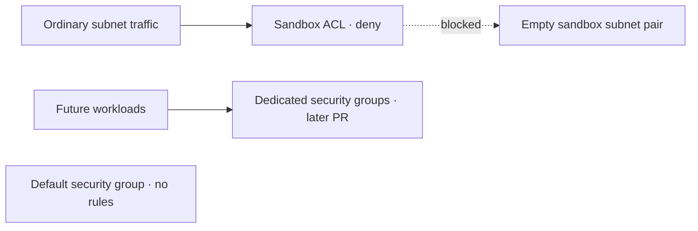

# AWS network hardening

**Harden the empty staging network before deploying workloads.** Same Terraform root and S3 state; four additional managed resources.

| Resource                         | Change                                         |
| -------------------------------- | ---------------------------------------------- |
| New VPC's default security group | Adopt it; remove every ingress and egress rule |
| Sandbox network ACL              | Create with no allow rules in either direction |
| Two ACL associations             | Attach only `sandbox-a` and `sandbox-b`        |



- Public, services, and database subnets keep their existing ACL associations. This change does not isolate those tiers from one another.
- No compute or new paid network service. The sandbox provider remains unqualified.
- This is a reservation guard, not complete sandbox isolation: ACLs do not filter same-subnet traffic; [AWS ACL exceptions](https://docs.aws.amazon.com/vpc/latest/userguide/vpc-network-acls.html) include VPC DNS, instance metadata, DHCP, and other reserved services. Workload security groups, DNS/egress controls, and provider qualification remain required.

## Prepare permissions

1. Finish the [26-resource foundation](AWS-STAGING-NETWORK.md). Confirm the VPC is empty: no workloads, network interfaces, or other security groups referencing its default group.
2. Run `terraform -chdir=infra/aws/staging-network output`; collect `vpc_id`, `default_security_group_id`, `default_network_acl_id`, and the two sandbox IDs from `subnets`. For an older foundation checkout without the default-ID outputs, read them from the selected VPC in the AWS console.
3. Render the policy offline with those exact IDs:

```sh
umask 077
node scripts/prepare-aws-network-hardening.mjs \
  --account-id '<12-digit-account>' --region us-west-2 \
  --vpc-id '<vpc-id>' \
  --default-security-group-id '<sg-id>' \
  --default-network-acl-id '<acl-id>' \
  --sandbox-subnet-a-id '<subnet-a-id>' \
  --sandbox-subnet-b-id '<subnet-b-id>' > .wallie/aws/network-hardening-policy.json
```

4. In **IAM → Policies → Create policy → JSON**, create customer-managed `WallieStagingNetworkHardening` from that file and attach it to `wallie-local`. Keep the login, discovery, state-access, and network policies attached.

- IDs must all belong to this foundation. The renderer validates syntax; it does not query AWS or establish those relationships.
- The policy scopes existing resources to their exact IDs. New ACL permissions require the ownership marker and the chosen VPC; initial tagging is limited to creation. It grants no compute, IAM, new security-group, or allow-rule creation permissions.
- Keep the custom ACL's metadata keys stable; removing a key requires a later policy scoped to the created ACL ID.

## Plan and apply

Run after this PR is merged, using the existing backend configuration and AWS login profile.

```sh
export AWS_PROFILE=wallie-staging
WALLIE_AWS_FILES="$PWD/.wallie/aws"
terraform -chdir=infra/aws/staging-network init -lockfile=readonly -backend-config="$WALLIE_AWS_FILES/staging.backend.hcl"
terraform -chdir=infra/aws/staging-network plan -var-file="$WALLIE_AWS_FILES/network.tfvars.json" -out="$WALLIE_AWS_FILES/network-hardening.tfplan"
terraform -chdir=infra/aws/staging-network show "$WALLIE_AWS_FILES/network-hardening.tfplan"
```

- Expect **four additions, no changes, no deletions** after foundation deployment. The default-SG “addition” **adopts and changes an existing AWS group**; it does not create another group. Its rules are removed on adoption.
- Confirm that the VPC/default group and both subnet IDs match the prepared policy. Apply only to the empty staging VPC.
- After reviewing the saved plan:

```sh
terraform -chdir=infra/aws/staging-network apply "$WALLIE_AWS_FILES/network-hardening.tfplan"
terraform -chdir=infra/aws/staging-network plan -var-file="$WALLIE_AWS_FILES/network.tfvars.json" -detailed-exitcode
```

- Require exit `0` from the full final plan. In AWS, verify zero default-SG rules and only the implicit deny entries on the sandbox ACL; verify exactly two sandbox associations and unchanged associations on the other six subnets.
- Offline tests cover explicit empty rules and graph connections. Live IAM and the AWS readback remain deployment checks.

## Removal behavior

- Removing the Terraform default-SG resource leaves the group and its empty rules in AWS; it does not restore AWS's original rules.
- Removing a sandbox ACL association restores that subnet to this VPC's default ACL, which may allow traffic. The hardening policy includes this exact default ACL for provider cleanup. Review removal plans separately; never use removal as a way to enable sandbox workloads.
