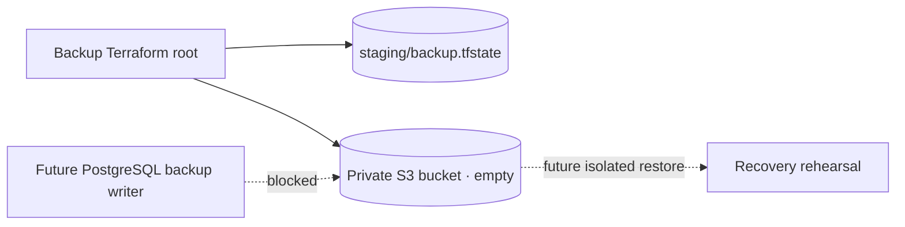

# AWS staging PostgreSQL backup destination

**Prepare an empty S3 bucket outside the PostgreSQL host state.** Uploads are denied until retention, writer access, a private network path, and recovery testing are reviewed.



| Control   | Configuration                                                                   |
| --------- | ------------------------------------------------------------------------------- |
| Name      | `wallie-staging-postgres-backups-<account-id>-<region>`                         |
| State     | Separate `staging/backup.tfstate` and `.tflock` in the existing state bucket    |
| Ownership | Bucket owner enforced; ACLs disabled                                            |
| Access    | All four S3 public-access blocks; deny non-TLS access; deny every object upload |
| Data      | Versioning enabled; Object Lock capability enabled; default SSE-S3 AES-256      |
| Deletion  | `prevent_destroy` and `force_destroy = false` on the bucket                     |

- [Object Lock requires versioning and cannot later be disabled](https://docs.aws.amazon.com/AmazonS3/latest/userguide/object-lock-configure.html). No default retention is set yet. The upload deny is the gate; this bucket does not yet contain protected backups.
- Terraform `prevent_destroy` applies while the resource stays in configuration; it cannot protect a removed block or lost state. [Terraform lifecycle reference](https://developer.hashicorp.com/terraform/language/meta-arguments/lifecycle).
- The [existing database subnet S3 endpoint](AWS-POSTGRES-IMAGE-PULL.md) permits ECR image layers only. The host has no backup S3 writer grant or upload route.

## Offline review

Use Terraform **1.16.3** and AWS provider **6.65.0**. The test provider is mocked and makes no AWS changes.

```sh
terraform -chdir=infra/aws/staging-backup fmt -check
terraform -chdir=infra/aws/staging-backup init -backend=false -lockfile=readonly
terraform -chdir=infra/aws/staging-backup validate
terraform -chdir=infra/aws/staging-backup test
node scripts/prepare-aws-state.mjs backend --component backup --account-id <account-id> --region us-west-2
```

## Live deployment gate

1. Reauthenticate as a non-root staging operator and verify the account and region. Inspect the intended bucket name; an access error is not proof of absence. Stop if it already exists or is in another account.
2. Have an administrator compare the live `WallieStagingStateAccess` default document with the [merged template](../infra/aws/state-access-policy.template.json). Add only `staging/backup.tfstate` and its lock to the existing policy, preserving its old default version for rollback. The `wallie-local` identity already has 10/10 managed-policy attachments.
3. Review a separate, scoped bucket deployment grant before a live plan or apply. This PR does not grant S3 bucket administration, change IAM, or create AWS resources. Require an additions-only plan for one bucket and its five control resources, followed by readback of versioning, Object Lock, encryption, ownership, public-access blocks, and both policy denies.

## Before the first backup

| Next control | Required proof                                                                                                                                                                                       |
| ------------ | ---------------------------------------------------------------------------------------------------------------------------------------------------------------------------------------------------- |
| Retention    | Set and verify a reviewed default Object Lock retention period; remove the upload deny only in the same reviewed change. Routine writers must lack bypass, retention-change, and delete permissions. |
| Writer path  | Scope writes to a backup prefix and this bucket; extend the private S3 endpoint policy for the database subnet without widening ECR layer access.                                                    |
| PostgreSQL   | Take a valid base backup and archive a complete WAL chain for point-in-time recovery. Verify the manifest and complete an isolated timed restore.                                                    |
| Other data   | Preserve `pgsodium_root.key` separately from database files; back up Supabase Storage objects separately from metadata.                                                                              |
| Operations   | Define retention cleanup, alerting, restore ownership, and a recovery target before production data moves.                                                                                           |

The bucket alone is not a backup. [PostgreSQL recovery](https://www.postgresql.org/docs/17/continuous-archiving.html), [Supabase key warning](https://supabase.com/docs/guides/self-hosting/postgres-upgrade-17), [Supabase self-hosting responsibilities](https://supabase.com/docs/guides/self-hosting).
