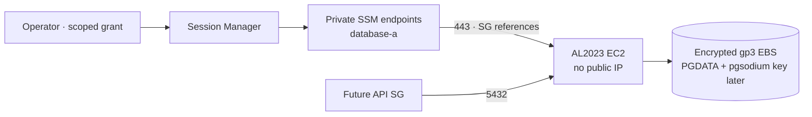

# Private PostgreSQL host foundation

**Prepare one private EC2 host and a separate encrypted data volume in `database-a`.** This root creates no PostgreSQL process, formatted filesystem, backup, or production data.



| Resource       | Contract                                                                                                                                                                                        |
| -------------- | ----------------------------------------------------------------------------------------------------------------------------------------------------------------------------------------------- |
| AMI            | Exact Amazon-owned AL2023 x86-64 EBS ID; no moving `latest` lookup.                                                                                                                             |
| Host           | Reviewed DB subnet/group, IMDSv2, no public IP, SSH key, user data, or database listener.                                                                                                       |
| Administration | Minimal five-action SSM instance policy; two private endpoints; no Parameter Store reads. The [private shell transcript path](AWS-POSTGRES-SESSION-LOGGING.md) and operator grant are separate. |
| Image identity | Named host role has exact-repository ECR pull actions, capped by an account- and region-scoped permissions boundary. The [private image path](AWS-POSTGRES-IMAGE-PULL.md) is off by default.    |
| Storage        | Independent 100 GiB gp3 data volume and disposable root, both encrypted with the same reviewed customer-managed KMS key ARN.                                                                    |
| Availability   | One AZ for staging qualification; no failover claim.                                                                                                                                            |
| State          | Separate `staging/postgres.tfstate` and lock in the existing private bucket.                                                                                                                    |

## Before a live plan

- **AWS:** Renew the non-root `wallie-staging` login. Recheck account, VPC, `database-a` subnet/routes, DB group and all rules, existing endpoints/instances/volumes, and quota. The September 22 inventory is historical. Stop if named resources already exist.
- **Network:** The [Supabase network slice](AWS-SUPABASE-NETWORK.md) must be separately reviewed, applied, and verified to supply `db_security_group_id`. Its guide currently blocks apply; stop here until that gate is cleared.
- **AMI:** Verify the exact regional image is Amazon-owned, named `al2023-ami-2023.*`, x86-64, and EBS-backed. Confirm its SSM Agent supports `ssmmessages`. [AWS endpoint guidance](https://docs.aws.amazon.com/systems-manager/latest/userguide/setup-create-vpc.html).
- **EBS key:** Select an enabled, same-account, same-region customer-managed symmetric KMS key and verify its key policy grants the operator the EBS use actions. Pass its exact ARN to Terraform and the temporary grant; confirm the key and policy again before apply. Explicit root-volume pinning requires a customer-managed key.
- **IAM:** Update the live `WallieStagingStateAccess` policy for the new state/lock objects. Render and review the exact-account/region `WallieStagingPostgresHostBoundary` policy with `node scripts/prepare-aws-postgres-deployment.mjs --policy host-boundary --account-id '<reviewed-account-id>' --region '<reviewed-region>'`. An administrator must create it, or update the existing policy's default version, and verify its document before the host role is created or updated. It retains the five SSM agent actions, caps ECR access to the exact PostgreSQL repository, and caps the separate [session log permissions](AWS-POSTGRES-SESSION-LOGGING.md). Then render and review the [two temporary host deployment policies](AWS-POSTGRES-DEPLOYMENT-GRANT.md). `wallie-local` already has 10/10 policy attachments; use a reviewed two-for-two temporary swap and restore it afterward. Scope a later operator `StartSession` grant to the exact instance and shell document.
- **Session settings:** Inspect regional Session Manager preferences. CloudWatch/S3 transcripts or KMS session encryption need additional private network and role permissions. If enabled, defer sessions until those paths exist. The first no-secrets connection probe may use CloudTrail StartSession/TerminateSession events; database administration requires the [private shell transcript path](AWS-POSTGRES-SESSION-LOGGING.md) and verified logging.

Write IDs only to ignored `.wallie/aws/postgres.tfvars.json`:

```json
{
  "aws_account_id": "<12-digit-account>",
  "aws_region": "us-west-2",
  "vpc_id": "<reviewed-vpc-id>",
  "database_subnet_id": "<reviewed-database-a-subnet-id>",
  "database_security_group_id": "<reviewed-supabase-db-group-id>",
  "ami_id": "<reviewed-al2023-ami-id>",
  "ebs_kms_key_arn": "<reviewed-customer-managed-ebs-key-arn>"
}
```

```sh
umask 077
mkdir -p .wallie/aws
node scripts/prepare-aws-state.mjs backend \
  --account-id '<12-digit-account>' --region us-west-2 --component postgres \
  > .wallie/aws/postgres.backend.hcl
terraform -chdir=infra/aws/staging-postgres init \
  -backend-config="$PWD/.wallie/aws/postgres.backend.hcl" -lockfile=readonly
terraform -chdir=infra/aws/staging-postgres plan \
  -var-file="$PWD/.wallie/aws/postgres.tfvars.json" \
  -out="$PWD/.wallie/aws/postgres.tfplan"
terraform -chdir=infra/aws/staging-postgres show "$PWD/.wallie/aws/postgres.tfplan"
```

**Review the full saved plan:** one host, data volume and attachment, role/profile/two inline policies, endpoint group, two endpoints, and two HTTPS rules. The second inline policy permits only the exact-repository ECR pull actions; the [network path](AWS-POSTGRES-IMAGE-PULL.md) remains off. Require no replacement, deletion, or unrelated changes. EC2, EBS, and interface endpoints accrue charges while idle. Apply only after the separate grant and plan review.

`prevent_destroy` blocks a planned destroy or replacement while its resource block remains. It does not guard in-place edits or a removed block, and it is not a backup.

## Live proof after an approved apply

| Check   | Evidence                                                                                                                                                                                                                                                                                                                                                                                               |
| ------- | ------------------------------------------------------------------------------------------------------------------------------------------------------------------------------------------------------------------------------------------------------------------------------------------------------------------------------------------------------------------------------------------------------ |
| Network | No public ENI address or subnet default route. With image pull and session logging off, DB SG has only reviewed API/5432 ingress and SSM/443 egress; the separate [image](AWS-POSTGRES-IMAGE-PULL.md) and [transcript](AWS-POSTGRES-SESSION-LOGGING.md) paths add narrow egress. SSM endpoint SG has only DB/443 ingress and no egress. Inspect all live rules; standalone rules do not detect extras. |
| SSM     | Both endpoints available with private DNS; node registered; no-secrets session works if account preferences allow; record agent version and CloudTrail events.                                                                                                                                                                                                                                         |
| Storage | gp3 volume encrypted, attached in host AZ, independent of root. Record volume ID and actual KMS key. Leave unformatted.                                                                                                                                                                                                                                                                                |
| Drift   | Full Terraform plan has zero changes. No database or application task is claimed.                                                                                                                                                                                                                                                                                                                      |

## Before PostgreSQL starts

- Apply and verify the [default-off private shell transcript path](AWS-POSTGRES-SESSION-LOGGING.md), then separately review regional Session Manager preferences and an exact-instance operator grant. The image-layer S3 route does not provide session logging.
- The [registry root](AWS-STAGING-REGISTRY.md) reserves a dedicated repository for the [pinned Supabase database image](SELF-HOSTED-SUPABASE.md). Follow the [mirror workflow](AWS-POSTGRES-IMAGE-MIRROR.md) and separately review the [default-off private pull path](AWS-POSTGRES-IMAGE-PULL.md). The host role alone cannot reach ECR; no image mirror or private pull has been verified live. Secret, backup, and runtime paths remain separate.
- Mount by stable EBS identity. Never format a volume with an existing filesystem. Persist **both** PGDATA and `/etc/postgresql-custom` (`pgsodium_root.key`); verify reboot/remount. [Nitro device names](https://docs.aws.amazon.com/ebs/latest/userguide/identify-nvme-ebs-device.html).
- Add PostgreSQL 17 base backups, continuous WAL archival, retention, monitoring, and an isolated timed restore. Back up the pgsodium key separately. An online EBS snapshot or `pg_verifybackup` alone does not prove recovery. [PostgreSQL recovery](https://www.postgresql.org/docs/17/continuous-archiving.html), [Supabase key guidance](https://supabase.com/docs/guides/self-hosting/postgres-upgrade-17).
- Set recovery targets and qualify failover before production. The [first Wallie task gate](AWS-APP-TASK-DEFINITIONS.md) still requires the API stack and shared HTTPS path.

**Offline check:** Terraform `fmt -check`, `init -backend=false -lockfile=readonly`, `validate`, and `test` for `infra/aws/staging-postgres`. Mocked tests do not prove live IAM, AMI contents, SSM reachability, backup quality, or drift.
