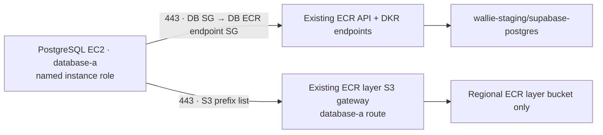

# Private PostgreSQL image pull path

**Prepare a default-off path from the private PostgreSQL host to its exact ECR repository.** This change does not mirror an image, start a host or database, supply a secret, or make the repository reachable from the Internet.

| Boundary        | Prepared change                                                                                                                                                                                                                                                     |
| --------------- | ------------------------------------------------------------------------------------------------------------------------------------------------------------------------------------------------------------------------------------------------------------------- |
| Host identity   | Exact-repository ECR authorization and pull actions on `wallie-staging-postgres`; an account- and region-scoped host permissions boundary retains the five SSM agent actions. No registry upload or repository administration.                                      |
| ECR API and DKR | Existing interface endpoints gain a statement for that repository and the exact host role. A new `wallie-staging-postgres-ecr-endpoints` security group is attached alongside their existing endpoint group, but not to Logs; only DB-to-endpoint TCP/443 is added. |
| Image layers    | The existing S3 gateway gains the `database-a` route table. The DB group gets TCP/443 egress to its S3 prefix list. The gateway policy still permits `s3:GetObject` only for the regional ECR layer bucket; the host gets no general S3 IAM grant.                  |
| Switch          | `enable_postgres_image_pull` defaults to `false` and requires both `enable_private_connectivity` and `enable_self_hosted_supabase_connectivity`. It creates no new ECR or S3 endpoint.                                                                              |

## Gates before a live apply

1. **Apply the base network separately.** The [Supabase network guide](AWS-SUPABASE-NETWORK.md) still blocks its default-off three-group/four-rule apply pending the reviewed HTTPS/routing decision. Its [temporary network grant](AWS-SUPABASE-NETWORK-GRANT.md) covers only those base groups and rules; it does not authorize this image-pull endpoint, route, or security-group change.
2. **Verify identity and image inventory.** The [host foundation](AWS-POSTGRES-HOST.md) and its [temporary deployment grant](AWS-POSTGRES-DEPLOYMENT-GRANT.md) remain separate: the DB group, `database-a` subnet, reviewed EBS key, host boundary, and host plan must be ready first. An administrator must render and review the exact-account/region host boundary policy, create it or update its managed-policy default version, and verify the result before the host role gets ECR permissions. The [image mirror](AWS-POSTGRES-IMAGE-MIRROR.md) has not been verified live; require its exact digest and fresh amd64 scan receipt before a pull probe.
3. **Authorize this extension separately.** The existing temporary Supabase network grant excludes endpoint and route changes, and the host grant is for the host foundation. Obtain a reviewed, expiring grant for this exact network extension before a future apply. `wallie-local` already has 10/10 managed-policy attachments; inventory every attachment and restore any temporarily swapped policy after the approved operation.

This PR is **offline preparation only**. Do not set the flag in live state or apply either Terraform root as part of it. The network and PostgreSQL roots have separate state and require their own saved, untargeted plans.

## Review at a later apply gate

| Plan                                     | Require                                                                                                                                                                                                                                                                                                                              |
| ---------------------------------------- | ------------------------------------------------------------------------------------------------------------------------------------------------------------------------------------------------------------------------------------------------------------------------------------------------------------------------------------ |
| `staging-network`                        | One DB-specific endpoint SG and its two TCP/443 DB/endpoint rules; DB TCP/443 egress to the existing S3 prefix list; in-place ECR API/DKR endpoint policy and SG attachment updates; `database-a` added to the existing S3 gateway route tables. No new endpoint, default route, NAT, broad CIDR, unrelated repository, or deletion. |
| `staging-postgres`                       | Exact ECR repository pull actions on the named role, with the reviewed boundary default version. Check every other host create/update against the [foundation plan](AWS-POSTGRES-HOST.md). No image execution, secret read, or PostgreSQL listener.                                                                                  |
| Live readback, only after approved apply | Confirm endpoint policies and SG attachments, every SG rule, the `database-a` gateway route, host role and boundary default document, and a zero-diff plan. A later digest-pinned pull probe must verify the mirrored index through this private path; the mirror receipt alone does not prove host reachability.                    |

**Offline check:** `terraform -chdir=infra/aws/staging-network fmt -check -recursive`, `init -backend=false -lockfile=readonly`, `validate`, and `test`; repeat for `infra/aws/staging-postgres`. Mock tests do not prove live IAM, endpoint DNS, S3 layer routing, image availability, or a successful pull.
