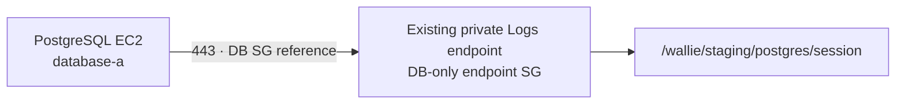

# Private PostgreSQL session transcripts

**Prepare a private CloudWatch Logs path for shell sessions on the staging PostgreSQL host.** The Terraform change does not enable Session Manager logging, grant an operator `StartSession`, start PostgreSQL, or apply live infrastructure.

| Root               | Prepared change                                                                                                                                                                                                                           |
| ------------------ | ----------------------------------------------------------------------------------------------------------------------------------------------------------------------------------------------------------------------------------------- |
| `staging-network`  | `enable_postgres_session_logging=false` by default. When enabled, attach `wallie-staging-postgres-logs-endpoints` only to the existing Logs endpoint; add two DB/endpoint TCP/443 rules and a named-role/group endpoint-policy statement. |
| `staging-postgres` | The same flag defaults to `false`. When enabled, create `/wallie/staging/postgres/session` with 90-day retention and deletion protection, and add scoped host-role log writes. The separately managed permissions boundary must cap them. |

The network flag requires `enable_private_connectivity` and `enable_self_hosted_supabase_connectivity`. Existing application logging remains; this path adds no endpoint, route, database runtime, or operator session grant.
After an opt-in apply, keep that root's flag enabled; protected resources require a separately reviewed retirement plan before the path can be removed.

## Live activation gates

1. Apply and verify the [base Supabase network](AWS-SUPABASE-NETWORK.md) and [private host](AWS-POSTGRES-HOST.md) separately. Their existing grants do not authorize this extension; obtain narrowly scoped, expiring deployment permissions.
2. Review, update, and read back the separately managed host permissions boundary before enabling the host flag. Review **saved, untargeted plans** for both roots with `enable_postgres_session_logging=true`:
   - Network: DB-only endpoint group, two referenced TCP/443 rules, in-place Logs endpoint policy and group updates. No public route, new endpoint, ECR/S3 change, broad CIDR, replacement, or deletion.
   - Host: named log group and scoped inline role policy. No database runtime or storage replacement.
   - After approved applies, read back every resource and require zero-diff plans.
3. Read regional, account-wide Session Manager preferences (`SSM-SessionManagerRunShell`) and check use by other nodes. Stop if a change would redirect or disrupt their transcripts. This Terraform does not set preferences; review any compatible update separately. Require CloudWatch logging to the exact group with `cloudWatchStreamingEnabled=true`, then read back the settings. The group uses CloudWatch's default at-rest encryption, so `cloudWatchEncryptionEnabled` must be `false`. Additional KMS encryption of session traffic needs a separately prepared key, permissions, and private KMS path. A customer-managed KMS key for the log group needs a separate CloudWatch Logs key policy and review.
4. Grant the operator `StartSession` separately for the exact instance and shell document. Before database administration, verify private reachability, host role and endpoint policy, transcript events arriving during a no-secrets shell session, and CloudTrail start/end events. Keep credentials and pgsodium key material out of transcripts.

CloudWatch session logging covers shell commands and output according to the regional preferences. It does **not** capture port-forwarding or SSH sessions; these are not an acceptable substitute for an audited administration shell. [AWS logging limits](https://docs.aws.amazon.com/systems-manager/latest/userguide/session-manager-logging.html), [private Logs endpoint requirement](https://docs.aws.amazon.com/systems-manager/latest/userguide/setup-create-vpc.html), [regional preferences](https://docs.aws.amazon.com/systems-manager/latest/userguide/getting-started-configure-preferences-cli.html).

This path is independent of the [private image pull](AWS-POSTGRES-IMAGE-PULL.md). PostgreSQL still needs a verified, digest-pinned image and base-backup/WAL/restore path before durable data starts.
