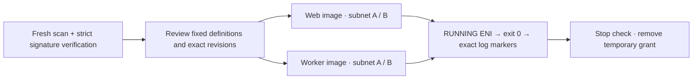

# Private ECS pull and log smoke

**Prepare four short-lived tasks: each qualified image in each private service subnet.** This batch provides offline request rendering and evidence comparison. Live execution requires review and merge; no task has been qualified by this change.



| Fixed boundary | Value                                                                                         |
| -------------- | --------------------------------------------------------------------------------------------- |
| Compute        | Fargate `1.4.0`, Linux/x86-64; one task per request; 256 CPU / 512 MiB                        |
| Images         | Exact web/worker repository digests and signing-profile version                               |
| Roles          | Own execution role only; no task role, secret references, or injected environment             |
| Program        | Node prints two run-specific markers 60 seconds apart, then exits; Wallie never starts        |
| Network        | One reviewed service subnet, task SG, public IP disabled; existing four private AWS endpoints |
| Logs           | Existing component log group; blocking delivery; unique run/task stream                       |

Fargate 1.4.0 sends ECR authentication, image pulls, and logs through the task ENI. Capture the ENI **while RUNNING**: stopping releases it. [AWS networking](https://docs.aws.amazon.com/AmazonECS/latest/developerguide/fargate-task-networking.html)

## Prerequisites and access

- Finish and freshly verify both [execution roles](AWS-EXECUTION-ROLES.md), [application cluster/log groups](AWS-APPLICATION-FOUNDATION.md), and [private connectivity](AWS-STAGING-NETWORK.md#private-application-connectivity). Empty runtime secrets are not used by this smoke.
- Keep `WallieStagingNetwork`, `WallieStagingPrivateConnectivity`, `WallieStagingImagePublishing`, and `WallieStagingImageSigning` available. They supply network, prefix-list, repository/scan, and signature reads. `DescribeManagedPrefixLists` is already in the connectivity policy; a denied read is a blocker, not permission to reuse old data.
- Use a fresh non-root `wallie-staging` identity in the expected account/region. Keep temporary credentials in process memory; no credentials, registry passwords, or application secrets in JSON files.
- Use [qualified local signing tools](AWS-SIGNING-TOOLCHAIN.md), fresh isolated strict trust configuration, and the pinned profile version. Recheck the profile/repository ownership and tool hashes as in the [signing workflow](AWS-IMAGE-SIGNING.md). Do not infer signature success from `signed` in a publisher receipt.
- Preparation and verification scripts are offline. They compare supplied data; **they cannot authenticate captures or timestamps**. The operator must retain original live outputs and review their provenance.

## Capture a launch-specific manifest

Use a private ignored directory and preserve separate snapshots for each launch. Set reviewed account, region, IDs, digests, source revisions, publish markers, and signing-profile version from the qualified infrastructure/images. Generate one new `runId` with `node -p 'require("node:crypto").randomBytes(16).toString("hex")'`.

Create `inputs.json` with these fields only:

| Field                                         | Value                                                                   |
| --------------------------------------------- | ----------------------------------------------------------------------- |
| `schemaVersion`, `account`, `region`, `runId` | `1`, exact commercial account/region, new 32-character lowercase hex ID |
| `vpcId`, `subnetIds`, `taskSecurityGroupId`   | Existing VPC, ordered pair of service subnet IDs, task SG               |
| `profileVersion`                              | Reviewed 10-character Signer profile version                            |
| `images.web`, `images.worker`                 | Each contains only `digest`, `sourceRevision`, `publishId`              |

This capture function records request start and response receipt separately and refuses to wrap failed AWS calls. Assembly uses request starts conservatively for freshness; task/ENI verification uses response receipt to check observed lifecycle times. Run it in Bash with `set -euo pipefail`; paths below are private local files.

```sh
umask 077
WALLIE_SMOKE_DIR="$PWD/.wallie/aws/private-task-smoke"
snapshot="$WALLIE_SMOKE_DIR/preparation"
mkdir -p "$snapshot"
aws_read=(aws --profile wallie-staging --region "$AWS_REGION" --output json --no-cli-pager --no-paginate)

capture() {
  local output="$1" captured; shift
  captured="$(node -p 'new Date().toISOString()')"
  "$@" > "$output.raw" || return
  node --input-type=module - "$captured" "$output.raw" <<'NODE' > "$output"
import {readFileSync} from 'node:fs';
console.log(JSON.stringify({requestStartedAt:process.argv[2],capturedAt:new Date().toISOString(),response:JSON.parse(readFileSync(process.argv[3],'utf8'))},null,2));
NODE
  rm "$output.raw"
}

capture "$snapshot/identity.json" "${aws_read[@]}" sts get-caller-identity
capture "$snapshot/vpcs.json" "${aws_read[@]}" ec2 describe-vpcs --vpc-ids "$VPC_ID"
capture "$snapshot/subnets.json" "${aws_read[@]}" ec2 describe-subnets --subnet-ids "$SUBNET_A" "$SUBNET_B"
capture "$snapshot/routeTables.json" "${aws_read[@]}" ec2 describe-route-tables --route-table-ids "$ROUTE_A" "$ROUTE_B"
capture "$snapshot/securityGroups.json" "${aws_read[@]}" ec2 describe-security-groups --group-ids "$TASK_SG" "$ENDPOINT_SG"
capture "$snapshot/endpoints.json" "${aws_read[@]}" ec2 describe-vpc-endpoints --vpc-endpoint-ids "$S3_ENDPOINT" "$ECR_API_ENDPOINT" "$ECR_DKR_ENDPOINT" "$LOGS_ENDPOINT"
capture "$snapshot/prefixList.json" "${aws_read[@]}" ec2 describe-managed-prefix-lists --prefix-list-ids "$S3_PREFIX_LIST"
```

- Every capture uses `--no-paginate` to preserve one raw service response and its tokens; `--no-cli-pager` only disables the display pager. Keep both flags for administrator captures too. [AWS CLI pagination](https://docs.aws.amazon.com/cli/latest/userguide/cli-usage-pagination.html)
- Select exactly those resources; do not include the default SG or other route tables. Use **`describe-managed-prefix-lists`**, not `describe-prefix-lists`: owner and address-family evidence are required. A network continuation token fails verification; never hide it with CLI aggregation.
- For each component, capture the exact digest's scan. Require `COMPLETE`, zero High/Critical findings, valid severity counts, and completion within 24 hours. This policy does not grant `StartImageScan`; stale or unavailable results require separately reviewed rescan/publication work.

```sh
component=web # repeat for worker with its digest and publish marker
capture "$snapshot/$component-scan.json" "${aws_read[@]}" ecr describe-image-scan-findings \
  --registry-id "$WALLIE_AWS_ACCOUNT_ID" --repository-name "wallie-staging/$component" \
  --image-id "imageDigest=$DIGEST"
```

In the reviewed **isolated verification runtime**, use the exact arguments below. `WALLIE_BOUNDED_VERIFY` is a separately prepared operator wrapper around the merged publisher's `runCommand` with `timeout: 120000` and `processGroup: true`, signal cleanup, freshly hash-verified tools, and fresh strict configuration. It supplies registry authentication and AWS credentials only to that process; `NOTATION_CONFIG` identifies that runtime's policy. This offline helper does **not** create the wrapper or credentials. Reuse the reviewed signing helper/operator procedure; stop if that preparation is unavailable. Do not substitute a direct unbounded command, user-global configuration, or an unverified binary.

```sh
reference="$WALLIE_AWS_ACCOUNT_ID.dkr.ecr.$AWS_REGION.amazonaws.com/wallie-staging/$component@$DIGEST"
verify_args=(verify "$reference" --plugin-config "aws-region=$AWS_REGION" --max-signatures 100 --user-metadata "wallie.dev/publish-id=$PUBLISH_ID")
captured="$(node -p 'new Date().toISOString()')"
verify_exit=0
"$WALLIE_BOUNDED_VERIFY" "${verify_args[@]}" > "$snapshot/$component-verify.stdout" || verify_exit=$?
node --input-type=module - "$snapshot/$component" "$captured" "$verify_exit" "$NOTATION_CONFIG/trustpolicy.json" "${verify_args[@]}" <<'NODE'
import {readFileSync,writeFileSync} from 'node:fs';
const [prefix,capturedAt,exitCode,policy,...args]=process.argv.slice(2);
writeFileSync(`${prefix}-verification.json`,JSON.stringify({capturedAt,exitCode:Number(exitCode),args,stdout:readFileSync(`${prefix}-verify.stdout`,'utf8'),trustPolicy:JSON.parse(readFileSync(policy,'utf8'))},null,2),{mode:0o600});
NODE
test "$verify_exit" = 0
```

Keep credentials valid for the bounded two-minute verification command plus 30 seconds; stop on revocation, signature, credential, or tooling errors. Never relax strict verification to make the smoke proceed.

```sh
node scripts/prepare-aws-private-task-smoke.mjs assemble \
  --manifest "$WALLIE_SMOKE_DIR/inputs.json" --readback-dir "$snapshot" \
  > "$snapshot/manifest.json"
```

- Assembly consumes the seven network/identity envelopes and both images' scan/verification files. It validates exact endpoint policies, private routes/SGs, digests, strict trust, and captures no older than 15 minutes.
- **Before each task launch**, recapture/assemble if needed. Preserve `runId`, image identities, profile version, and network IDs. Store a new snapshot and retain the manifest used by every earlier task; never update timestamps on old evidence.
- Final verification is retrospective: it enforces that every qualifying capture preceded that task's `createdAt` by at most 15 minutes, and each scan was at most 24 hours old at launch. Reading old evidence later does not invalidate a valid historic run.

## Administrator registration and temporary grant

Render both definitions from a fresh manifest; review the Node probe, image digests, execution roles, tags, and absence of a task role/secrets.

```sh
for component in web worker; do
  node scripts/prepare-aws-private-task-smoke.mjs definition \
    --manifest "$snapshot/manifest.json" --component "$component" \
    > "$WALLIE_SMOKE_DIR/$component-definition-input.json"
done
```

- An administrator inspects existing revisions in each exact smoke family first, then registers **one reviewed revision per component** using `ecs register-task-definition --cli-input-json file://…`. Registration and deregistration remain administrator actions. Save both returned revision ARNs; do not blindly repeat an uncertain registration.
- With that administrator session, capture `ecs describe-task-definition --task-definition "$EXACT_REVISION_ARN" --include TAGS` for each component into `web-definition.json` / `worker-definition.json`. Assemble the exact raw responses:

```sh
node --input-type=module - "$WALLIE_SMOKE_DIR" <<'NODE' > "$WALLIE_SMOKE_DIR/definitions.json"
import {readFileSync} from 'node:fs';
console.log(JSON.stringify(Object.fromEntries(['web','worker'].map(c=>[c,JSON.parse(readFileSync(`${process.argv[2]}/${c}-definition.json`,'utf8'))])),null,2));
NODE
node scripts/prepare-aws-private-task-smoke.mjs policy \
  --manifest "$snapshot/manifest.json" --definitions "$WALLIE_SMOKE_DIR/definitions.json" \
  > "$WALLIE_SMOKE_DIR/policy.json"
```

- An administrator reviews and attaches temporary **WallieStagingPrivateTaskSmoke**. Its RunTask grant names only these two revisions, this cluster, and this run's tags. No local registration, service creation, secret reads, IAM writes, or ECS Exec.
- At the managed-policy attachment limit, explicitly review a temporary replacement: save the exact current **WallieStagingRegistry** ARN/default version, detach only that provisioning policy, then attach the smoke grant. Retained publishing/signing grants cover image/scan/signature reads; no registry provisioning/configuration/tag writes are allowed during this window. After cleanup, remove smoke and restore/verify the exact Registry attachment. Never automate this swap or detach another policy to gain capacity.
- AWS cannot constrain RunTask subnet/public IP, command/env overrides, task count, or all task resources with the conditions used here. `PassRole` also allows those execution roles to be supplied as a **task-role override**, exposing their ECR/log credentials to an altered task. The fixed requests and evidence checks reject overrides; **IAM alone does not guarantee the probe's behavior**. Keep the grant temporary. [ECS authorization reference](https://docs.aws.amazon.com/service-authorization/latest/reference/list_ecs.html)
- `DescribeTaskDefinition` and `DescribeNetworkInterfaces` require regional/account-scoped `Resource: "*"` reads; task inspection/stopping is constrained to this run's tagged tasks, and log reads to its two stream prefixes.

## Run one task and capture its live ENI

Repeat for `web/0`, `web/1`, `worker/0`, `worker/1`; no parallel launches. Set `snapshot` to that launch's fresh manifest directory and `component` / `subnet_index` explicitly.

```sh
component=web
subnet_index=0
task_dir="$WALLIE_SMOKE_DIR/$component-$subnet_index"
mkdir -p "$task_dir"
cp "$snapshot/manifest.json" "$task_dir/manifest.json"
node scripts/prepare-aws-private-task-smoke.mjs run \
  --manifest "$task_dir/manifest.json" --definitions "$WALLIE_SMOKE_DIR/definitions.json" \
  --component "$component" --subnet-index "$subnet_index" > "$task_dir/run-input.json"
# Review this exact request immediately before the one authorized mutation.
capture "$task_dir/run.json" "${aws_read[@]}" ecs run-task --cli-input-json "file://$task_dir/run-input.json"
```

- Require `failures: []` and exactly one returned task ARN, even on HTTP 200. Record that ARN before further actions. An ambiguous timeout is not absence: preserve the client token and resolve the original request with an administrator; do not generate another run/token. [RunTask semantics](https://docs.aws.amazon.com/AmazonECS/latest/APIReference/API_RunTask.html)
- One 10-minute deadline starts at `run.json.requestStartedAt` and covers RUNNING/ENI, STOPPED, and all log-response captures. Poll that exact task at bounded intervals until RUNNING. Capture `running.json` using `ecs describe-tasks --cluster wallie-staging --tasks "$TASK_ARN" --include TAGS`. Extract the attached ENI ID from this response, then immediately capture `eni.json` using `ec2 describe-network-interfaces --network-interface-ids "$TASK_ENI"`.
- Use the `capture` function for both. The probe exits after 60 seconds: if RUNNING/ENI evidence is missed, fail this qualification. A STOPPED attachment snapshot cannot replace live ENI evidence.

```sh
node scripts/prepare-aws-private-task-smoke.mjs verify-network \
  --manifest "$task_dir/manifest.json" --definitions "$WALLIE_SMOKE_DIR/definitions.json" \
  --component "$component" --subnet-index "$subnet_index" --readback-dir "$task_dir"
```

## Stop, logs, and final comparison

- Within the same 10-minute overall task deadline, capture `stopped.json` with the exact `describe-tasks` call. Require normal essential-container exit, code 0, and the expected digest. On timeout, unexpected behavior, or interruption, explicitly stop **only the recorded task ARN**, retain evidence, and wait for STOPPED before removing the temporary grant. Never retry a failed smoke automatically.
- After STOPPED, request the exact stream `wallie-smoke-<runId>/smoke/<task-id>` from `/wallie/staging/<component>`. Save each request and full raw GetLogEvents response using `aws_read` with **`--no-paginate`**; start with `startFromHead: true`, then follow `nextForwardToken` until the **request and returned token match**. Empty intermediate pages are not completion. If delivery is still pending, recollect a fresh complete chain within the deadline; do not concatenate polling attempts. [AWS pagination](https://docs.aws.amazon.com/AmazonCloudWatchLogs/latest/APIReference/API_GetLogEvents.html)
- Use a JSON request file with only `logGroupName`, `logStreamName`, `startFromHead`, and, after page one, `nextToken`. Capture it with the same function, then add its request object to the envelope:

```sh
capture "$task_dir/log-page-01.json" "${aws_read[@]}" logs get-log-events --cli-input-json "file://$task_dir/log-request-01.json"
node --input-type=module - "$task_dir/log-page-01.json" "$task_dir/log-request-01.json" <<'NODE'
import {readFileSync,writeFileSync} from 'node:fs';
const [page,request]=process.argv.slice(2),value=JSON.parse(readFileSync(page,'utf8'));
value.request=JSON.parse(readFileSync(request,'utf8'));writeFileSync(page,JSON.stringify(value,null,2));
NODE
# Repeat with numbered files and nextToken; then combine only this complete chain:
node --input-type=module - "$task_dir" <<'NODE' > "$task_dir/logs.json"
import {readFileSync,readdirSync} from 'node:fs';
const dir=process.argv[2];console.log(JSON.stringify(readdirSync(dir).filter(n=>/^log-page-\d{2}\.json$/.test(n)).sort().map(n=>JSON.parse(readFileSync(`${dir}/${n}`,'utf8'))),null,2));
NODE
node scripts/prepare-aws-private-task-smoke.mjs verify \
  --manifest "$task_dir/manifest.json" --definitions "$WALLIE_SMOKE_DIR/definitions.json" \
  --component "$component" --subnet-index "$subnet_index" --readback-dir "$task_dir" \
  > "$task_dir/result.json"
```

- Keep 2–20 pages and exactly the two expected log messages, tied to this run/component/task and its lifetime. Extra messages, wrong streams/digests, public associations, unexpected SGs, overrides, incomplete pagination, or missing evidence fail closed.
- Completion requires four matching results and fresh STOPPED readback for every recorded task. An administrator also checks the cluster for any extra tasks from this run, removes the temporary smoke grant, restores any temporarily replaced Registry attachment, and may deregister only the two recorded smoke revisions after confirming no remaining tasks use them.
- Retain private requests, raw evidence, result files, and cleanup readback. `deployable: false` remains: this proves only the reviewed image-pull/log path. Wallie startup, application task roles, populated secrets, Supabase connectivity, services, and production traffic remain later gates.
