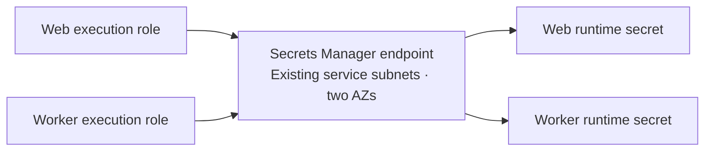

# Private runtime secret connectivity

**Prepare one private Secrets Manager endpoint for later ECS secret injection.** Apply only after this change is reviewed and merged.



| Boundary           | Contract                                                                                               |
| ------------------ | ------------------------------------------------------------------------------------------------------ |
| Opt-in             | `enable_runtime_secret_connectivity = false` by default; requires private connectivity                 |
| Network            | One IPv4 interface endpoint; private DNS; existing service subnets and endpoint SG                     |
| Policy             | Each exact execution role → `GetSecretValue` → its own full secret ARN only                            |
| Existing resources | Four image/log endpoints, three SG rules, routes, and `application_connectivity` output stay unchanged |
| State              | Existing network state; `prevent_destroy`; metadata only                                               |

- The endpoint supplies a private path, without NAT or public IPs. It does **not** grant execution-role permissions, populate secrets, or launch tasks. Those remain separate reviewed changes. [Secrets Manager endpoints](https://docs.aws.amazon.com/secretsmanager/latest/userguide/vpc-endpoint-overview.html), [endpoint policy boundary](https://docs.aws.amazon.com/vpc/latest/privatelink/vpc-endpoints-access.html)
- Two policy statements bind each role to its own secret. `aws:PrincipalArn` matches the IAM role behind an assumed-role session; no account-wide principal access. [AWS role context](https://docs.aws.amazon.com/IAM/latest/UserGuide/reference_policies_condition-keys.html#condition-keys-principalarn)
- This adds **two billable endpoint-AZ hours per elapsed hour**, plus applicable data processing. Review current regional [PrivateLink pricing](https://aws.amazon.com/privatelink/pricing/) before enabling.

## Prepare

1. Require the [private network](AWS-STAGING-NETWORK.md#private-application-connectivity), [execution roles](AWS-EXECUTION-ROLES.md), and [empty runtime secrets](AWS-SECRETS-FOUNDATION.md) to be qualified. Complete and clean up the original [image/log smoke](AWS-PRIVATE-TASK-SMOKE.md) first.
2. Copy each **full ARN** from the application root's `runtime_secrets` output. Verify its name, account, region, and ownership using metadata readback; do not retrieve values. Terraform validates exact names and six-character suffixes, but cannot establish ownership or existence from an ARN alone.
3. Repeat the existing [connectivity policy renderer](AWS-STAGING-NETWORK.md#prepare-plan-verify) with the same reviewed IDs and add **`--runtime-secrets`**. Update the existing **WallieStagingPrivateConnectivity** managed policy; no additional attachment. This adds only the Secrets Manager service/name to endpoint creation allowances. IAM still permits changing owned endpoint policies; Terraform and saved-plan review enforce their contents.
4. Add these settings to the existing private `network.tfvars.json`; retain account, region, AZ order, CIDR, and every existing opt-in:

```json
{
  "enable_private_connectivity": true,
  "enable_runtime_secret_connectivity": true,
  "runtime_secret_arns": {
    "web": "<full existing web runtime secret ARN>",
    "worker": "<full existing worker runtime secret ARN>"
  }
}
```

The snippet is an **addition**, not a replacement variables file. Keep both flags and the ARN map in future plans; removing/disabling them requests deletion and is blocked by `prevent_destroy`.

- The renderer keeps its 6,144-character managed-policy limit. Oregon fits; longer region names such as `ap-southeast-7` currently exceed the limit with this opt-in. A denied render needs a separately reviewed policy split/refactor; do not remove conditions or use wildcard services to fit.

## Plan and verify

- Start from the existing network's zero-drift plan, using its backend and Terraform/provider lock versions.
- Verify the expected non-root identity. Capture one raw `describe-vpc-endpoints` response filtered to the exact VPC and `com.amazonaws.<region>.secretsmanager`, with `--no-paginate --no-cli-pager`. First creation requires no endpoint and no continuation token; denial is not absence. Inspect an existing endpoint separately; do not adopt, replace, or retag it automatically.

```sh
terraform -chdir=infra/aws/staging-network plan \
  -var-file="$WALLIE_AWS_FILES/network.tfvars.json" \
  -out="$WALLIE_AWS_FILES/runtime-secret-connectivity.tfplan"
terraform -chdir=infra/aws/staging-network show \
  "$WALLIE_AWS_FILES/runtime-secret-connectivity.tfplan"
```

- Require **1 addition / 0 changes / 0 deletions**: only `aws_vpc_endpoint.runtime_secrets[0]`. Review private DNS, IPv4, exact existing VPC/subnets/SG, tags, and both complete role-to-secret policy statements.
- After review, apply that saved plan. Preserve state and enabled settings after partial failure; inspect and review a fresh recovery plan instead of replaying it.

```sh
terraform -chdir=infra/aws/staging-network apply \
  "$WALLIE_AWS_FILES/runtime-secret-connectivity.tfplan"
terraform -chdir=infra/aws/staging-network output runtime_secret_connectivity
terraform -chdir=infra/aws/staging-network plan \
  -var-file="$WALLIE_AWS_FILES/network.tfvars.json" -detailed-exitcode
```

- Capture the returned exact endpoint ID with `describe-vpc-endpoints --vpc-endpoint-ids`, then its exact ENI IDs with `describe-network-interfaces --network-interface-ids`; preserve raw responses and reject continuation tokens. Use `--no-paginate --no-cli-pager` for both.
- Require `available`, expected account/VPC/service, IPv4/private DNS, two ENIs in the two service subnets, only the existing endpoint SG, exact tags, and policy equality with the reviewed plan. Recheck the complete SG rules and original four endpoints as in the network runbook; require final full plan exit **0**.
- The original smoke verifier deliberately still accepts exactly **four image/log endpoint captures**. Do not add this endpoint to that manifest or relax its checks. Verify this fifth endpoint separately as above; its metadata qualification does not prove secret injection. A later bounded task must qualify injection after role reads and secret versions are reviewed.
