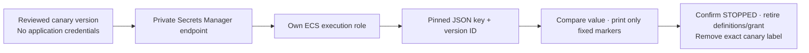

# Private runtime-secret injection smoke

**Qualify one non-sensitive canary per component through ECS secret injection.** Reuse the [private task smoke](AWS-PRIVATE-TASK-SMOKE.md) lifecycle; Wallie never starts and `deployable: false` remains.



| Boundary            | Injection gate                                                              |
| ------------------- | --------------------------------------------------------------------------- |
| Images/tasks        | Same signed digests, Fargate 1.4.0, private subnets, and no task role       |
| Secret identity     | Own full component ARN; version ID equals the new 32-hex `runId`            |
| Only injected key   | `WALLIE_SMOKE_CANARY`; expected `wallie-smoke:<component>:<runId>`          |
| Version selection   | `<full ARN>:WALLIE_SMOKE_CANARY::<runId>`; no implicit current version      |
| Definition families | `wallie-staging-{web,worker}-secret-injection-smoke`                        |
| Logs                | `wallie-secret-smoke-<runId>/smoke/<task-id>`; two fixed markers, no values |
| Result              | `offline-secret-injection-evidence-matches`; canary injection only          |

## Before preparation

- Review/merge this tooling and the separate [canary-write procedure](AWS-RUNTIME-SECRET-CANARY.md) before live changes. Use the [scoped execution-role option](AWS-EXECUTION-ROLES.md#optional-runtime-secret-access) and [private Secrets Manager endpoint](AWS-RUNTIME-SECRET-CONNECTIVITY.md).
- Canary creation starts from both owned containers with **zero versions, including deprecated versions**. Its first non-sensitive version uses the exact run ID and `AWSCURRENT`. Do not overwrite an existing version or start application services while a canary is current.
- The secret must contain only the reviewed canary JSON. Actual credentials, encryption keys, and application payloads remain later work. IAM grants access to the whole component secret, not individual JSON keys.
- Retain the reviewed administrator write/metadata evidence. This offline smoke verifier cannot prove what was written or authenticate capture provenance. [AWS version selection](https://docs.aws.amazon.com/AmazonECS/latest/developerguide/secrets-envvar-secrets-manager.html)

## Add the explicit gate

Keep all [smoke inputs and capture rules](AWS-PRIVATE-TASK-SMOKE.md#capture-a-launch-specific-manifest). Add only this field to `inputs.json`; use the same run ID as canary preparation:

```json
{
  "secretInjection": {
    "web": { "secretArn": "<full-reviewed-web-runtime-secret-arn>", "versionId": "<runId>" },
    "worker": { "secretArn": "<full-reviewed-worker-runtime-secret-arn>", "versionId": "<runId>" }
  }
}
```

- Capture **five exact endpoints** in `endpoints.json`: existing ECR API/DKR, Logs, S3, plus Secrets Manager. The fifth must have private DNS, both service subnets, the endpoint SG, six exact ownership tags, and the reviewed policy binding each role to its own full secret ARN.
- Copy each original `<component>-put.json` from the canary-write procedure **unchanged** into every launch snapshot. Do not repeat `PutSecretValue` or refresh its timestamps.
- For each component, capture fresh metadata with the existing bounded capture procedure (`--no-paginate --no-cli-pager`, exact account/region/ARN). Preserve these files beside the image/network captures:

| File                               | Read                                                                  |
| ---------------------------------- | --------------------------------------------------------------------- |
| `<component>-put.json`             | Original `PutSecretValue` response envelope; no new API call          |
| `<component>-secret.json`          | `describe-secret --secret-id <full ARN>`                              |
| `<component>-resource-policy.json` | `get-resource-policy --secret-id <full ARN>`                          |
| `<component>-versions.json`        | `list-secret-version-ids --secret-id <full ARN> --include-deprecated` |

- All envelopes contain `requestStartedAt`, `capturedAt`, and `response`. The original write response must match the full ARN, name, run ID, and exactly `AWSCURRENT`; all three metadata requests must start after that response. The versions envelope also contains **`request: {"SecretId":"<full ARN>","IncludeDeprecated":true}`**, recording the actual request. Omitted/false inclusion and continuation tokens fail closed. [AWS version inventory](https://docs.aws.amazon.com/secretsmanager/latest/apireference/API_ListSecretVersionIds.html)
- Require exact container identity/tags/description, default encryption, no rotation/replicas/deletion/resource policy, and **one version only**, matching `runId` with exactly `AWSCURRENT`. Metadata payload fields are rejected. The version creation time must fall within the original write request/response interval (one-second timestamp tolerance) and no later than its metadata capture. A fresh response from replaying an old version does not renew qualification.
- **Two independent windows:** original write start and version creation must each be at most **one hour old** at preparation and every actual task creation; metadata remains fresh for **15 minutes** at each launch. Recapture metadata as needed and preserve the original write envelope. Retrospective checks use the manifest and actual task times, never new timestamps.

```sh
node scripts/prepare-aws-private-task-smoke.mjs assemble \
  --manifest "$WALLIE_SMOKE_DIR/inputs.json" --readback-dir "$snapshot" \
  > "$snapshot/manifest.json"
```

## Run and clean up

- Use the existing `definition`, `policy`, `run`, `verify-network`, and `verify` commands with the new manifest. No new launch controller or permission to write/read secret values is added. Preserve original four-endpoint manifests/results; omitting `secretInjection` still selects that original gate.
- An administrator inspects the distinct families, registers one reviewed revision each, and attaches the rendered temporary task grant. Verify both execution roles against their exact secret-enabled manifests immediately before launch. IAM alone cannot prevent altered RunTask overrides; retain the fixed request review and temporary-grant cleanup rules.
- Run **web/0, web/1, worker/0, worker/1 sequentially**, with all four task creations inside both canaries’ original one-hour windows. If a window expires, stop qualification; do not rewrite or replay the canary to extend it. Retain the single-attempt RunTask journal, exact task ARN, live RUNNING ENI, normal exit 0, complete 2–20-page log chain, and 10-minute deadline. The program rejects a missing/wrong canary with exit 71 and no markers; it deletes the checked environment value before waiting. Never print values or environment dumps.
- Get logs from the injection prefix above. Their `kind` is `wallie-secret-injection-smoke`; connectivity-only markers, plaintext environment substitutes, another key/version, and extra output fail qualification.
- After all tasks are freshly confirmed STOPPED, remove the temporary grant and deregister only the two recorded injection revisions. Then use the separately reviewed canary cleanup to remove **only `AWSCURRENT` from the exact run ID version**, with no label moved to another version. Stop if ownership/labels changed; retain the exact container and deprecated canary version.
- Confirm both secrets have no labeled versions before later application population. Deprecated versions remain temporarily; this does **not** restore the original zero-version state. No automatic retry, canary rewrite, real-secret population, or AWS mutation is performed by this renderer.
