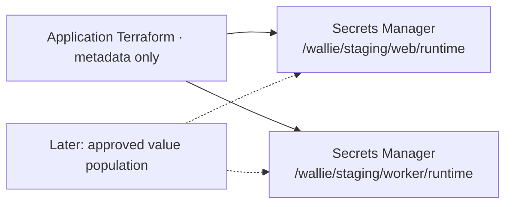

# Runtime secrets foundation

**Create two empty secret containers; populate values in a later reviewed workflow.** The application root keeps its existing state and defaults to no secrets.



| Setting      | Contract                                                                         |
| ------------ | -------------------------------------------------------------------------------- |
| Opt-in       | `enable_runtime_secrets = false` by default; enabling adds exactly two resources |
| Contents     | No versions, values, generated keys, or payload validation in this batch         |
| Encryption   | Same-account AWS-managed `aws/secretsmanager`; no customer KMS key               |
| Ownership    | `WallieStack=wallie-staging-application`, `Component=runtime-secrets`            |
| Retention    | Terraform `prevent_destroy`; 30-day recovery if later deletion is authorized     |
| State/output | Metadata only; output `runtime_secrets` contains component names and full ARNs   |

- No secret-version resources or value data sources in Terraform. [Provider metadata resource](https://github.com/hashicorp/terraform-provider-aws/blob/v6.65.0/internal/service/secretsmanager/secret.go)
- No rotation, replicas, resource policies, workloads, or secret-network endpoints are configured.
- Budget **$0.80/month for two secrets**, plus **$0.05 per 10,000 API calls**, before tax; checked September 22, 2026. Keep the flag false until the cost and plan are reviewed. [AWS pricing](https://aws.amazon.com/secrets-manager/pricing/)

## Prepare access

Prerequisites: merged changes, the verified [application foundation](AWS-APPLICATION-FOUNDATION.md), Terraform 1.16.3, Node.js 22, and temporary non-root AWS login. Keep the existing application/state grants and backend configuration.

```sh
umask 077
mkdir -p .wallie/aws
export AWS_PROFILE=wallie-staging
export AWS_REGION=us-west-2
WALLIE_AWS_ACCOUNT_ID='<your-12-digit-account-id>'
node scripts/prepare-aws-secrets.mjs --account-id "$WALLIE_AWS_ACCOUNT_ID" --region "$AWS_REGION" > .wallie/aws/secrets-policy.json
aws sts get-caller-identity
```

- Confirm the account and non-root identity. Create customer-managed **WallieStagingRuntimeSecrets** from the rendered policy and attach it to that identity; rendering makes no AWS calls.
- Grants exact-name creation/tagging and metadata reads only. No `UpdateSecret`, `PutSecretValue`, value reads, deletion, resource-policy writes, rotation, replication API, IAM, or KMS grants. Name patterns allow only AWS's six-character ARN suffix; unsuffixed exact ARNs are included only for missing-name `DescribeSecret` checks. [AWS authorization reference](https://docs.aws.amazon.com/service-authorization/latest/reference/list_secretsmanager.html)
- **Creation limit:** `CreateSecret` itself can contain an initial value; IAM does not enforce an empty payload. The reviewed provider call omits it, and post-create checks require zero versions. Creation conditions reject custom KMS keys and replica-region arguments. [CreateSecret](https://docs.aws.amazon.com/secretsmanager/latest/apireference/API_CreateSecret.html)
- Creation tagging requires all six fixed tags and cannot overwrite a different ownership marker. AWS supplies no create-only tagging condition: an untagged secret at either exact name could be claimed, so absence checks are mandatory. Metadata changes require a reviewed permission update; this grant omits `UpdateSecret` and tag removal.

## Check, plan, apply

```sh
aws secretsmanager describe-secret --secret-id /wallie/staging/web/runtime
aws secretsmanager describe-secret --secret-id /wallie/staging/worker/runtime
```

- Before first creation, require **`ResourceNotFoundException` for each exact name**. Stop on access denial, any existing secret, or scheduled deletion; never import, restore, retag, or overwrite automatically.
- Add `"enable_runtime_secrets": true` to the existing private `application.tfvars.json`; preserve every other setting. Keep it true in all later plans. The application variables renderer omits optional flags: rerendering requires restoring them. Disabling/removing the flag after creation requests deletion and is blocked by `prevent_destroy`.

```sh
WALLIE_AWS_FILES="$PWD/.wallie/aws"
terraform -chdir=infra/aws/staging-application init -lockfile=readonly -backend-config="$WALLIE_AWS_FILES/application.backend.hcl"
terraform -chdir=infra/aws/staging-application plan -var-file="$WALLIE_AWS_FILES/application.tfvars.json" -out="$WALLIE_AWS_FILES/secrets.tfplan"
terraform -chdir=infra/aws/staging-application show "$WALLIE_AWS_FILES/secrets.tfplan"
```

- Require **2 additions / 0 changes / 0 deletions**; existing cluster/log groups stay unchanged. Review exact names, tags, no values/versions/replicas/custom KMS, and recovery settings.
- After reviewing that saved plan:

```sh
terraform -chdir=infra/aws/staging-application apply "$WALLIE_AWS_FILES/secrets.tfplan"
terraform -chdir=infra/aws/staging-application output runtime_secrets
```

- For **each full ARN** from the output, perform metadata-only checks:

```sh
WALLIE_RUNTIME_SECRET_ARN='<full returned secret ARN>'
aws secretsmanager describe-secret --secret-id "$WALLIE_RUNTIME_SECRET_ARN"
aws secretsmanager get-resource-policy --secret-id "$WALLIE_RUNTIME_SECRET_ARN"
aws secretsmanager list-secret-version-ids --secret-id "$WALLIE_RUNTIME_SECRET_ARN" --include-deprecated
terraform -chdir=infra/aws/staging-application plan -var-file="$WALLIE_AWS_FILES/application.tfvars.json" -detailed-exitcode
```

- Require exact account/region/name and six Terraform tags; no deletion date, custom KMS key, rotation, replicas, resource policy, or versions. Require final full plan exit **0**. Do not retrieve values.
- Partial failure: preserve resources/state and the enabled flag; inspect metadata and review a new saved plan for only missing containers. Never replay the old plan. Stop on denied/ambiguous results; no automatic retry, adoption, deletion, or permission broadening.
- Offline mocks do not qualify live authorization or empty-container creation. Run the post-merge checks before claiming deployment success.

## Later: populate and inject

- Before real values, [prepare a non-sensitive canary version](AWS-RUNTIME-SECRET-CANARY.md) for the separately reviewed injection check. Its cleanup removes the staging label; the deprecated version remains temporarily.
- Empty containers have no `AWSCURRENT` version and cannot supply task values. Plan per-component JSON objects using existing secret environment names. Keep public URLs, publishable keys, and ordinary runtime settings outside secret storage. `SUPABASE_SECRET_KEY` stays server-only. [Supabase key boundaries](https://supabase.com/docs/guides/getting-started/api-keys)
- Web and worker share `WALLIE_ENCRYPTION_KEY` while sharing encrypted database records; preserve it during migration. Rotation requires re-encrypting existing data, not just replacing a value. Workspace credentials remain in Wallie's encrypted database.
- A component bundle is the IAM boundary; JSON keys are not separately authorized. Future task definitions must map each required environment variable explicitly using the returned full ARN, JSON key, and reviewed version selection.
- Add scoped execution-role reads and [private Secrets Manager connectivity](AWS-RUNTIME-SECRET-CONNECTIVITY.md); existing ECR/Logs/S3 endpoints do not provide it. ECS JSON-key injection requires Linux Fargate 1.4.0+; running tasks do not refresh rotated values automatically. Qualify coordinated rollout/rollback and worker drain before enabling it. [ECS secret injection](https://docs.aws.amazon.com/AmazonECS/latest/developerguide/secrets-envvar-secrets-manager.html)
