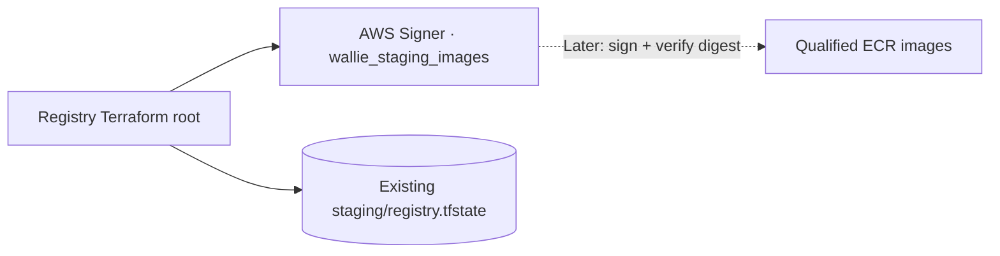

# AWS image-signing profile

**Prepare one AWS Signer profile; image signing and deployment remain blocked.** Apply only after this PR is reviewed and merged.



| Setting            | Value                                                         |
| ------------------ | ------------------------------------------------------------- |
| Name               | `wallie_staging_images`                                       |
| Platform           | `Notation-OCI-SHA384-ECDSA`                                   |
| Signature lifetime | 365 days; future releases must account for expiry             |
| Ownership          | `WallieStack=wallie-staging-registry`, `Component=signing`    |
| Destruction        | Terraform `prevent_destroy`; no cancellation/revocation grant |
| Outputs            | Profile name, ARN, version, version ARN, status               |

- AWS manages the OCI signing keys and certificate; no signing key belongs in Terraform, `.env`, or GitHub secrets. [AWS profile documentation](https://docs.aws.amazon.com/signer/latest/developerguide/signing-profiles.html)
- Name, platform, and validity changes require replacement in provider 6.65.0. Rotation needs a separately reviewed change; existing signatures must remain verifiable. [Provider resource](https://github.com/hashicorp/terraform-provider-aws/blob/v6.65.0/website/docs/r/signer_signing_profile.html.markdown)
- No `SignPayload` permission, signing job, ECR signing configuration, trust store, or deployment approval is introduced.

## Prepare access

Use the existing temporary CLI login and [registry backend/variables](AWS-STAGING-REGISTRY.md#prepare).

```sh
umask 077
mkdir -p .wallie/aws
export AWS_PROFILE=wallie-staging
export AWS_REGION=us-west-2
WALLIE_AWS_ACCOUNT_ID='<your-12-digit-account-id>'
node scripts/prepare-aws-registry.mjs signing-policy --account-id "$WALLIE_AWS_ACCOUNT_ID" --region "$AWS_REGION" > .wallie/aws/signing-profile-policy.json
aws sts get-caller-identity
```

- Confirm the expected account and a non-root identity.
- Create customer-managed **WallieStagingSigningProfileBootstrap** from that file. Attach it to `wallie-local` only for the reviewed infrastructure operation; detach it after verification and before publishing.
- Existing registry/state grants are still required. The image-publishing policy is unchanged; separate policy files do not isolate privileges when attached to the same identity.
- **Creation scope:** AWS requires `Resource: "*"` for `PutSigningProfile`. Conditions require the expected account, region, and six fixed request tags. The `Name` tag does **not** constrain the API's profile-name argument, platform, or validity. [AWS Signer IAM reference](https://docs.aws.amazon.com/service-authorization/latest/reference/list_signer.html)
- Read/tag grants target the exact profile ARN; metadata updates preserve the ownership marker. Bootstrap tagging can claim an untagged profile at that name, so the absence check below is mandatory.

## Check the name

```sh
aws signer get-signing-profile --profile-name wallie_staging_images --region "$AWS_REGION"
```

- Before first creation, require **`ResourceNotFoundException`**. Stop on access errors or any existing profile, including canceled/foreign profiles; do not import, retag, or overwrite it.
- Later operations require the same owned profile in this Terraform state. Keep the bootstrap grant detached outside reviewed infrastructure operations; reattach it for a future reviewed refresh/plan if needed.

## Plan and apply

Follow the [registry saved-plan procedure](AWS-STAGING-REGISTRY.md#plan-review-apply).

- Existing staging: **1 addition, 0 changes, 0 deletions**. Both ECR repositories must remain unchanged.
- Fresh installation: **3 additions** (two repositories + profile).
- Review the exact account/region, name, platform, 365-day validity, and ownership tags before applying the saved plan.

## Verify and remove bootstrap access

```sh
aws signer get-signing-profile --profile-name wallie_staging_images --region "$AWS_REGION"
terraform -chdir=infra/aws/staging-registry output signing_profile
```

- Require `Active`, the expected ARN/account/region, platform, validity, and tags. Record the profile version and version ARN from the readback; compare Terraform outputs.
- Run the final registry plan with `-detailed-exitcode`; require **0**. Then detach **WallieStagingSigningProfileBootstrap** in IAM.
- Mock tests cover configuration, output wiring, and account/root guards. Live IAM and creation are qualified only after merge; this PR has not created a profile.
- Next PR: digest signing + strict verification, only after [image qualification](AWS-IMAGE-PUBLISHING.md#verification-boundary) passes. Provenance, broader vulnerability scanning, and GitHub OIDC publishing remain later work.
