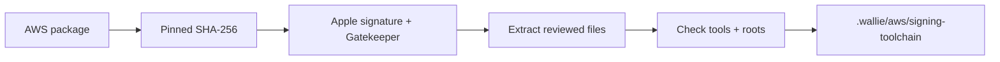

# Prepare the local signing tools

**Qualify a pinned Notation toolchain in an isolated project directory.** This batch supports macOS on Apple silicon and the commercial AWS signing root. Linux CI packaging and GovCloud qualification follow separately.



## Prepare

```sh
node scripts/prepare-aws-signing-toolchain.mjs
```

- Requires Node.js 22, macOS arm64, system curl 8.4 or newer, internet access, and functioning Apple trust services. Older curl cannot enforce the download limit for responses without a declared size.
- Pinned AWS bundle `2.2.0-1`: Notation `1.3.2`, AWS Signer plugin `1.0.2292`.
- Downloads the exact package pinned in `infra/aws/signing-toolchain.lock.json`. AWS's download URL is mutable; changed bytes fail verification until a reviewed pin update.
- Verifies the package before extraction. Does not run the package installer or its scripts.
- Creates `.wallie/aws/signing-toolchain` only if absent. Existing installations and symlinked parent directories are rejected.
- After a host crash or forced kill, inspect `.wallie/aws/.signing-toolchain-*` and `.signing-toolchain.prepare.lock`. Remove stale temporary files only after confirming no preparation process is running; never remove a lock held by an active run.
- Runs version, plugin, and certificate checks with isolated configuration. AWS credentials are neither required nor passed to the tools.
- Keeps the binaries, licenses, root certificate, and verification receipt under ignored `.wallie/`.

## Boundaries

| Check                                  | Purpose                                                   |
| -------------------------------------- | --------------------------------------------------------- |
| Pinned package and file hashes         | Reject changed downloads and extracted payloads           |
| Apple package signature and Gatekeeper | Authenticate AWS's distribution and notarization          |
| AWS publisher identity                 | Require `AMZN Mobile LLC (94KV3E626L)`                    |
| Pinned root certificate                | Keep trust material tied to the authenticated package     |
| Isolated configuration                 | Preserve the user's existing Notation and Docker settings |

- No global installation, signing-policy attachment, image signing, or application deployment.
- The root certificate alone authorizes no image: the [signing workflow](AWS-IMAGE-SIGNING.md) creates strict, version-pinned trust settings in fresh private configuration.
- A prepared toolchain is not a release approval. Recheck its files before use; later signing still requires current passing scans and exact source, digest, profile, and repository checks.
- Do not bypass signature, notarization, hash, or runtime-check failures. A changed vendor package or certificate requires a reviewed update.

## Sources

- [AWS package downloads and signature verification](https://docs.aws.amazon.com/signer/latest/developerguide/image-signing-prerequisites.html)
- [AWS certificate and trust-policy setup](https://docs.aws.amazon.com/signer/latest/developerguide/image-verification.html)
- [Notation configuration overrides](https://github.com/notaryproject/notation/blob/v1.3.2/cmd/notation/main.go)

## Local verification · September 21, 2026

- Real setup passed: package authentication, seven payload hashes, binary signatures, root identity/validity, and runtime inventory.
- Installed binaries still worked after the final directory move; repeat preparation rejected the existing installation.
- Notation accepted the version-pinned trust policy in a disposable configuration. The installation itself contains no trust policy or registry authentication.
- Private receipts record the checked files. No AWS API calls or signing occurred; live signature and revocation verification remain unqualified.

## Next

- Qualify the [gated signing workflow](AWS-IMAGE-SIGNING.md) against live AWS once the image blocker is resolved.
- Add Linux CI packaging, provenance, broader package scanning, and GitHub OIDC publishing.
- Existing web and worker images still fail the High-severity scan gate.
