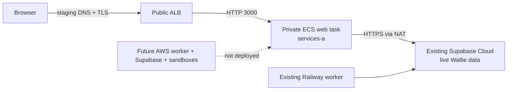

# AWS staging web milestone and replay

**September 26, 2026:** `aws-staging.wallie.dev` served the Wallie Next.js web container from a private ECS Fargate task behind a public HTTPS ALB. The web task reached the **existing hosted Wallie Supabase project** through a one-AZ NAT. This proved the web path only. The service was then scaled from one healthy task to **0/0**; the unused PostgreSQL qualification EC2 host was stopped. Billable-resource teardown is planned and requires the checks below before it can be called complete.

| Observed on September 26                                                         | Boundary                                                                                                                         |
| -------------------------------------------------------------------------------- | -------------------------------------------------------------------------------------------------------------------------------- |
| `https://aws-staging.wallie.dev` returned HTTP 200 with a valid TLS certificate. | The browser path and hosted web response worked; this alone does not prove login, writes, or a full session.                     |
| ECS reached 1/1 running and healthy, then 0/0 after scale-down.                  | Only the web service was launched; no AWS worker was deployed.                                                                   |
| The unused private EC2 qualification host was stopped.                           | It had no running PostgreSQL service. Stopping does not remove its EBS, endpoint, or log charges.                                |
| Supabase Auth allowed `https://aws-staging.wallie.dev/auth/confirm**`.           | The existing production project and live data remained in Supabase Cloud. `wallie.dev` and the Railway worker were not cut over. |

| Layer         | Canary                                    | Full AWS migration still needs                             |
| ------------- | ----------------------------------------- | ---------------------------------------------------------- |
| Web           | One private Fargate task behind HTTPS ALB | Durable service, monitoring, multi-AZ rollout and rollback |
| Data and Auth | Existing hosted Supabase project          | Self-hosted API, PostgreSQL, Storage, backup and recovery  |
| Jobs          | Existing Railway worker                   | AWS worker with drain and active-job recovery              |
| Sandboxes     | Existing external providers               | In-account execution for every required use case           |
| Edge/egress   | Staging DNS and one-AZ NAT                | Production cutover, WAF, reviewed egress and availability  |

## Reuse the checked-in staging infrastructure

This repository contains **five separate Terraform roots**, not a turnkey self-hosted Wallie installation. Use Terraform 1.16.3, the checked-in AWS provider 6.65.0 lock files, Node.js 22, a non-root AWS identity, and a commercial-region account you control. Keep backend files, plans, IDs, and secret metadata in ignored `.wallie/aws/`; never put credentials or secret values in Git.

1. **Own the inputs.** Select an AWS account, region, two distinct AZs, non-overlapping private `/16` CIDR, domain/DNS operator, and an isolated Supabase project for a new canary. Confirm them with `aws sts get-caller-identity`. Do not point a replay at Wallie's hosted production project or reuse its encryption key.
2. **Parameterize before applying.** The current hosted-web path is tied to Wallie's account and domain. Change the exact guards below and their tests; replacing IDs only in a private manifest is insufficient.
3. **Bootstrap state.** Use [`infra/aws/state-bootstrap.yaml`](../infra/aws/state-bootstrap.yaml) and `scripts/prepare-aws-state.mjs` to create the private versioned state bucket and separate backend keys `staging/{foundation,registry,application,postgres,backup}.tfstate`. Review the change set and the generated exact-account IAM policy before execution. Follow [state bootstrap](AWS-STATE-BOOTSTRAP.md).
4. **Build the network and registry.** Apply [`staging-network`](../infra/aws/staging-network) in the sequence in [network foundation](AWS-STAGING-NETWORK.md): foundation and hardening, private ECR/Logs endpoints and S3 gateway, runtime Secrets Manager endpoint, then the reviewed `services-a` NAT/HTTPS option. Preserve all prior opt-in flags and exact secret ARNs in the private variables file. Apply [`staging-registry`](../infra/aws/staging-registry), publish and verify a pinned web image digest, and review its scan and signature. See [registry](AWS-STAGING-REGISTRY.md) and [image publishing](AWS-IMAGE-PUBLISHING.md).
5. **Prepare the web runtime.** Apply [`staging-application`](../infra/aws/staging-application) for the ECS cluster, logs, and secret containers. Create a **separate canary project/key** and web secret through the reviewed, interactive workflow; register one digest-pinned web task revision and verify its complete ECS readback. The checked-in [visible-web guide](AWS-VISIBLE-WEB.md) describes the original existing-project canary and its exact live-data gates; substitute the newly reviewed origin and credential contract after parameterization.
6. **Publish HTTPS in stages.** Request the staging ACM certificate, create only its exact validation CNAME at your DNS provider, and confirm `ISSUED`. Apply the ALB and ECS service with desired count **zero**, then review a separate plan raising it to **one**. Test the ALB with staging SNI/Host before publishing the site CNAME. Keep the production hostname and site URL untouched.

The [`staging-postgres`](../infra/aws/staging-postgres) root provisions a private qualification host and EBS volume; [`staging-backup`](../infra/aws/staging-backup) provisions an initially empty, upload-blocked bucket. Neither deploys PostgreSQL, Supabase Auth/Data API/Realtime/Storage, an AWS worker, or an in-account sandbox. Those remain [migration-plan](AWS_VPC_DEPLOYMENT_PLAN.md) work.

| Input or current fixed identifier                                             | Where to review for a new account                                                                                                                                                 |
| ----------------------------------------------------------------------------- | --------------------------------------------------------------------------------------------------------------------------------------------------------------------------------- |
| Account `111614490109`, region `us-west-2`, operator `wallie-local`           | Terraform `aws_account_id`/`aws_region` inputs; hosted-web secret/grant helpers; visible-web grant renderer. Other account-aware renderers take flags.                            |
| Host `aws-staging.wallie.dev`                                                 | `staging-application/visible-web-variables.tf`, hosted origin in `prepare-aws-app-task-definition.mjs`, ACM domain in `prepare-aws-visible-web-grant.mjs`, DNS and Auth callback. |
| Existing web secret full ARN                                                  | `prepare-aws-hosted-web-secret-grant.mjs`, `populate-aws-hosted-web-secret.mjs`, private manifest and exact network/role grants. Generate a secret in your own account.           |
| `wallie-staging` cluster, repositories, task family, policies, tags, and logs | Terraform roots, renderers, policy templates, and tests. Keep names only when they are unused in your account; parameterize them for parallel installations.                      |

### Replay verification checklist

- [ ] Caller identity and each Terraform provider `allowed_account_ids` match the intended account/region; each deployed root has its own backend key and lock.
- [ ] Saved, untargeted Terraform plans show only reviewed changes; after apply, full plans exit **0**. Read back live AWS resources, not only Terraform outputs.
- [ ] Private web task has no public IP, exact image digest/task revision/secret version, the reviewed two egress security groups plus ALB ingress group, and only the intended Supabase project URL.
- [ ] ECS service reaches **1/1**; task/container are `RUNNING`/`HEALTHY`; ALB target is healthy; web logs show readiness; the read-only Supabase Data API health query succeeds.
- [ ] ACM is `ISSUED`; staging SNI/Host returns HTTP 200 over valid HTTPS; browser configuration contains the intended public Supabase origin/key; staging DNS points only to the reviewed ALB.
- [ ] Auth redirect allowlist includes the intended staging callback pattern, with production entries unchanged; test sign-in and read-only dashboard access separately. Keep job submission disabled until an AWS worker and isolated data path exist.
- [ ] After the canary, remove the staging site CNAME, scale the ECS service to **0/0**, and confirm no running or pending tasks or healthy ALB targets.

## Teardown order and protections

**Status: planned; verify every line before reporting completion.** A zero-task ECS service still leaves the ALB, NAT/EIP, interface endpoints, EBS, ECR images, logs, secrets, and S3 object versions billable. Use an exact-account administrator teardown grant; the deployment policies intentionally omit many delete actions. Preserve private state and a reviewed inventory until all resources it tracks are gone.

1. **Stop traffic and compute:** remove the external staging site CNAME and the hosted Supabase Auth redirect entry; verify ECS desired/running/pending **0/0/0**, no standalone tasks, and the PostgreSQL host stopped. Decide whether any EBS data, backup versions, images, logs, or Terraform state need an encrypted export before deletion. Check for other consumers of shared keys, roles, or DNS records.
2. **Application root:** disable ALB and CloudWatch log-group native deletion protection, then remove `prevent_destroy` in a reviewed teardown change. Keep all current opt-ins and IDs in the variables file until the root is destroyed. Review and apply a saved destroy plan for the ECS service, listener, ALB, target group, certificate, web/security groups, secret containers, logs, and cluster. Deregister the manually registered task revision and retire its execution role after no task uses it.
3. **PostgreSQL and backup roots:** confirm the host has no database data and no attached consumers. Review and destroy the stopped instance, standalone gp3 volume, SSM endpoints, host IAM resources, and session logs after relaxing their protections. Inspect **all** backup object versions, delete markers, legal holds, and Object Lock retention; an empty-looking bucket listing is insufficient. Remove `prevent_destroy`; `force_destroy = false` still requires an actually empty bucket. Do not bypass unexpired retention.
4. **Registry and network roots:** delete ECR image manifests/signatures only after no task needs them; `force_delete = false` requires empty repositories. Review destroy of repositories and, unless deliberately retained, the signing profile. Destroy NAT/EIP and interface endpoints after all tasks/host are gone, then security groups, routes, subnets, and VPC. Their Terraform `prevent_destroy` guards need explicit review and removal. Confirm NAT, public IPv4, and all interface endpoints are absent in AWS, not just absent from state.
5. **State and access last:** after all five roots are destroyed and verified, retire unused manual task definitions, execution roles, and temporary deployment policies/attachments. Schedule deletion of an exclusive customer KMS key. The CloudFormation state bucket/policy use `DeletionPolicy: Retain`; deleting the stack **does not empty or delete the bucket**. Inspect and delete every state and lock object version/delete marker, then remove the retained bucket/policy with a separate reviewed action. Recheck regional inventory and billing after the next reporting interval.

An empty VPC shell, ECS cluster, IAM policy, or Signer profile may be useful to retain and has no resource-hour charge. If retaining Terraform-managed controls, also retain their state backend and account for its S3 versions and requests. A full no-storage teardown removes those controls and the backend after an encrypted audit export.
