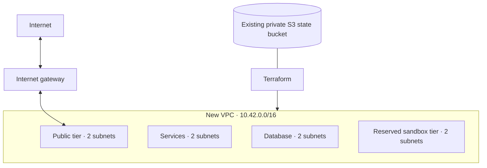

# AWS staging network

**Reserve a dedicated two-AZ network before adding workloads.** This PR defines 26 Terraform-managed resources; deployment follows review and merge.



| Tier                | Default /24 ranges         | Non-local routes                           |
| ------------------- | -------------------------- | ------------------------------------------ |
| Public              | `10.42.0.0`, `10.42.1.0`   | IPv4 default route to the internet gateway |
| Services            | `10.42.16.0`, `10.42.17.0` | None                                       |
| Database            | `10.42.32.0`, `10.42.33.0` | None                                       |
| Sandbox reservation | `10.42.48.0`, `10.42.49.0` | None                                       |

- One explicit route table per subnet; automatic public IPv4 assignment and IPv6 assignment disabled.
- No compute, load balancer, NAT gateway, paid endpoint, or public IPv4 allocation.
- Existing VPCs are not adopted. AWS-created defaults within the new VPC remain unmanaged in this batch.
- **Subnets are reservations, not security boundaries:** the VPC-local route still connects tiers. Harden the default security group and define workload/sandbox security groups, ACLs, and egress controls before launching anything.
- The sandbox provider remains unqualified; reserving addresses does not select or qualify one.

## Prepare

Prerequisites: Terraform **1.16.3**, Node.js 22, AWS CLI login, and the completed [state bootstrap](AWS-STATE-BOOTSTRAP.md) with reduced `WallieStagingStateAccess` attached. Provider **6.65.0** and its checksums are committed.

From the repository root, replace the account placeholder and choose two AZs confirmed by [discovery](AWS-DISCOVERY.md):

```sh
umask 077
mkdir -p .wallie/aws
export AWS_PROFILE=wallie-staging
export AWS_REGION=us-west-2
WALLIE_AWS_ACCOUNT_ID='<your-12-digit-account-id>'
node scripts/prepare-aws-network.mjs policy --account-id "$WALLIE_AWS_ACCOUNT_ID" --region "$AWS_REGION" > .wallie/aws/network-policy.json
node scripts/prepare-aws-network.mjs variables --account-id "$WALLIE_AWS_ACCOUNT_ID" --region "$AWS_REGION" --availability-zones us-west-2a,us-west-2b > .wallie/aws/network.tfvars.json
node scripts/prepare-aws-state.mjs backend --account-id "$WALLIE_AWS_ACCOUNT_ID" --region "$AWS_REGION" > .wallie/aws/staging.backend.hcl
```

- Rendering is offline; account files, downloaded providers, state, and plans are ignored by Git. Keep state and plans private.
- Confirm the /16 does not overlap existing or connected networks; use `--cidr` to select another aligned RFC 1918 /16. Keep AZ ordering stable after creation.
- In **IAM → Policies → Create policy → JSON**, create customer-managed `WallieStagingNetwork` from `network-policy.json`, then attach it to `wallie-local`.
- The policy allows regional inventory reads and creation/management of networks marked `WallieStack=wallie-staging-network`. It cannot mark unrelated existing resources as owned or change/remove that marker. No compute, SG/ACL mutation, IAM, or state-object grant is included.
- IAM constrains resource ownership; the reviewed Terraform plan constrains CIDRs, route destinations, and resource counts.

## Plan, review, apply

Run after the PR is merged. The backend is the default workspace at `staging/foundation.tfstate`, with S3 locking and an account guard.

```sh
WALLIE_AWS_FILES="$PWD/.wallie/aws"
terraform -chdir=infra/aws/staging-network init -lockfile=readonly -backend-config="$WALLIE_AWS_FILES/staging.backend.hcl"
terraform -chdir=infra/aws/staging-network plan -var-file="$WALLIE_AWS_FILES/network.tfvars.json" -out="$WALLIE_AWS_FILES/network.tfplan"
terraform -chdir=infra/aws/staging-network show "$WALLIE_AWS_FILES/network.tfplan"
```

- Confirm the account, region, two AZs, CIDRs, routes, and **26 additions / no changes / no deletions** for first deployment.
- The provider enforces the expected account; the VPC also rejects root, mismatched identity, and unavailable AZs. Offline mock tests do not prove effective AWS permissions.
- After reviewing the saved plan:

```sh
terraform -chdir=infra/aws/staging-network apply "$WALLIE_AWS_FILES/network.tfplan"
terraform -chdir=infra/aws/staging-network output
terraform -chdir=infra/aws/staging-network plan -var-file="$WALLIE_AWS_FILES/network.tfvars.json" -detailed-exitcode
```

- Verify the final plan exits `0` (no changes), then inspect subnet and route-table associations in AWS. Verify private tiers have only the implicit local route.
- Keep the state-access policy attached. Recover interrupted operations from Terraform state; do not relabel or adopt existing resources to bypass an authorization failure.

## Cost and next gate

- These empty [VPC/subnet/route resources](https://aws.amazon.com/vpc/faqs/) and the [internet gateway](https://docs.aws.amazon.com/vpc/latest/userguide/VPC_Internet_Gateway.html) have **no fixed network service charge**. State storage retains its separate usage charges.
- Before workloads: exact-ID SG/ACL hardening, scoped workload IAM, TLS, secrets, monitoring, and a reviewed egress/capacity cost estimate. NAT gateways, interface endpoints, load balancers, public IPv4 addresses, and compute will add charges when introduced.
- CI uses mocked providers only: formatting, locked provider initialization without a backend, validation, and network safety tests. Live IAM, state locking, provisioning, and final drift checks are separate deployment gates.
