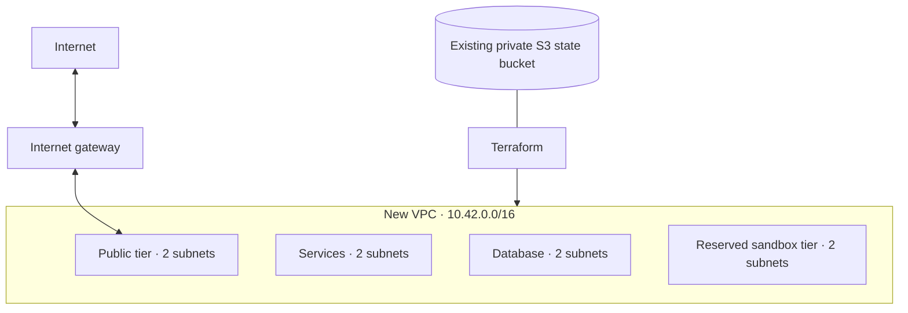
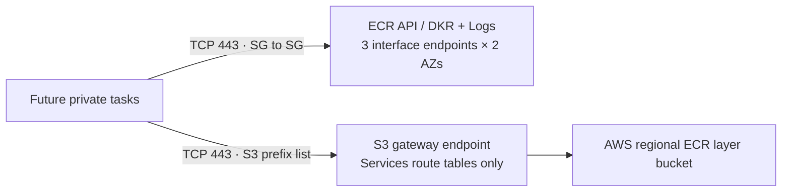

# AWS staging network

**Reserve a dedicated two-AZ network before adding workloads.** Deploy 26 foundation resources, then four [hardening resources](AWS-NETWORK-HARDENING.md). The separately enabled [private connectivity batch](#private-application-connectivity) adds nine resources. Each deployment follows review and merge.



| Tier                | Default /24 ranges         | Non-local routes                           |
| ------------------- | -------------------------- | ------------------------------------------ |
| Public              | `10.42.0.0`, `10.42.1.0`   | IPv4 default route to the internet gateway |
| Services            | `10.42.16.0`, `10.42.17.0` | None                                       |
| Database            | `10.42.32.0`, `10.42.33.0` | None                                       |
| Sandbox reservation | `10.42.48.0`, `10.42.49.0` | None                                       |

- One explicit route table per subnet; automatic public IPv4 assignment and IPv6 assignment disabled.
- Foundation/hardening add no compute, load balancer, NAT gateway, paid endpoint, or public IPv4 allocation. Keep `enable_private_connectivity = false` for those steps.
- Existing VPCs are not adopted. The next step manages only this new VPC's default security group.
- **Subnets are reservations, not security boundaries:** the VPC-local route still connects tiers. Harden the default security group and define workload/sandbox security groups, ACLs, and egress controls before launching anything.
- The sandbox provider remains unqualified; reserving addresses does not select or qualify one.

## Prepare

Prerequisites: Terraform **1.16.3**, Node.js 22, AWS CLI login, and the completed [state bootstrap](AWS-STATE-BOOTSTRAP.md) with reduced `WallieStagingStateAccess` attached. Provider **6.65.0** and its checksums are committed.

From the repository root, replace the account placeholder and choose two AZs confirmed by [discovery](AWS-DISCOVERY.md):

```sh
umask 077
mkdir -p .wallie/aws
export AWS_PROFILE=wallie-staging
export AWS_REGION=us-west-2
WALLIE_AWS_ACCOUNT_ID='<your-12-digit-account-id>'
node scripts/prepare-aws-network.mjs policy --account-id "$WALLIE_AWS_ACCOUNT_ID" --region "$AWS_REGION" > .wallie/aws/network-policy.json
node scripts/prepare-aws-network.mjs variables --account-id "$WALLIE_AWS_ACCOUNT_ID" --region "$AWS_REGION" --availability-zones us-west-2a,us-west-2b > .wallie/aws/network.tfvars.json
node scripts/prepare-aws-state.mjs backend --account-id "$WALLIE_AWS_ACCOUNT_ID" --region "$AWS_REGION" > .wallie/aws/staging.backend.hcl
```

- Rendering is offline; account files, downloaded providers, state, and plans are ignored by Git. Keep state and plans private.
- Confirm the /16 does not overlap existing or connected networks; use `--cidr` to select another aligned RFC 1918 /16. Keep AZ ordering stable after creation.
- In **IAM → Policies → Create policy → JSON**, create customer-managed `WallieStagingNetwork` from `network-policy.json`, then attach it to `wallie-local`.
- The policy allows regional inventory reads and creation/management of networks marked `WallieStack=wallie-staging-network`. It cannot mark unrelated existing resources as owned or change/remove that marker. No compute, SG/ACL mutation, IAM, or state-object grant is included.
- IAM constrains resource ownership; the reviewed Terraform plan constrains CIDRs, route destinations, and resource counts.

## Plan, review, apply

Run after the PR is merged. The backend is the default workspace at `staging/foundation.tfstate`, with S3 locking and an account guard.

For a **fresh network only**, bootstrap the foundation first to obtain the exact resource IDs required by the hardening IAM policy. The target below includes all 26 foundation resources through their dependencies. [Targeting is exceptional](https://developer.hashicorp.com/terraform/cli/commands/plan#resource-targeting): finish with the full hardening plan; use untargeted plans for subsequent changes.

```sh
WALLIE_AWS_FILES="$PWD/.wallie/aws"
terraform -chdir=infra/aws/staging-network init -lockfile=readonly -backend-config="$WALLIE_AWS_FILES/staging.backend.hcl"
terraform -chdir=infra/aws/staging-network plan -target=aws_route_table_association.tier -var-file="$WALLIE_AWS_FILES/network.tfvars.json" -out="$WALLIE_AWS_FILES/network.tfplan"
terraform -chdir=infra/aws/staging-network show "$WALLIE_AWS_FILES/network.tfplan"
```

- Confirm the account, region, two AZs, CIDRs, routes, and **26 additions / no changes / no deletions** for first deployment.
- The provider enforces the expected account; the VPC also rejects root, mismatched identity, and unavailable AZs. Offline mock tests do not prove effective AWS permissions.
- After reviewing the saved plan:

```sh
terraform -chdir=infra/aws/staging-network apply "$WALLIE_AWS_FILES/network.tfplan"
terraform -chdir=infra/aws/staging-network output
```

- Inspect subnet and route-table associations in AWS; private tiers must have only the implicit local route. Continue immediately to [network hardening](AWS-NETWORK-HARDENING.md), whose full plan should add four managed resources; that guide ends with the zero-diff check.
- Keep the state-access policy attached. Recover interrupted operations from Terraform state; do not relabel or adopt existing resources to bypass an authorization failure.

## Cost and next gate

- These empty [VPC/subnet/route resources](https://aws.amazon.com/vpc/faqs/) and the [internet gateway](https://docs.aws.amazon.com/vpc/latest/userguide/VPC_Internet_Gateway.html) have **no fixed network service charge**. State storage retains its separate usage charges.
- Before workloads: scoped workload IAM, TLS, secrets, monitoring, and a reviewed external-egress/capacity cost estimate. Private image/log connectivity is the next separately enabled batch below.
- CI uses mocked providers only: formatting, locked provider initialization without a backend, validation, and network safety tests. Live IAM, state locking, provisioning, and final drift checks are separate deployment gates.

## Private application connectivity

**Enable private ECR pulls and application logs after the empty VPC is hardened.** This batch launches no tasks and supplies no internet egress.



| Added resources       | Boundary                                                                        |
| --------------------- | ------------------------------------------------------------------------------- |
| 3 interface endpoints | Private DNS; IPv4; services-a/b; dedicated endpoint security group              |
| 1 S3 gateway endpoint | Only services-a/b route tables; only reads from AWS's regional ECR layer bucket |
| 2 security groups     | Separate task and endpoint groups; no task ingress or endpoint egress           |
| 3 rules               | Task → endpoint HTTPS, endpoint ← task HTTPS, task → S3 prefix-list HTTPS       |

- ECR policies permit authentication and pulls from this account's `wallie-staging/web` and `wallie-staging/worker` only. Logs permits creating streams and writing events in the two application log groups; it cannot create groups or read logs. Task execution IAM is a later batch.
- The S3 policy intentionally allows AWS-owned principals to read `prod-<region>-starport-layer-bucket/*`: ECR layer URLs use that bucket. Requiring our account there would block pulls. It allows no object writes or bucket listing. [AWS endpoint requirements and minimum S3 policy](https://docs.aws.amazon.com/AmazonECR/latest/userguide/vpc-endpoints.html)
- Database/sandbox/public route tables and the default SG remain unchanged. The existing `route = []` guard still rejects ordinary non-local routes; [provider 6.65.0 ignores endpoint-generated prefix-list routes](https://github.com/hashicorp/terraform-provider-aws/blob/v6.65.0/internal/service/ec2/vpc_route_table.go#L895-L899), which the S3 endpoint manages.
- This supports commercial AWS only. Secrets access, external integrations, ingress, sandbox connectivity, and workloads remain later batches.

### Cost before enabling

Oregon estimate, checked September 21, 2026; assume 730 hours/month:

| Charge                                | Estimate                                   |
| ------------------------------------- | ------------------------------------------ |
| 3 endpoints × 2 AZs × $0.01/hour      | **$43.80/month**, including while idle     |
| Interface data processing             | $0.01/GB for the first PB/month            |
| S3 gateway endpoint / security groups | No endpoint-hour or data-processing charge |

- ECR storage, CloudWatch ingestion/retention, and applicable data transfer remain separate. No NAT, public IPv4, or compute charges are introduced here. [Oregon price list](https://pricing.us-east-1.amazonaws.com/offers/v1.0/aws/AmazonVPC/current/us-west-2/index.json), [PrivateLink pricing](https://aws.amazon.com/privatelink/pricing/), [S3 gateway pricing](https://docs.aws.amazon.com/vpc/latest/privatelink/gateway-endpoints.html)
- Leave the flag false until this cost and the saved plan are reviewed. Disabling it after creation would request deletion; `prevent_destroy` blocks endpoint/group deletion. Decommissioning needs a separate reviewed change and permissions.

### Prepare, plan, verify

1. Start from the hardened network's zero-diff plan. Obtain the exact VPC, services-a/b subnet, and services-a/b route-table IDs from its output. In VPC → Managed prefix lists, select the **AWS-owned IPv4** `com.amazonaws.<region>.s3` list and record its ARN. Verify every ID, relationship, and ownership in AWS; the renderer checks syntax, region, and AWS ownership format only.
2. Render a separate **WallieStagingPrivateConnectivity** customer-managed policy. This leaves the foundation policy unchanged and limits existing-resource authorization to these IDs:

```sh
node scripts/prepare-aws-private-connectivity.mjs \
  --account-id "$WALLIE_AWS_ACCOUNT_ID" --region "$AWS_REGION" \
  --vpc-id '<vpc-id>' \
  --services-subnet-a-id '<subnet-id>' --services-subnet-b-id '<subnet-id>' \
  --services-route-table-a-id '<rtb-id>' --services-route-table-b-id '<rtb-id>' \
  --s3-prefix-list-arn 'arn:aws:ec2:<region>:aws:prefix-list/<pl-id>' \
  > .wallie/aws/private-connectivity-policy.json
```

3. Review and attach the policy to the non-root temporary-login identity, retaining existing network/hardening/state permissions. Require absence of both named security groups and all four selected service endpoints in this VPC before first creation. Never import or retag existing resources to bypass a denial.
4. Add `"enable_private_connectivity": true` to the existing private `network.tfvars.json`; preserve its account, region, AZ order, and CIDR. Retain `true` in every subsequent network plan. The older variables renderer does not emit this flag: if rerendering that file, restore and review the flag before planning. An omitted/false flag requests teardown; `prevent_destroy` blocks accidental endpoint/group deletion.

```sh
aws sts get-caller-identity
terraform -chdir=infra/aws/staging-network plan -var-file="$WALLIE_AWS_FILES/network.tfvars.json" -out="$WALLIE_AWS_FILES/private-connectivity.tfplan"
terraform -chdir=infra/aws/staging-network show "$WALLIE_AWS_FILES/private-connectivity.tfplan"
```

- Require **9 additions / 0 changes / 0 deletions** against the existing hardened stack. Review exact subnet/route/group associations, endpoint policies, ownership tags, and private DNS before applying this saved plan.
- After a partial apply, retain `true` and remote state; inspect state and AWS, then review a fresh plan for only the remaining resources. Stop on denial. Do not replay the original plan, disable the flag, import resources, or broaden permissions automatically. Created endpoints continue accruing charges.
- Deployment IAM restricts creation by names, service names, ownership, and existing parent IDs. It permits configuration of owned endpoints/groups; IAM does **not** constrain rule ports/destinations or endpoint-policy contents. No compute, IAM administration, endpoint/group deletion, or tag removal is granted.
- The provider removes each new SG's default allow-all egress, creates tagged rules, and reads endpoints, rules, and prefix lists. Rule updates use `ModifySecurityGroupRules`; its exact AWS-owned S3 prefix-list grant authorizes only a rule's reference, never editing the list. Keep tag keys stable; removing tags requires a reviewed policy change. Optional statement IDs are omitted to stay within IAM's 6,144-character limit. [EC2 authorization reference](https://docs.aws.amazon.com/service-authorization/latest/reference/list_ec2.html)
- After apply, inspect `application_connectivity` outputs and AWS readback: all four endpoints available; exact services/VPC/subnets/route tables; reviewed policies, tags, and private DNS. **Inspect every rule:** task SG has zero ingress and exactly the two outbound HTTPS rules; endpoint SG has exactly the inbound task-SG HTTPS rule and zero egress. No IPv6 or CIDR rules.
- Standalone rule resources do not detect unrelated extra rules. Exact live rule inspection remains required even when the final full Terraform plan exits **0**. Do not attach workloads until both checks pass.
- This batch is unqualified until post-merge live apply/readback. A future private task must prove image pull and log delivery with its reviewed execution role; mocked Terraform tests do not establish live IAM or connectivity.
