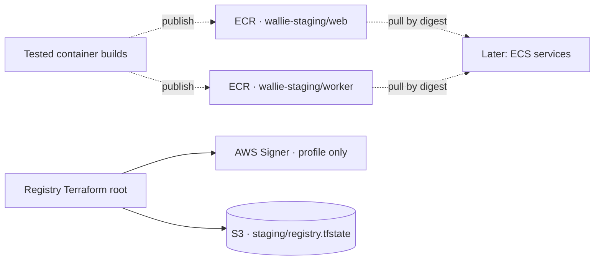

# AWS staging image registry

**Manage two private ECR repositories and one image-signing profile.** Deploy after review and merge. Existing installations add only the profile; see the [signing bootstrap steps](AWS-SIGNING-PROFILE.md).



| Setting    | Value                                                                    |
| ---------- | ------------------------------------------------------------------------ |
| Image tags | Immutable, no exclusions                                                 |
| Encryption | AES-256, managed by ECR                                                  |
| Scanning   | Repository basic scan-on-push enabled                                    |
| Deletion   | Terraform `prevent_destroy`; `force_delete = false`; no IAM delete grant |
| State      | Existing private bucket, separate registry key and lock                  |

- This Terraform root configures repositories and the signing profile. Image publishing and signing are separate operations; no compute, lifecycle expiration, repository sharing, or account-wide scanning/signing changes.
- ECR is a regional AWS service outside the VPC. Private access from workloads needs a later endpoint/egress decision.
- Repository settings do not establish the account's effective scanning mode. Before publishing, inspect ECR **Private registry → Scanning**, verify repository coverage, and check actual findings. [Basic scanning covers OS packages; enhanced scanning also covers language packages](https://docs.aws.amazon.com/AmazonECR/latest/userguide/image-scanning.html).

## Prepare

Prerequisites: Terraform **1.16.3**, Node.js 22, temporary AWS CLI login, and the completed [state bootstrap](AWS-STATE-BOOTSTRAP.md). Provider **6.65.0** is locked. No network outputs are needed.

```sh
umask 077
mkdir -p .wallie/aws
export AWS_PROFILE=wallie-staging
export AWS_REGION=us-west-2
WALLIE_AWS_ACCOUNT_ID='<your-12-digit-account-id>'
node scripts/prepare-aws-registry.mjs policy --account-id "$WALLIE_AWS_ACCOUNT_ID" --region "$AWS_REGION" > .wallie/aws/registry-policy.json
node scripts/prepare-aws-registry.mjs variables --account-id "$WALLIE_AWS_ACCOUNT_ID" --region "$AWS_REGION" > .wallie/aws/registry.tfvars.json
node scripts/prepare-aws-state.mjs access-policy --account-id "$WALLIE_AWS_ACCOUNT_ID" --region "$AWS_REGION" > .wallie/aws/state-access-policy.json
node scripts/prepare-aws-state.mjs backend --component registry --account-id "$WALLIE_AWS_ACCOUNT_ID" --region "$AWS_REGION" > .wallie/aws/registry.backend.hcl
aws sts get-caller-identity
```

- Confirm the intended account and non-root identity. Rendered files contain no credentials; keep plans and state private under ignored `.wallie/`.
- In IAM, create customer-managed **WallieStagingRegistry** from `registry-policy.json`; attach it to `wallie-local`.
- Update the existing **WallieStagingStateAccess** policy with the new `state-access-policy.json` as its default version. It retains foundation access and adds only the registry state key and lock. Neither state object can be deleted by this grant.
- Prepare the separate [signing bootstrap policy](AWS-SIGNING-PROFILE.md#prepare-access) before planning this root.
- Keep the existing network backend file unchanged. The registry uses the default Terraform workspace and **`staging/registry.tfstate`**, never `staging/foundation.tfstate`.

## Check names before creating

```sh
aws ecr describe-repositories --registry-id "$WALLIE_AWS_ACCOUNT_ID" --repository-names wallie-staging/web
aws ecr describe-repositories --registry-id "$WALLIE_AWS_ACCOUNT_ID" --repository-names wallie-staging/worker
```

- First deployment: require **`RepositoryNotFoundException` for each name**. Access errors are not evidence of absence. Stop if either repository exists; do not import or retag it without separate review.
- IAM is limited to those two exact names, account, region, and ownership tag. ECR has no create-only tagging condition: initial tagging also permits claiming an untagged repository at either name. The absence check is required.
- The grant permits changing scanning and tag-mutability settings on owned repositories; Terraform sets their reviewed values. It grants no login token, image push/pull, repository/image deletion, IAM, or registry-wide configuration access.

- Existing managed repositories: inspect their settings and Terraform state instead of requiring absence. Always complete the [signing profile absence check](AWS-SIGNING-PROFILE.md#check-the-name) before its first creation.

## Plan, review, apply

```sh
WALLIE_AWS_FILES="$PWD/.wallie/aws"
terraform -chdir=infra/aws/staging-registry init -lockfile=readonly -backend-config="$WALLIE_AWS_FILES/registry.backend.hcl"
terraform -chdir=infra/aws/staging-registry plan -var-file="$WALLIE_AWS_FILES/registry.tfvars.json" -out="$WALLIE_AWS_FILES/registry.tfplan"
terraform -chdir=infra/aws/staging-registry show "$WALLIE_AWS_FILES/registry.tfplan"
```

- Fresh installation: **three additions, no changes, no deletions** (two repositories + one profile).
- Existing two-repository installation: **one addition, no changes, no deletions** (profile only).
- Check exact names, account/region, encryption, scanning, immutable tags, ownership tags, and the profile settings in the [signing guide](AWS-SIGNING-PROFILE.md).
- After reviewing the saved plan:

```sh
terraform -chdir=infra/aws/staging-registry apply "$WALLIE_AWS_FILES/registry.tfplan"
terraform -chdir=infra/aws/staging-registry output
aws ecr describe-repositories --registry-id "$WALLIE_AWS_ACCOUNT_ID" --repository-names wallie-staging/web wallie-staging/worker
terraform -chdir=infra/aws/staging-registry plan -var-file="$WALLIE_AWS_FILES/registry.tfvars.json" -detailed-exitcode
```

- Verify repository and [signing profile readback](AWS-SIGNING-PROFILE.md#verify-and-remove-bootstrap-access) match the plan; the final plan must exit **0**. CI mocks do not prove live IAM or effective scanning. Detach the signing bootstrap grant afterward, before image publishing.
- No fixed repository charge; stored images and applicable transfer incur [ECR usage charges](https://aws.amazon.com/ecr/pricing/). Empty repositories add no image storage; Terraform state retains its separate S3 usage.
- Continue with [manual image publishing](AWS-IMAGE-PUBLISHING.md); actual signing and release verification remain separate PRs. Retention must preserve deployed and rollback images; no expiration policy is added here.
