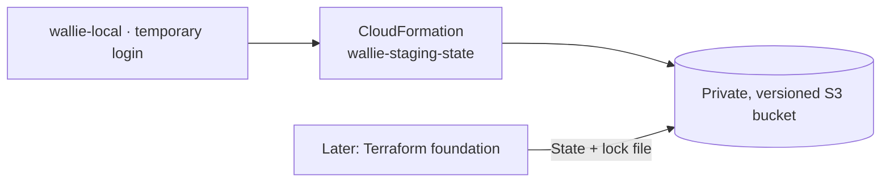

# AWS state bootstrap

**Create one private S3 bucket for Terraform state. Review and merge this PR before running the AWS steps.**



- [Template](../infra/aws/state-bootstrap.yaml): `wallie-staging-tfstate-<account>-<region>` and its bucket policy.
- Versioning, SSE-S3 encryption, bucket-owner-enforced ownership, public access blocked, HTTPS required.
- Bucket retained on stack deletion or replacement. Retained state still incurs storage charges.
- No VPC, compute, IAM roles, or application deployment in this batch.

## Prepare locally

Prerequisites: Node.js 22 and the authenticated AWS CLI profile from [AWS discovery](AWS-DISCOVERY.md).

```sh
umask 077
mkdir -p .wallie/aws
export AWS_PROFILE=wallie-staging
export AWS_REGION=us-west-2
WALLIE_AWS_ACCOUNT_ID='<your-12-digit-account-id>'
node scripts/prepare-aws-state.mjs bootstrap-policy --account-id "$WALLIE_AWS_ACCOUNT_ID" --region "$AWS_REGION" > .wallie/aws/state-bootstrap-policy.json
node scripts/prepare-aws-state.mjs access-policy --account-id "$WALLIE_AWS_ACCOUNT_ID" --region "$AWS_REGION" > .wallie/aws/state-access-policy.json
node scripts/prepare-aws-state.mjs backend --account-id "$WALLIE_AWS_ACCOUNT_ID" --region "$AWS_REGION" > .wallie/aws/staging.backend.hcl
aws sts get-caller-identity
```

- Replace the account placeholder first. Verify the returned account and non-root `wallie-local` identity before continuing.
- Rendering makes no AWS calls. Generated files stay under ignored `.wallie/`.
- The profile uses temporary login credentials; keep keys/tokens out of `.env`, backend files, and Git.

## Grant bootstrap access

In the IAM console, using an identity allowed to manage IAM policies:

1. **Policies → Create policy → JSON**: paste `state-bootstrap-policy.json`; name it `WallieStagingStateBootstrap`.
2. **Users → wallie-local → Add permissions → Attach policies directly**: attach that policy.
3. Keep `SignInLocalDevelopmentAccess` attached; use the non-root CLI session below.

- Grants CloudFormation access to this stack and administrative configuration of this bucket only.
- No IAM, `iam:PassRole`, or bucket/stack deletion grant; CloudFormation uses the caller's permissions, without a service role.
- These are permission grants, not a boundary on permissions supplied by other policies.
- Use a new stack initially. Before reusing an existing stack, inspect `aws cloudformation describe-stacks --stack-name wallie-staging-state` and stop if `RoleARN` is set: CloudFormation can [reuse a previously attached service role](https://docs.aws.amazon.com/AWSCloudFormation/latest/UserGuide/using-iam-servicerole.html) even without `--role-arn`.

## Preview, review, then create

From the repository root, create a [change set without executing it](https://docs.aws.amazon.com/cli/latest/reference/cloudformation/deploy.html):

```sh
aws cloudformation deploy --template-file infra/aws/state-bootstrap.yaml --stack-name wallie-staging-state --no-execute-changeset
```

Copy the change-set ARN printed by the command:

```sh
WALLIE_CHANGE_SET_ARN='<change-set-arn>'
aws cloudformation describe-change-set --change-set-name "$WALLIE_CHANGE_SET_ARN" --include-property-values
```

**Review before executing:** expected account/region, one S3 bucket and its policy, no replacement or deletion. Creating the change set does not create the bucket.

After reviewing that exact change set:

```sh
aws cloudformation execute-change-set --change-set-name "$WALLIE_CHANGE_SET_ARN"
aws cloudformation wait stack-create-complete --stack-name wallie-staging-state
aws cloudformation describe-stacks --stack-name wallie-staging-state --query 'Stacks[0].Outputs'
```

These commands cover first creation. For a later update, review its changes and use `stack-update-complete`. Investigate failures before retrying; retained resources may need recovery.

Verify the bucket before removing bootstrap access: versioning `Enabled`, encryption `AES256`, all public-access blocks `true`, ownership `BucketOwnerEnforced`, and the `RequireTLS` deny policy.

```sh
WALLIE_STATE_BUCKET="wallie-staging-tfstate-${WALLIE_AWS_ACCOUNT_ID}-${AWS_REGION}"
aws s3api get-bucket-versioning --bucket "$WALLIE_STATE_BUCKET" --expected-bucket-owner "$WALLIE_AWS_ACCOUNT_ID"
aws s3api get-bucket-encryption --bucket "$WALLIE_STATE_BUCKET" --expected-bucket-owner "$WALLIE_AWS_ACCOUNT_ID"
aws s3api get-public-access-block --bucket "$WALLIE_STATE_BUCKET" --expected-bucket-owner "$WALLIE_AWS_ACCOUNT_ID"
aws s3api get-bucket-ownership-controls --bucket "$WALLIE_STATE_BUCKET" --expected-bucket-owner "$WALLIE_AWS_ACCOUNT_ID"
aws s3api get-bucket-policy --bucket "$WALLIE_STATE_BUCKET" --expected-bucket-owner "$WALLIE_AWS_ACCOUNT_ID" --query Policy --output text
```

## Reduce permissions afterward

- After the checks pass, create and attach `WallieStagingStateAccess` from `state-access-policy.json`, then detach `WallieStagingStateBootstrap`.
- Backend access is scoped to `staging/foundation.tfstate`, `staging/registry.tfstate`, `staging/application.tfstate`, `staging/postgres.tfstate`, and `staging/backup.tfstate`, plus their `.tflock` files; it cannot delete state objects. Existing installations update this policy before first use of a new backend, as with the [image registry](AWS-STAGING-REGISTRY.md), [application foundation](AWS-APPLICATION-FOUNDATION.md), [PostgreSQL host](AWS-POSTGRES-HOST.md), and [backup destination](AWS-POSTGRES-BACKUP-DESTINATION.md).
- The generated [S3 backend configuration](https://developer.hashicorp.com/terraform/language/backend/s3) enables locking, encryption, and the expected-account guard. It contains no credentials and is for the default Terraform workspace.
- Continue with the [network foundation](AWS-STAGING-NETWORK.md) and its separate deployment permissions; verify Terraform backend initialization and locking with the reduced state policy.

## Cost

- Oregon S3 Standard: **$0.023/GB-month**, **$0.005/1,000 PUT/COPY/POST/LIST**, **$0.0004/1,000 GET/other requests**. [AWS regional price catalog](https://pricing.us-east-1.amazonaws.com/offers/v1.0/aws/AmazonS3/current/us-west-2/index.json)
- Example: **1 GB including retained versions + 1,000 writes/lists + 10,000 reads ≈ $0.032/month**, before tax and any data transfer. No fixed bucket-hour fee. [S3 pricing](https://aws.amazon.com/s3/pricing/)
- [SSE-S3](https://docs.aws.amazon.com/AmazonS3/latest/userguide/UsingServerSideEncryption.html) and [CloudFormation for AWS resources](https://aws.amazon.com/cloudformation/pricing/) add no service fee. Prices checked September 21, 2026.
