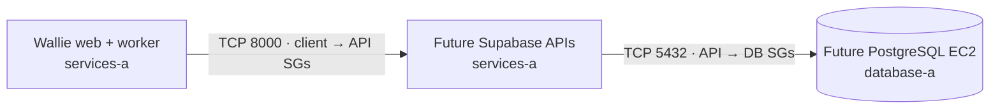

# Self-hosted Supabase staging network

**Reserve private paths for Supabase before deploying its database or APIs.** This opt-in Terraform change prepares security groups only; it creates no compute, storage, public ingress, or paid endpoint.

| Path             | Security groups                      | Boundary                             |
| ---------------- | ------------------------------------ | ------------------------------------ |
| Wallie → gateway | New client egress; new API ingress   | TCP 8000, group references only      |
| APIs → Postgres  | New API egress; new database ingress | TCP 5432, group references only      |
| Everything else  | No new rule                          | No CIDR, SSH, public IP, or NAT path |

- `enable_self_hosted_supabase_connectivity` defaults to `false` and requires the existing private task connectivity flag. When enabled, the network plan adds **3 security groups and 4 rules**. Existing web/worker endpoint rules remain unchanged.
- Future web/worker tasks attach the **existing application task group plus the new client group**. A future Supabase API task attaches the API group; a future PostgreSQL instance attaches the database group. Other operational groups must be reviewed separately.
- First-AZ placement is `services-a` for APIs and `database-a` for PostgreSQL. Both subnets are private; the database route table still has no default route. This is a qualification topology, not high availability.
- The output exposes those two subnet IDs and three group IDs only. No credentials or deployment requests are produced.

**Do not enable or apply this flag yet.** A later PR must prepare a scoped IAM grant for these exact groups/rules and review an untargeted saved Terraform plan. `wallie-local` already uses all ten managed-policy attachment slots; plan an explicit temporary swap or policy consolidation instead of adding an eleventh attachment. After apply, inspect every live rule: Terraform's standalone rule resources do not detect unrelated extra rules.

| Later batch       | Required before running Supabase in AWS                                                                                                                         |
| ----------------- | --------------------------------------------------------------------------------------------------------------------------------------------------------------- |
| Database host     | Pinned OS/image delivery into `database-a`, private administration path, dedicated encrypted persistent storage, database-aware backup/restore, recovery target |
| API tasks         | Mirrored pinned images, expanded private ECR/Logs/Secrets access, service discovery, gateway routing, health checks                                             |
| Storage / ingress | S3 storage backend and restricted access, browser-facing TLS route for Auth/Realtime/Storage, email/OAuth callbacks                                             |

- The current ECR endpoint policy permits only the Wallie web/worker repositories; the current S3 gateway endpoint is associated only with service route tables. The database subnet cannot use those paths as-is.
- Security groups have [no additional charge](https://docs.aws.amazon.com/vpc/latest/userguide/vpc-security-groups.html). EC2, EBS, backups, API tasks, S3, load balancing, and any extra VPC endpoints will incur AWS charges in later batches.
- Self-hosted Supabase needs no Supabase Cloud project or billing organization; this stack remains in our AWS account. [Supabase self-hosting responsibilities](https://supabase.com/docs/guides/self-hosting).

**Offline check:** `terraform -chdir=infra/aws/staging-network fmt -check -recursive`, `init -backend=false -lockfile=readonly`, `validate`, and `test`. These mock checks do not verify live IAM or network behavior.
