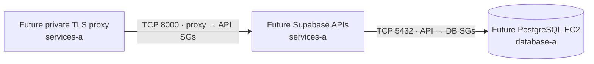

# Self-hosted Supabase staging network

**Reserve private paths for Supabase before deploying its database or APIs.** This opt-in Terraform change prepares security groups only; it creates no compute, storage, public ingress, TLS, or paid endpoint.

| Path            | Security groups                      | Boundary                             |
| --------------- | ------------------------------------ | ------------------------------------ |
| Proxy → gateway | New proxy egress; new API ingress    | TCP 8000, group references only      |
| APIs → Postgres | New API egress; new database ingress | TCP 5432, group references only      |
| Everything else | No new rule                          | No CIDR, SSH, public IP, or NAT path |

- `enable_self_hosted_supabase_connectivity` defaults to `false` and requires the existing private task connectivity flag. When enabled alone, the network plan adds **3 security groups and 4 rules**. Existing web/worker endpoint rules remain unchanged.
- A separate `enable_postgres_image_pull` flag defaults to `false` and requires both connectivity flags. It prepares the [private PostgreSQL ECR path](AWS-POSTGRES-IMAGE-PULL.md) through the existing ECR and S3 endpoints. The `postgres_image_pull` output is `null` while disabled; when enabled, it returns the DB/endpoint group IDs, ECR API/DKR and S3 gateway endpoint IDs, and `database-a` route table ID for later readback.
- A future private TLS proxy can attach the new proxy group to forward to the gateway; a Supabase API task attaches the API group; PostgreSQL attaches the database group. Web/worker need a separately reviewed HTTPS/443 path to that proxy. The current one-off launch renderer accepts exactly two task groups and cannot use this TCP/8000 path directly.
- First-AZ placement is `services-a` for APIs and `database-a` for PostgreSQL. Both subnets are private; the database route table still has no default route. This is a qualification topology, not high availability.
- The base `self_hosted_supabase_connectivity` output exposes those two subnet IDs and three group IDs only. Neither output contains credentials or deployment requests.

**Base network apply gate:** The [first-task contract](AWS-APP-TASK-DEFINITIONS.md) already specifies one HTTPS/443 hostname with public API routing and private VPC TLS routing to the proxy. Its listener, DNS, and certificate are later work; this security-group-only slice does not depend on them.

- Enable only the base flag, keeping `enable_postgres_image_pull=false` and `enable_postgres_session_logging=false`, after the [temporary IAM grant](AWS-SUPABASE-NETWORK-GRANT.md) and a full, untargeted saved plan show exactly three group and four rule additions with no other changes.
- After apply, inspect every live rule: Terraform's standalone rule resources do not detect unrelated extra rules. Keep workloads detached until their runtime and HTTPS gates pass.
- The base grant does not cover the separate image-pull endpoint, route, or security-group changes.

| Later batch       | Required before running Supabase in AWS                                                                                                                                                           |
| ----------------- | ------------------------------------------------------------------------------------------------------------------------------------------------------------------------------------------------- |
| Database host     | Pinned OS, [private image delivery](AWS-POSTGRES-IMAGE-PULL.md) into `database-a`, private administration, dedicated encrypted persistent storage, database-aware backup/restore, recovery target |
| API tasks         | Mirrored pinned images, expanded private ECR/Logs/Secrets access, co-located or explicitly routed interservice topology, health checks, Auth/OAuth/email egress                                   |
| Storage / ingress | S3 backend and restricted access, split-horizon HTTPS hostname with private/public TLS, browser API routes but no public Studio/admin, callback and WebSocket checks                              |

- With image pull disabled, the ECR endpoint policy permits only Wallie web/worker repositories, and the S3 gateway has only service route tables. Enabling it adds an exact PostgreSQL repository statement restricted to the host role, a DB-specific group on **ECR API/DKR only**, and the `database-a` S3 gateway route. It does not open Logs, general S3, or Internet access to the DB host. The API group's only outbound rule is PostgreSQL TCP/5432, so Storage S3 and Auth email/OAuth paths need separate review before those features work.
- Supabase's [gateway defaults to HTTP on port 8000](https://supabase.com/docs/guides/self-hosting/docker#configure-supabase-urls), while production browser access requires HTTPS. The application uses one `NEXT_PUBLIC_SUPABASE_URL` for browser, server, worker, and its health check. This skeleton alone does not make the [first app tasks](AWS-APP-TASK-DEFINITIONS.md) runnable.
- Security groups have [no additional charge](https://docs.aws.amazon.com/vpc/latest/userguide/vpc-security-groups.html). EC2, EBS, backups, API tasks, S3, load balancing, and any extra VPC endpoints will incur AWS charges in later batches.
- Self-hosted Supabase needs no Supabase Cloud project or billing organization; this stack remains in our AWS account. [Supabase self-hosting responsibilities](https://supabase.com/docs/guides/self-hosting).

**Offline check:** `terraform -chdir=infra/aws/staging-network fmt -check -recursive`, `init -backend=false -lockfile=readonly`, `validate`, and `test`. These mock checks do not verify live IAM or network behavior.
