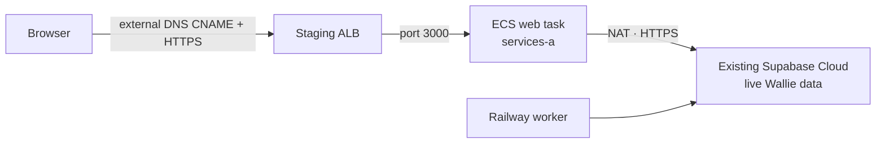

# Visible AWS web canary

**Deploy only the Wallie web container at `aws-staging.wallie.dev`.** This uses the **existing hosted Wallie Supabase project and live data**. It does not move `wallie.dev`, the Railway worker, or Supabase data into the VPC. The first service apply has zero tasks; traffic and task startup are separate reviewed steps.



| Gate    | Evidence before advancing                                                                                                                                                                                                                                                                                                                                                           |
| ------- | ----------------------------------------------------------------------------------------------------------------------------------------------------------------------------------------------------------------------------------------------------------------------------------------------------------------------------------------------------------------------------------- |
| Project | Compare the **existing** project reference and HTTPS origin from the current Wallie deployment with both `existingWallieSupabaseUrl` and `hostedSupabaseUrl`; all three manifest origins must match. Review reuse of the existing production `WALLIE_ENCRYPTION_KEY`.                                                                                                               |
| DNS     | `wallie.dev` is currently delegated outside Route 53. Confirm control of `aws-staging.wallie.dev`, no existing A/CNAME, and an operator for the current DNS provider. Terraform never edits DNS.                                                                                                                                                                                    |
| Runtime | Apply the already merged `services-a` HTTPS NAT option; verify the route and two task security groups. Populate only the web runtime secret. The existing web digest `sha256:038383bb66be04cd81d4c6110d3d4a18aca427110ebab0502e31a84131602e4b` is aligned with current runtime inputs; require fresh ECR image/scanning readback and strict signature verification before using it. |
| Auth    | Add `https://aws-staging.wallie.dev/auth/confirm` to the **existing** Supabase Auth redirect allowlist before testing sign-in. Do not change the production site URL.                                                                                                                                                                                                               |
| Scope   | The web image receives only the Supabase secret and encryption key. GitHub app, OAuth, webhook, and other optional integration credentials are absent. This is a login/read canary, not full Wallie functionality. The existing Railway worker may process jobs created through this web app; session progress does not prove an AWS worker.                                        |

## 1. Review and write the web secret

Use the existing full web ARN in `us-west-2`; it must have **zero versions**, including deprecated versions. The helper is web-only, requires a TTY, strips ambient AWS endpoint/proxy/credential overrides, refuses AWS CLI history, and passes the two values through stdin. It never calls `GetSecretValue` or prints values.

```sh
umask 077
mkdir -p .wallie/aws
EXPIRES_AT='<reviewed UTC expiry within 24 hours>'
node scripts/prepare-aws-hosted-web-secret-grant.mjs --expires-at "$EXPIRES_AT" > .wallie/aws/hosted-web-secret-grant.json
```

Have an administrator review the exact one-web-secret, expiring policy, create `WallieStagingHostedWebSecretWrite`, and swap it one-for-one for a temporarily unused policy on `wallie-local` (which has ten attachments). Check that only `wallie-local` is attached. After the grant is active:

```sh
WEB_VERSION_ID="$(openssl rand -hex 16)"
AWS_PROFILE=wallie-staging node scripts/populate-aws-hosted-web-secret.mjs \
  --version-id "$WEB_VERSION_ID" \
  --hosted-origin 'https://<existing-project-ref>.supabase.co' \
  --existing-origin 'https://<existing-project-ref>.supabase.co'
```

At the hidden prompts, enter an **active `sb_secret_` key for the existing project** and the **same production `WALLIE_ENCRYPTION_KEY`** currently used by Wallie. A dedicated web key is preferable for independent revocation but need not be created for this PR. Validate the supplied key belongs to the reviewed project using a read-only Data API canary. Record the non-secret version ID and require exactly one `AWSCURRENT` version. If interrupted, inspect version metadata before any retry. Detach the temporary grant, restore the original ten-policy attachment set, and delete the temporary policy after readback. Keep values out of files, shell arguments, logs, PRs, and chat. [Supabase API keys](https://supabase.com/docs/guides/getting-started/api-keys).

## 2. Register one reviewed web task definition

Create a private `.wallie/aws/hosted-web-manifest.json` containing metadata only:

```json
{
  "schemaVersion": 2,
  "mode": "hosted-web-existing",
  "account": "111614490109",
  "region": "us-west-2",
  "existingWallieSupabaseUrl": "https://<existing-project-ref>.supabase.co",
  "hostedSupabaseUrl": "https://<existing-project-ref>.supabase.co",
  "publicConfig": {
    "NEXT_PUBLIC_APP_URL": "https://aws-staging.wallie.dev",
    "NEXT_PUBLIC_SUPABASE_URL": "https://<existing-project-ref>.supabase.co",
    "NEXT_PUBLIC_SUPABASE_PUBLISHABLE_KEY": "sb_publishable_<existing-project-public-key>"
  },
  "images": { "web": "sha256:038383bb66be04cd81d4c6110d3d4a18aca427110ebab0502e31a84131602e4b" },
  "runtimeSecrets": {
    "web": {
      "arn": "arn:aws:secretsmanager:us-west-2:111614490109:secret:/wallie/staging/web/runtime-vDeDr4",
      "versionId": "<reviewed-version-id>"
    }
  }
}
```

The renderer rejects a worker entry or component in this mode, a different Supabase origin, `wallie.dev` as the app origin, floating image tags, and secret keys in public configuration. Render the web task and its temporary registration policy:

```sh
node scripts/prepare-aws-app-task-definition.mjs --manifest .wallie/aws/hosted-web-manifest.json --component web > .wallie/aws/hosted-web-task.json
node scripts/prepare-aws-app-task-launch.mjs register-policy --manifest .wallie/aws/hosted-web-manifest.json --expires-at "$EXPIRES_AT" > .wallie/aws/hosted-web-register-policy.json
```

Review and temporarily attach the grant, register only the web definition, then capture `aws ecs describe-task-definition --include TAGS` and verify the complete readback with `verifyDefinition()` before recording its **revision ARN**. Restore the prior IAM attachment. The container health check must perform both local HTTP and a read-only `worker_heartbeats` Supabase Data API query. The public configuration is injected by the server at runtime; `next start` reloads `next.config.ts` for the image origin allowlist. Verify this in a live browser canary after launch.

## 3. Request and validate the certificate

Preserve every existing private `staging-application` variable, especially `enable_runtime_secrets = true`. In the existing application Terraform state, set `request_web_certificate = true`, keep `enable_visible_web = false` and `web_desired_count = 0`. Render the `service` grant, which includes only staging ACM, named ALB, and web ECS service rights; inspect every statement and its expiry before a one-for-one IAM attachment swap:

```sh
node scripts/prepare-aws-visible-web-grant.mjs service --account 111614490109 --region us-west-2 --expires-at "$EXPIRES_AT" > .wallie/aws/visible-web-service-grant.json
```

Review an untargeted saved plan that adds **only one** ACM certificate, then apply it. No AWS DNS record is created.

Read `web_certificate_validation_records` from Terraform output. Have the external DNS operator create **only the exact CNAME name/value shown**. Check whether the provider UI automatically appends `.wallie.dev` before saving. Wait for the certificate to read back `ISSUED` in `us-west-2`; record its exact ARN. Do not use a same-apply certificate validation resource or a targeted Terraform apply.

## 4. Create the zero-task HTTPS service

Preserve the certificate flag and all existing application variables. Set `enable_visible_web = true`, `web_validated_certificate_arn` to the exact issued ARN, and the following reviewed network outputs:

| Variable                        | Source                                                         |
| ------------------------------- | -------------------------------------------------------------- |
| `web_vpc_id`                    | Staging network `vpc_id`                                       |
| `web_public_subnet_ids`         | `subnets.public-a.id` and `subnets.public-b.id`                |
| `web_service_subnet_id`         | `runtime_https_egress.services_subnet_id` (`services-a`)       |
| `web_egress_security_group_ids` | `runtime_https_egress.task_security_group_ids` in output order |
| `web_task_definition_arn`       | Exact verified hosted web revision                             |

Keep `web_desired_count = 0`. The enabled plan must contain only two new security groups, three named rules, one public ALB, one IP target group, one HTTPS listener, and one zero-task web ECS service. It must preserve the existing cluster, log groups, and runtime secret containers. The staging ALB has only public TCP/443 ingress; its outbound port 3000 reaches only the dedicated web-ingress group. Web tasks have no public IP and retain the two reviewed egress groups. Render the second expiring grant for the exact staging VPC and web security-group names:

```sh
node scripts/prepare-aws-visible-web-grant.mjs infrastructure --account 111614490109 --region us-west-2 --expires-at "$EXPIRES_AT" > .wallie/aws/visible-web-infrastructure-grant.json
```

Review both grants and their temporary attachment swaps before applying a saved plan. Restore the original attachment set after verification. The ALB, Fargate tasks, NAT, and logs incur charges.

## 5. Start, verify, then publish external DNS

After a separate live-data canary review, raise `web_desired_count` from zero to **one** in another saved plan. The plan must also change `force_new_deployment` from `false` to `true`, so ECS creates a deployment for the first task and evaluates its circuit breaker. Temporarily attach the reviewed `service` grant for the update and `elasticloadbalancing:DescribeTargetHealth` readback. Require the one ECS task `RUNNING` and container `HEALTHY`, the exact image digest and private ENI, a healthy ALB target, Next.js ready logs, and the read-only Supabase Data API health check. The ALB's `/favicon.ico` check proves HTTP only; ECS also evaluates the task's database-aware container health. The service has a deployment circuit breaker with rollback, but live rollback behavior remains unproven until this launch is observed. If the apply fails, inspect ECS and return desired count to zero through a reviewed plan before any DNS publication.

Before external DNS, test HTTPS through the ALB with the staging SNI/Host and verify the runtime public Supabase origin and key in a browser. Then have the external DNS operator create **only** `aws-staging.wallie.dev` as a CNAME to the ALB DNS name from `visible_web.load_balancer_dns`. Verify public TLS and login redirect. Keep `wallie.dev` pointed at its current host. Any write through this staging web app reaches **live Wallie data**; avoid submitting jobs during the canary. Stop traffic by removing only the external staging CNAME; for the service, set desired count back to zero through a reviewed plan. Restore temporary IAM policy attachments and remove expiring grants after readback.
