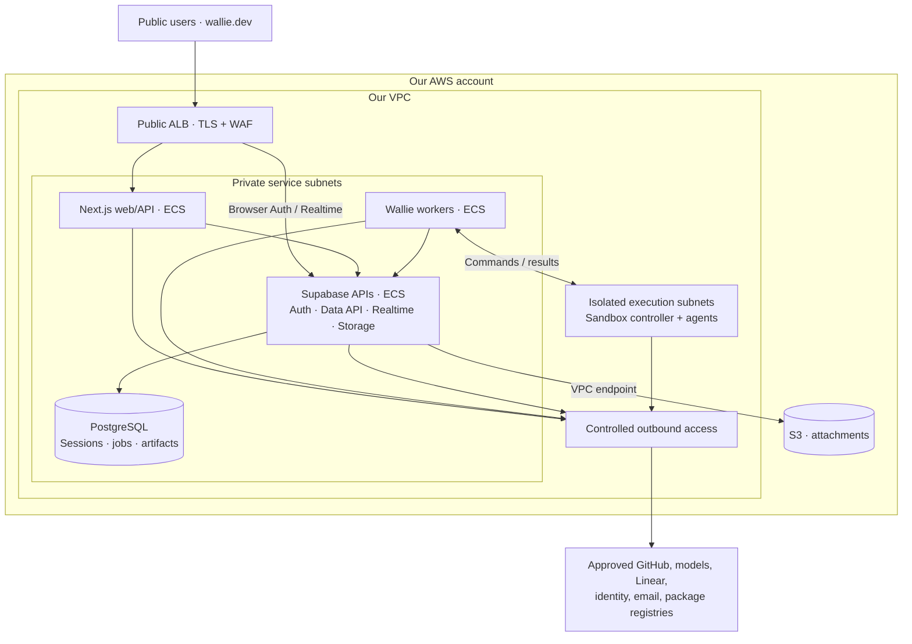

**One AWS stack for Wallie**

Proposal · September 19, 2026

**Direction**

- Make AWS the primary hosting platform. Migrate **wallie.dev first**, then deploy the same stack for enterprises.
- **Next.js serves the website, dashboard, and API** on ECS Fargate. [Self-hosting is supported](https://nextjs.org/docs/app/guides/self-hosting).
- **Self-hosted Supabase provides Auth, PostgreSQL, Realtime, and Storage** in the same deployment.
- Share container images, Terraform modules, migrations, and release tooling. Keep the existing pipeline engine, queue, and workspace isolation.

| Deployment | Account / VPC    | Access               | Operator            |
| ---------- | ---------------- | -------------------- | ------------------- |
| wallie.dev | Our organization | Public HTTPS         | Us                  |
| Enterprise | Customer         | Private access + SSO | Customer by default |

- Separate installations and data; configuration controls access, domains, identity, and capacity.
- Start with one region and multiple Availability Zones.

**Architecture: wallie.dev**

- Enterprise profile: internal load balancer and private DNS/access.
- Expose required application and Supabase APIs only; PostgreSQL, Studio, and administrative endpoints stay private.
- Supporting AWS services: Route 53, ACM, ECR, Secrets Manager, KMS, CloudWatch; optional CloudFront for public assets.
- **Data boundary:** approved model providers may receive repository content, session titles/prompts, rejection feedback, and prior artifacts. Attachments available to agents can also leave the VPC. Approved external integrations remain.

**Vercel exit scope**

| Dependency in the repo                | Target                                                                             |
| ------------------------------------- | ---------------------------------------------------------------------------------- |
| Vercel web hosting                    | Next.js container on ECS                                                           |
| Railway worker deployment             | Separate ECS worker service                                                        |
| Supabase Cloud configuration          | Self-hosted Supabase + PostgreSQL in AWS                                           |
| Vercel Sandbox                        | One in-account provider, covering sessions, onboarding, helpers, and agent sign-in |
| Vercel Analytics / Speed Insights     | CloudWatch and configurable browser telemetry                                      |
| Vercel production / preview detection | Platform-independent settings; keep development pages blocked in production        |

- Keep Next.js; the target is **zero Vercel service dependencies**.
- Migrate existing sandbox connections and drain their resources before removing Vercel credentials, SDKs, and configuration.

**Decide first**

| Decision  | Preferred path                                                                                                      | Must prove                                                                                  |
| --------- | ------------------------------------------------------------------------------------------------------------------- | ------------------------------------------------------------------------------------------- |
| Database  | Qualify upstream Supabase PostgreSQL locally, then on EC2; [qualification guide](SELF-HOSTED-SUPABASE.md)           | Auth, RLS, RPCs, migrations, Realtime replication, failover, restore                        |
| Sandboxes | Daytona through the [existing adapter](SANDBOX-PROVIDER-CONTRACTS.md), pending a supported full self-hosted package | Controller, runners, snapshots, and logs stay in-account; isolation, cleanup, support terms |

- **Database:** the [upstream bootstrap](https://github.com/supabase/supabase/blob/8c7a4d9dbbaf8b552893822e89d7bf06f33f9220/docker/docker-compose.yml#L479-L496) uses superuser operations that [RDS does not expose](https://docs.aws.amazon.com/AmazonRDS/latest/UserGuide/Appendix.PostgreSQL.CommonDBATasks.Roles.rds_superuser.html). An RDS variant needs custom bootstrap and separate qualification.
- **Sandboxes remain unqualified:** [Daytona BYOC](https://www.daytona.io/docs/en/bring-your-own-compute/) retains its hosted control plane; it does not meet our boundary. The [old public core is unmaintained](https://github.com/daytonaio/daytona). Confirm current full self-hosting availability and support terms before choosing infrastructure.
- Select one supported combination; estimate delivery after qualification.
- **Tradeoff:** one shared hosting architecture; we take on Supabase upgrades, availability, backups, and recovery. [Self-hosting responsibilities](https://supabase.com/docs/guides/self-hosting).

**Migration order**

| Step                       | Deliverable                                                                               | Exit check                                                                         |
| -------------------------- | ----------------------------------------------------------------------------------------- | ---------------------------------------------------------------------------------- |
| 1. Qualify                 | Database/sandbox decisions and recovery targets                                           | Real stage runs within agreed boundaries                                           |
| 2. Build AWS staging       | Shared Terraform, signed/scanned images, prepared agent image, CI/CD, monitoring          | Fresh installation and full review/revision/PR workflow pass                       |
| 3. Move compute            | Next.js, workers, and sandbox execution on AWS; temporarily retain existing data services | wallie.dev runs on AWS; login, assets, streaming, webhooks, and agent sign-in pass |
| 4. Move state              | Self-hosted Supabase, Auth data, objects, keys, and integration settings                  | Restore rehearsal and controlled production cutover pass                           |
| 5. Ship enterprise profile | Private ingress, customer SSO, installation/upgrade/support guides                        | Customer deploys the same release independently                                    |

**Cutover and launch gates**

- **State migration:** pause writes and drain work; transfer [database/Auth data](https://supabase.com/docs/guides/self-hosting/restore-from-platform) and [objects separately](https://supabase.com/docs/guides/self-hosting/copy-from-platform-s3); preserve Wallie's encryption key.
- **Identity:** configure new endpoints, email, and callbacks; plan for users to sign in again. Test invitations, SSO access removal, and workspace isolation.
- **Rollback:** keep one writable database; retain the old deployment through a defined rollback window. After new writes, rollback requires data reconciliation.
- **Worker safety:** current [drain budget](WORKER-OPERATIONS.md) is **45 minutes**; [Fargate stop timeout](https://docs.aws.amazon.com/AmazonECS/latest/developerguide/task_definition_parameters.html) is **2 minutes maximum**. Integrate the [local worker drain command](WORKER-CONTAINER.md#drain-before-a-planned-stop) into deployment tooling and verify each exact task has drained **before planned ECS rollouts, scale-in, or manual stops**. SIGTERM starts too late; separately test crash recovery and duplicate prevention.
- **Web portability:** runtime customer URLs, streaming/WebSockets, replica cache/rate-limit coordination, and isolated preview deployments.
- **Isolation:** sandbox network/IAM restrictions; block database, deployment secrets, metadata, and unrelated networks. Allowlist egress; use private AWS endpoints.
- **Enterprise webhooks:** narrow signed/deduplicated ingress, or an outbound relay/polling implementation.
- **Operations:** restore database, objects, and keys; test rotation, forward-only upgrades, audit export, retention, alerts, and spend limits.
- **Completion:** retire Vercel, Railway, and hosted Supabase after validation; verify no production dependency remains.

**Review batches**

- Batch 1: this plan and platform-independent production checks, in separate PRs.
- Batch 2: runtime public configuration, then container packaging.
- Later: database/sandbox qualification, AWS staging, cutover, enterprise installation.
- Start qualification with [read-only AWS discovery](AWS-DISCOVERY.md); inventory does not establish database or sandbox compatibility.
- Prepare [private Terraform state storage](AWS-STATE-BOOTSTRAP.md) before the network foundation; this batch creates no compute.
- Reserve the [two-AZ staging network](AWS-STAGING-NETWORK.md); workload security controls and compute follow after its review and deployment.
- Apply [network hardening](AWS-NETWORK-HARDENING.md) to the empty VPC: remove default-SG rules and block ordinary traffic in the sandbox reservation.
- Prepare [private image repositories](AWS-STAGING-REGISTRY.md) for the web app and worker; image publishing and compute follow in separate PRs.
- [Publish smoke-tested images](AWS-IMAGE-PUBLISHING.md) with immutable tags and recorded digests; signing and deployment approval remain separate gates.
- Foundation code needs no AWS credentials. Infrastructure work needs an AWS account, region, and SSO/assumable role.
- Each PR waits for human review and merge; dependent batches follow after merge.

**Later**

- Disconnected operation, private inference, SCIM, GitHub Enterprise Server.
- Multi-region operation and EKS packaging.
