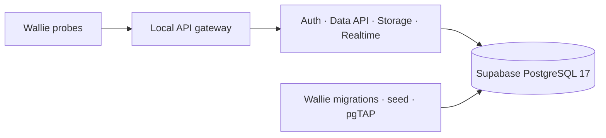

# Self-hosted Supabase qualification

**Qualify Wallie against the upstream Supabase stack locally before provisioning AWS.**

- Candidate: [Supabase `self-hosted/v0.8.1`](https://github.com/supabase/supabase/releases/tag/self-hosted%2Fv0.8.1), commit `8c7a4d9dbbaf8b552893822e89d7bf06f33f9220`.
- Database: upstream `supabase/postgres:17.6.1.136`; all seven images are locked to manifest digests.
- Target to qualify next: Supabase PostgreSQL on EC2, with Supabase APIs in the same VPC.
- Status: qualification tooling; a successful local run establishes the checks below, not AWS readiness.

## Why this database

- The [upstream bootstrap](https://github.com/supabase/supabase/blob/8c7a4d9dbbaf8b552893822e89d7bf06f33f9220/docker/docker-compose.yml#L479-L496) uses Supabase's database image and superuser operations.
- [RDS administrators do not receive PostgreSQL superuser access](https://docs.aws.amazon.com/AmazonRDS/latest/UserGuide/Appendix.PostgreSQL.CommonDBATasks.Roles.rds_superuser.html).
- Therefore, the unmodified upstream bootstrap cannot simply target RDS. An RDS variant would need custom bootstrap, extension/role compatibility work, and separate qualification.
- Operating PostgreSQL ourselves makes failover, backups, recovery, and upgrades our responsibility.

## Run locally

Prerequisites: Node.js 22, pnpm dependencies installed, Git, and local Docker Engine/Desktop with Docker Compose on a Unix socket. Remote Docker contexts are rejected.

```sh
pnpm install --frozen-lockfile
node scripts/check-self-hosted-supabase.mjs
```



- Fetches the pinned upstream configuration; creates a unique Compose project with fresh synthetic data.
- Runs PostgreSQL, Envoy, Auth, PostgREST, Realtime, Storage, and imgproxy. Studio, Meta, Edge Functions, and pooling are outside this check.
- Publishes the test endpoint on loopback only; generates fresh credentials in a private OS temporary directory.
- Uses its own containers and data; leaves an existing Supabase CLI stack untouched.
- Cleans up its containers, volumes, and temporary stack files automatically. Cleanup failure returns a failure and prints the project/configuration path for recovery.
- Keeps a success report and private diagnostic log under ignored `.wallie/self-hosted-supabase/`. Logs can contain temporary credentials; keep them local.
- Requires no AWS credentials and creates no AWS resources.

## Checks

| Area           | Required evidence from the run                                            |
| -------------- | ------------------------------------------------------------------------- |
| Schema         | All Wallie migrations and seed apply; existing database pgTAP tests pass  |
| Auth           | Synthetic users obtain usable sessions through the real Auth service      |
| Data API / RLS | Members can access their workspace; another workspace's user cannot       |
| RPCs           | Wallie RPC behavior works through the Data API                            |
| Storage        | Service upload/download, signed URL, and denied direct user access        |
| Realtime       | Authenticated member receives an update after database-listener readiness |

Use the command's exit status and check output as evidence. A failed or interrupted run does not qualify the stack.

The dedicated GitHub Actions job reruns this check when the bundle, harness, database, or dependency lock changes. It needs no repository secrets.

## Gates before AWS cutover

- **AWS deployment:** private subnets, TLS, secrets, restricted network/IAM access, monitoring, and capacity.
- **Durability:** high availability, failover, database/object/key backup and restore, measured recovery targets.
- **Storage:** S3 backend and its IAM/VPC endpoint behavior; local object storage is insufficient evidence.
- **Identity:** real email, OAuth/SSO callbacks, invitations, session behavior, and access removal.
- **Keys:** this baseline uses fresh legacy HS256 keys; asymmetric signing and opaque API-key rollout need their own checks.
- **Wallie:** complete worker stage/review/retry workflow and sandbox isolation/cleanup.
- **Release operations:** forward-only upgrade and rollback rehearsals; rerun qualification for each pinned stack change.

Configuration follows the [current Docker guide](https://supabase.com/docs/guides/self-hosting/docker). Upgrades must account for the [Envoy gateway change](https://supabase.com/changelog/48048-self-hosted-supabase-envoy-becomes-the-default-api-gateway-b) and [Auth URL prefix change](https://supabase.com/changelog/47093-self-hosted-supabase-api-external-url-to-include-auth-v1).
