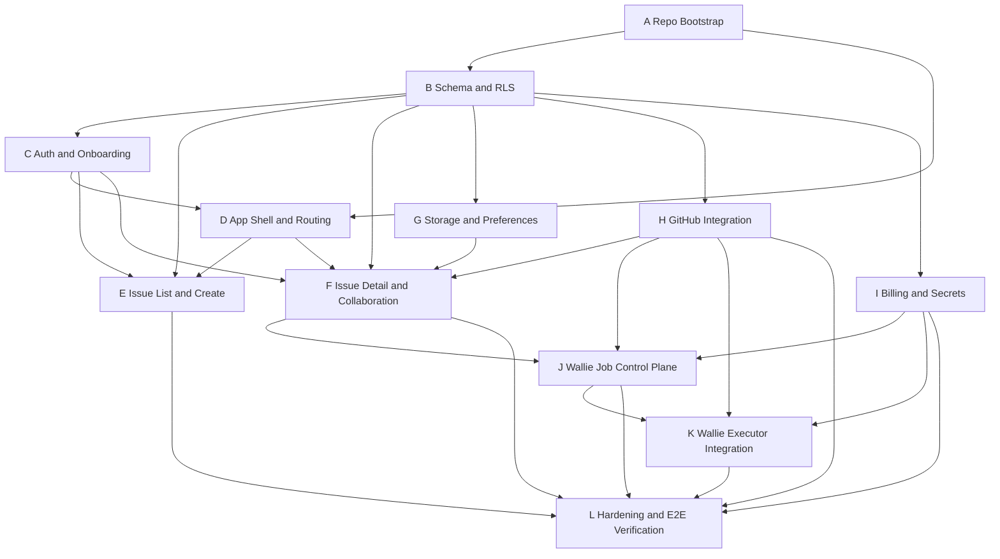

# Wallie Cloud Rebuild Execution Graph

## Purpose

This document turns the rebuild handoff into an execution plan:

- where to create the new repo
- how to keep this repo as reference-only
- what depends on what
- what to run in parallel
- what you should do, step by step, to coordinate a team of coding agents

Read this together with:

- [cloud-rebuild-handoff.md](/Users/anant/src/wallie/docs/cloud-rebuild-handoff.md)

## Short Answer

Yes. Create a new folder outside this working directory, ideally as a sibling repo, and keep the current `wallie` repo as read-only reference material.

Recommended layout:

```text
/Users/anant/src/
  wallie/                # existing repo, reference only
  wallie-cloud/          # new rebuild repo
```

This is better than rebuilding inside the current repo because:

- it prevents accidental mixing of old and new architectures
- it avoids dragging dead code and stale assumptions into the rebuild
- it makes agent ownership cleaner
- it lets agents inspect the old repo without editing it

## Operating Model

Use these rules from the start.

## Rule 1: Old Repo Is Reference-Only

The current repo should be treated as:

- a product behavior reference
- a schema reference
- a UI/interaction reference
- an integration reference

It should not be used as:

- the implementation base
- the schema source of truth for the new app
- a code-copy source except in very small, deliberate cases

## Rule 2: New Repo Is The Only Write Target

All implementation agents should edit only:

- `/Users/anant/src/wallie-cloud`

They may read:

- `/Users/anant/src/wallie`

but they should not modify it.

## Rule 3: Copy The Handoff Docs Into The New Repo Early

Do this immediately after creating the new repo.

Create:

- `docs/reference/cloud-rebuild-handoff.md`
- `docs/reference/cloud-rebuild-execution-graph.md`

You can copy these files from the current repo.

Reason:

- agents working in the new repo should not need to jump back and forth mentally
- the handoff becomes part of the new repo's working context

## Rule 4: Add An `AGENTS.md` In The New Repo

The new repo should include a top-level `AGENTS.md` that says:

- this repo is the implementation target
- the old repo is reference-only at `/Users/anant/src/wallie`
- do not port dead architecture
- do not edit the old repo
- preserve the data contracts defined in the handoff docs

## Workspace Setup

## Step 1: Create The New Repo

From `/Users/anant/src`:

```bash
mkdir wallie-cloud
cd wallie-cloud
git init
pnpm init
```

If you prefer GitHub from the beginning:

```bash
gh repo create wallie-cloud --private --source=. --remote=origin --push
```

## Step 2: Copy Reference Docs

From `/Users/anant/src/wallie-cloud`:

```bash
mkdir -p docs/reference
cp /Users/anant/src/wallie/docs/cloud-rebuild-handoff.md docs/reference/
cp /Users/anant/src/wallie/docs/cloud-rebuild-execution-graph.md docs/reference/
```

## Step 3: Add `AGENTS.md`

Create a top-level `AGENTS.md` in the new repo with at least:

- implementation target is this repo
- old repo path is `/Users/anant/src/wallie`
- old repo is read-only reference
- use `docs/reference/cloud-rebuild-handoff.md`
- use `docs/reference/cloud-rebuild-execution-graph.md`
- do not reintroduce ElectricSQL, PGlite, proxy/write servers, or client-exposed storage credentials

## Step 4: Create A Top-Level Progress Board File

Create:

- `docs/build-status.md`

This should track:

- active agents
- current branch per agent
- blocked dependencies
- accepted decisions
- known deviations from the handoff

This keeps the rebuild coordinated.

## Step 5: Create The Baseline Branch

In the new repo:

```bash
git checkout -b codex/bootstrap
```

Use this branch only for initial setup and shared docs if you want a clean merge point.

## Dependency Graph

The graph below shows what must happen before other work can safely proceed.

## Node List

- `A`: repo bootstrap and shared conventions
- `B`: schema v2 and RLS
- `C`: auth and onboarding
- `D`: app shell and workspace routing
- `E`: issue list and create flow
- `F`: issue detail and collaboration
- `G`: storage and preferences
- `H`: GitHub integration
- `I`: billing and secrets
- `J`: Wallie job control plane
- `K`: Wallie executor integration
- `L`: hardening and end-to-end verification

## Graph



## Critical Path

The minimum critical path is:

1. `A` Repo bootstrap
2. `B` Schema and RLS
3. `C` Auth and onboarding
4. `D` App shell and workspace routing
5. `E` Issue list and create
6. `F` Issue detail and collaboration
7. `H` GitHub integration
8. `I` Billing and secrets
9. `J` Wallie job control plane
10. `K` Wallie executor integration
11. `L` hardening

## Parallelization Plan

This is the safest high-throughput sequence.

## Wave 0

Start:

- Agent Platform on `A`

Output:

- fresh repo
- shared tooling
- top-level conventions

## Wave 1

Start in parallel after `A` is stable:

- Agent Data on `B`
- Agent Shell on `D`

Reason:

- shell scaffolding can begin while schema is still stabilizing
- but no feature work should assume final DB contracts until `B` is reviewed

## Wave 2

Start after first reviewed draft of `B`:

- Agent Auth on `C`
- Agent Issues List on `E`
- Agent Issue Detail on `F`
- Agent Infra on `G`
- Agent GitHub on `H`
- Agent Billing/Secrets on `I`

This is the main productivity wave.

## Wave 3

Start after `F`, `H`, and `I` have stable interfaces:

- Agent Wallie Control Plane on `J`

Do not start Wallie orchestration before:

- issue detail contracts exist
- GitHub contracts exist
- secrets and billing enforcement exist

## Wave 4

Start after `J` exists:

- Agent Wallie Executor on `K`

This may initially stub the actual long-running model execution.

## Wave 5

Start after all core work is merged:

- Verification agent or main engineer on `L`

## Stage Gates

Use these explicit gates before opening later phases.

## Gate A: Bootstrap Complete

Must exist:

- new repo
- package manager selected
- CI baseline
- env validation strategy
- docs copied in
- `AGENTS.md`

## Gate B: Schema Freeze v1

Must exist:

- migrations apply cleanly
- RLS works
- enums stable
- table names stable
- issue number RPC exists

You can revise later, but feature agents should not start until there is at least one reviewed schema draft.

## Gate C: App Can Authenticate And Enter A Workspace

Must exist:

- sign-in works
- onboarding works
- owner membership works
- `wallie` system member bootstrap works
- workspace-scoped route resolves

## Gate D: Core Issue Workflow Works

Must exist:

- create issue
- list issues
- open issue
- edit issue
- comment
- relationship and sub-issue editing

This is the first major product milestone.

## Gate E: Integrations Work

Must exist:

- GitHub install and repo sync
- Stripe portal and webhook flow
- secrets CRUD
- uploads

## Gate F: Wallie Control Plane Works

Must exist:

- explicit run button
- queued job row
- run row
- status transitions
- message display

This gate does not require the final executor to be perfect.

## Gate G: Production Candidate

Must exist:

- idempotent webhooks
- rate limiting
- error monitoring
- end-to-end test coverage on critical paths

## What You Should Do, Step By Step

This is the practical operator checklist.

## Step 1: Create The New Repo As A Sibling Folder

Do this first.

Recommended path:

- `/Users/anant/src/wallie-cloud`

Do not create it inside `/Users/anant/src/wallie`.

## Step 2: Copy The Reference Docs

Copy:

- [cloud-rebuild-handoff.md](/Users/anant/src/wallie/docs/cloud-rebuild-handoff.md)
- [cloud-rebuild-execution-graph.md](/Users/anant/src/wallie/docs/cloud-rebuild-execution-graph.md)

into the new repo under `docs/reference/`.

## Step 3: Create `AGENTS.md` In The New Repo

Add explicit instructions:

- implementation target is `wallie-cloud`
- old repo is `/Users/anant/src/wallie`
- old repo is read-only reference
- use docs in `docs/reference/`
- do not import dead architecture

## Step 4: Ask One Agent To Do Bootstrap Only

Do not launch all agents at once yet.

First launch one platform/bootstrap agent to:

- scaffold Next.js
- configure Tailwind
- configure TypeScript
- configure lint/test/build
- add env parsing
- create `docs/build-status.md`

This becomes the base everyone else can branch from.

## Step 5: Review Bootstrap Before Parallel Work

Check:

- local app boots
- lint/build/typecheck work
- repo structure matches the handoff

Only then launch more agents.

## Step 6: Launch Schema Agent Next

The schema/RLS agent should work immediately after bootstrap.

This agent should own:

- migrations
- RLS
- helper functions
- type generation strategy

This is your most important dependency.

## Step 7: Once Schema Draft Exists, Launch 4 To 6 Parallel Feature Agents

Recommended parallel batch:

- Auth/onboarding
- App shell/workspace routing
- Issue list/create
- Issue detail/collaboration
- GitHub integration
- Billing/secrets/storage

Do not launch Wallie run agents yet.

## Step 8: Force Agents To Publish Interface Decisions

Require each agent to record in `docs/build-status.md`:

- routes added
- tables touched
- reusable interfaces introduced
- unresolved decisions

This is what prevents divergence.

## Step 9: Merge In Dependency Order

Suggested merge order:

1. Bootstrap
2. Schema/RLS
3. Auth/onboarding
4. App shell/routing
5. Issue list/create
6. Issue detail/collaboration
7. Storage/preferences
8. Billing/secrets
9. GitHub integration
10. Wallie control plane
11. Wallie executor
12. Hardening

## Step 10: Launch Wallie Control Plane Agent

Only after:

- issue detail exists
- GitHub contract exists
- secret storage exists
- billing limits exist

This agent should implement:

- run button
- enqueue API
- job rows
- run rows
- timeline status wiring

## Step 11: Launch Wallie Executor Agent

Only after control plane exists.

This agent can:

- implement actual processing if feasible
- or initially stub executor behavior while preserving run lifecycle

If Vercel limits are a problem, keep the control plane intact and mark executor compute as a follow-up deployment decision.

## Step 12: Do An Integration Sweep

Run an explicit verification pass for:

- workspace creation
- issue create/edit/comment
- GitHub install and webhook flow
- billing update flow
- secret CRUD
- upload flow
- Wallie run lifecycle

## Step 13: Freeze MVP

Do not reintroduce:

- board view
- offline support
- local-first sync

until the cloud MVP is stable.

## Agent Launch Order

If you want a concrete order for a team of agents, use this:

1. Agent Bootstrap
2. Agent Schema
3. Agent Auth
4. Agent Shell
5. Agent Issues List
6. Agent Issue Detail
7. Agent Storage/Preferences
8. Agent Billing/Secrets
9. Agent GitHub
10. Agent Wallie Control Plane
11. Agent Wallie Executor
12. Agent Verification

## Suggested Branch Strategy

Use one branch per major stream:

- `codex/bootstrap`
- `codex/schema-v2`
- `codex/auth-onboarding`
- `codex/app-shell`
- `codex/issues-list`
- `codex/issue-detail`
- `codex/storage-preferences`
- `codex/billing-secrets`
- `codex/github-integration`
- `codex/wallie-control-plane`
- `codex/wallie-executor`
- `codex/hardening`

## Suggested Ownership Boundaries

To reduce merge conflicts:

- Schema agent owns only `supabase/` and DB type generation.
- Bootstrap agent owns only global config and shared shell scaffolding.
- Feature agents own `features/<domain>` plus route entrypoints for that domain.
- Integration agents own `app/api/<domain>` and `lib/<domain>`.
- Wallie agents own `lib/wallie`, `features/wallie`, and Wallie route handlers.

## How Agents Should Refer To The Old Repo

Tell agents:

- read from `/Users/anant/src/wallie`
- treat it as behavioral reference only
- if you copy any implementation idea, adapt it to the new architecture
- do not preserve old abstractions without justification
- do not edit the old repo

Recommended line to include in prompts:

`Reference repo is /Users/anant/src/wallie. Read it as needed for behavior and product details, but do not modify it and do not port its dead architecture.`

## Copy-Paste Operator Prompt For The Bootstrap Agent

Use this first in the new repo:

Build the initial scaffold for the Wallie cloud rebuild in this repo. This repo is the implementation target. The reference repo is `/Users/anant/src/wallie` and is read-only. Use `docs/reference/cloud-rebuild-handoff.md` and `docs/reference/cloud-rebuild-execution-graph.md` as product and execution specs. Set up Next.js App Router, TypeScript, Tailwind, linting, test/build scripts, env validation, shared app shell scaffolding, and `docs/build-status.md`. Do not implement product features deeply yet. Do not import dead ElectricSQL/PGlite architecture. List every file you changed.

## Copy-Paste Operator Prompt For The Schema Agent

After bootstrap:

Implement schema v2 for the Wallie cloud rebuild in this repo. The reference repo is `/Users/anant/src/wallie` and is read-only. Use `docs/reference/cloud-rebuild-handoff.md` as the contract. Own `supabase/` migrations, enums, tables, indexes, RLS, helper functions, and an atomic issue-number allocator RPC. Do not build UI. Keep naming stable for downstream agents. Record any schema decisions or deviations in `docs/build-status.md`. List every file you changed.

## Copy-Paste Operator Prompt For Feature Agents

General template:

This repo is the implementation target for the Wallie cloud rebuild. The reference repo is `/Users/anant/src/wallie` and is read-only. Use `docs/reference/cloud-rebuild-handoff.md` and `docs/reference/cloud-rebuild-execution-graph.md`. You are not alone in the codebase. Stay within your ownership boundary, do not overwrite unrelated work, and record any route/interface/schema assumptions in `docs/build-status.md`. Do not port old ElectricSQL/PGlite architecture. List every file you changed.

## What Not To Do

- Do not start in the current repo.
- Do not let multiple agents invent schema independently.
- Do not let client code own GitHub installation or secrets writes.
- Do not let uploads depend on browser-held storage secrets.
- Do not make Wallie automation implicit before the control plane exists.
- Do not revive board/offline/local-first work before MVP is stable.

## Recommended Next Action

Your next concrete move should be:

1. create `/Users/anant/src/wallie-cloud`
2. copy the reference docs into it
3. add `AGENTS.md`
4. run one bootstrap agent only
5. then run one schema agent
6. then fan out feature agents after schema review

That is the cleanest path.
